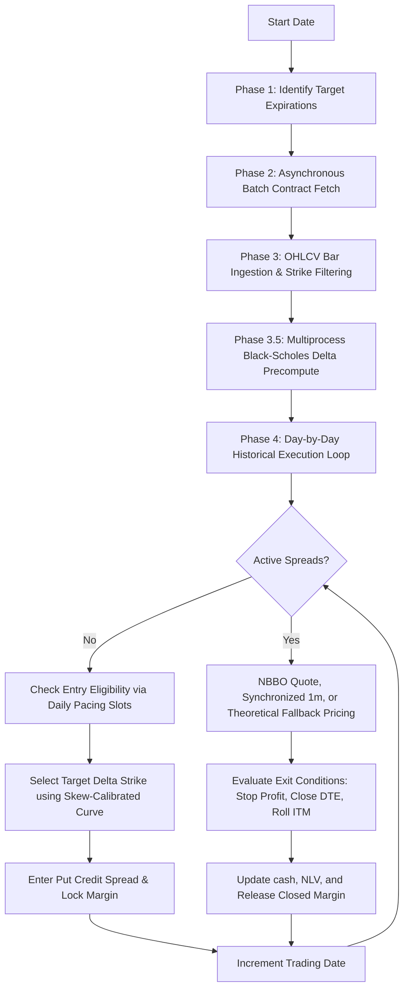

# E*TRADE Quantitative Option Framework — AI Agent Manual

Welcome, Agent. This repository contains an institutional-grade, non-anticipative quantitative trading framework developed in Python, designed for options trading (Put Credit Spreads and Covered Calls) on the SPY and SPX. 

This document serves as your **high-fidelity context bootstrap**. Every time you begin a new session, review this manual to instantly master the system architecture, mathematical pipelines, execution steps, and strict non-anticipativity mandates.

---

## 1. System Architecture & Directory Topology

The project is structured into modular components to decouple live broker execution from historical simulation and research pipelines:

```text
etrade_python_client/
├── docs/                       # Core system specifications & mathematical guidelines
│   ├── market_regime_detect_specs.md # SOURCE OF TRUTH for regime & causal mandates
│   ├── backtesting_logic.md    # Backtester design principles & premium formulas
│   └── live_trading_logic.md   # Live agent rules, order execution, & VIX sizing
│
├── live_trading/               # Core execution scripts running against E*TRADE Production
│   ├── etrade_cover_call_new.py # Master live agent (Covered Call + Option Matrix Entry)
│   ├── etrade_put_credit_spread.py # Put credit spread live execution module
│   ├── spy_position_tracker.py # Real-time position tracking and YTD realized PnL tracker
│   ├── portfolio_manager.py    # Multi-account margin, capital, and risk manager
│   ├── ev_engine.py            # Point-in-time HMM regime classification & GMM return fitting
│   ├── ev_plots.py             # Live expected value (EV) options matrix visualizer
│   ├── data_ingestion.py       # Causal feature loader, stationarity tests, rolling robust scaling
│   ├── pca_fusion.py           # Sequential subspace projections & eigenvector sign stabilizer
│   └── email_snapshot.py       # Automated HTML daily digest reporter
│
├── backtesting/                # Historical testing and out-of-sample simulation
│   ├── backtest_runner.py      # Main chronological options simulator (126KB, high fidelity)
│   ├── massive_api_client.py   # Asynchronous batch-fetching client for Polygon.io
│   ├── option_data_cache.py    # SQLite local options database manager
│   ├── greeks_calculator.py    # Vectorized Black-Scholes pricing & Greek engines
│   ├── polygon_multi.py        # Parallel multi-ticker backtest coordinator
│   └── monthly_cpu_bound.py    # Multiprocessing CPU resource allocations
│
├── scratch/                    # Research sandbox, verification, & forensic scripts
│   ├── regime_probability_audit.py # Multi-year walk-forward probability audit script
│   └── check_multi_gap.py      # Missing options pricing cache coverage auditor
│
└── config.ini                  # Broker API & database paths configuration
```

---

## 2. The Market Regime Detection (MRD) Engine

The MRD engine provides **absolute point-in-time** identification of market states. It operates under strict causal regulations to prevent quant look-ahead bias.

### 2.1 Causal Preprocessing & Data Ingestion (`data_ingestion.py`)
- **Strict Stationarity**: Raw economic inputs (SPY close, VIX level, Treasury yields, credit spreads) are never passed directly to unsupervised models. The engine enforces transformations (log-returns, fractional differencing) and verifies stationarity via the Augmented Dickey-Fuller (ADF) test ($p < 0.05$).
- **Earnings-Neutral Volatility**: Intercepts scheduled corporate events (earnings seasons) and filters out deterministic volatility jumps to ensure the HMM classifies broad macro regimes rather than calendar events.
- **Causal Robust Scaling**: Standard scalers are strictly forbidden on full datasets. The custom `ExpandingRobustScaler` and `RollingRobustScaler` scale features at time $t$ using only data from $0 \dots t-1$.
- **No Centered Smoothing**: Centered filters (e.g., `rolling(..., center=True)`) are strictly forbidden. All feature smoothing is strictly trailing (`center=False` or EWMA).

### 2.2 Latent Space Feature Fusion (`pca_fusion.py`)
- **Expanding Subspace Fitting**: PCA matrix projection loadings used at time $t$ are fit strictly on scaled data from $0 \dots t-1$. Global fits are forbidden.
- **Orthogonality Enforcement**: Since HMMs use diagonal covariance matrices (assuming independent inputs), standard PCA is verified dynamically. If correlation between components exceeds $0.1$, standard PCA is enforced over SparsePCA to guarantee strict mathematical orthogonality.
- **Eigenvector Sign-Stabilization**: Unsupervised PCA can randomly flip eigenvector signs across rolling windows. The engine computes the cosine similarity (via `scipy.spatial.distance.cosine`) between components of $T$ and $T-1$. If negative, the current eigenvector is multiplied by $-1$ to maintain continuous, stable feature generation.

### 2.3 Hidden Markov Model & Overlay (`ev_engine.py`)
- **Model Topology**: Gaussian Mixture Hidden Markov Model ([GMMHMM](file:///Users/btian/EtradePythonClient/etrade_python_client/live_trading/ev_engine.py)) with diagonal covariance.
- **State Selection**: Bayesian Information Criterion (BIC) dynamically selects the number of hidden states $K$ (typically 3 to 5) inside the walk-forward loop using only training data available at that date.
- **Prohibition of Viterbi (Smoothing)**: `hmmlearn` `.predict()` uses Viterbi decoding which looks forward in time to smooth hidden state sequences. Backtests are **strictly forbidden** from using Viterbi. They must implement a custom Forward Algorithm (filtering) using `.predict_proba(X)` and extracting **only the final row's probability** (point-in-time).
- **Deterministic State Mapping**: HMMs assign arbitrary integer labels (State 0, State 1) to regimes. To prevent label-switching bugs during walk-forward refits, the engine sorts states deterministically by emission variance (State 0 = quietest, State N = highest variance).
- **Symmetric KL-Divergence Tracking**: Refits perform continuity alignment against the prior model using symmetric Kullback-Leibler (KL) divergence to align newly fitted states with historical definitions.
- **Actionable Three-Regime Overlay**: HMM archetypes are raw classifications. Downstream strategies consume a final three-regime taxonomy (`Expansion`, `Cautious Decline`, `Panic / Crisis`) which overlays the HMM state with absolute physical stress anchors (SPY drawdown, VIX close, log-return shocks).
- **State Debouncing**: A regime shift signal is only validated if the filtering probability of the new state exceeds the baseline threshold (e.g., $> 0.70$) for $N$ consecutive periods (typically 3 days), mitigating transaction costs from high-frequency state flickering.

---

## 3. Offline Option Backtester (`backtesting/backtest_runner.py`)

The backtest runner is a high-fidelity, event-driven option backtester designed to simulate put credit spreads with full capital allocation, margin limits, and option rolls.



### 3.1 Core Execution Pipeline
1. **Phase 1: Expiration Target Selection**: For each trading date, `find_target_expiration_friday` identifies candidate Friday expirations near the target DTE (e.g., 42 days) or panic target DTE (e.g., 63 days) based on the current regime.
2. **Phase 2: Contract List Retrieval**: Batch fetches available listed contracts from Polygon.io using [MassiveAPIClient](file:///Users/btian/EtradePythonClient/etrade_python_client/backtesting/massive_api_client.py) asynchronously.
3. **Phase 3: Chain OHLCV Ingestion**: Fetches daily bars. Applies **Strike-Filtering Optimization** to restrict downloads to a buffer around the spot price range during the trade window ($80\%$ of minimum spot to $140\%$ of maximum spot), preventing unnecessary API latency.
4. **Phase 3.5: Multiprocess Greek Precomputation**: Spawns a process pool via `ProcessPoolExecutor` to run [_compute_delta_chain_worker](file:///Users/btian/EtradePythonClient/etrade_python_client/backtesting/backtest_runner.py#L519-L539). This computes Black-Scholes implied volatilities and Deltas for all strikes in parallel to populate the historical delta chains.
5. **Phase 4: Day-by-Day Historical Execution Loop**: Iterates through the trading dates chronologically, managing open positions first, then evaluating new entries.

### 3.2 Execution Logistics & Option Management
- **Early Exits**: Stop profit triggers when closing spread cost drops to $30\%$ of entry credit (`early_profit_pct = 0.70`). Scheduled exit triggers for OTM spreads at $21$ DTE (`close_dte`).
- **Option Rolling Rules**:
  - *ITM DTE Roll*: If a normal position's short strike is ITM at close DTE ($21$), the system triggers an **ITM Roll**: it closes the spread and rolls into a new spread with half the contract quantity (`ceil(qty/2)`), an ATM Long Leg, and double the spread width (`roll_spread_width_multiplier`). This maintains margin neutrality while reducing assignment delta.
  - *ITM Expiration Roll*: Rolled positions are held until expiration day ($0$ DTE). If still ITM, they roll into the same short strike with the same width for a credit. If OTM, they expire or exit when closing cost $< \$0.50$.
  - *Safety Net Expiration Roll*: If a position is ITM at $\le 7$ DTE and has not been processed, the system triggers a roll to half size and double width.
- **Panic Swap Overlay**: During a `Panic / Crisis` regime overlay, the strategy swaps standard short puts into the **Panic Variant**: further out-of-the-money puts (panic delta multiplier), wider spread width, half contract size, and longer target holding period ($63$ DTE).
- **Data Gap & Pricing Fallbacks**:
  - *Primary Source*: NBBO Bid/Ask quote midpoints.
  - *Fallback 1 (Synchronized 1m Aggs)*: If EOD quotes are missing, fetches synchronized 1-minute bars around market close to extract valid fill midpoints.
  - *Fallback 2 (Theoretical BS Extrapolation)*: If the long leg quote is missing, fetches the short leg's actual trade price, extracts its implied volatility, and extrapolates the long leg's theoretical price using Black-Scholes.
  - *Fallback 3 (OHLCV Closes)*: Falls back to unsynchronized EOD OHLCV close prices.
- **Capital Management**: Sized via `margin_limit_pct` of realized capital. Supported by `daily_pacing_slots` to partition the margin budget across rolling entry days (preventing full allocation on a single day).

---

## 4. The Regime Probability Audit Engine (`scratch/regime_probability_audit.py`)

The probability audit engine runs multi-decade, walk-forward diagnostic audits of options pricing, calibrating implied volatility curves and expected value (EV) surfaces across historical regimes.

### 4.1 Skew-Calibrated Strike Selection
- **Robust Quadratic Market IV Curve**: Polynomial fit mapping $(\text{Strike}/\text{Spot}) - 1$ against implied volatility.
- **ATM VIX Anchor**: To stabilize thin chains, the curve is anchored at $(0.0, \text{VIX})$ and weighted by the inverse of bid-ask spread tightness.
- **MAD Outlier Rejection**: Employs robust Median Absolute Deviation (MAD) outlier filtering on empirical options prices to eliminate illiquid or stale quotes.
- **Numerical Strike Search**: Employs Black-Scholes solvers [_solve_smooth_delta_strike](file:///Users/btian/EtradePythonClient/etrade_python_client/scratch/regime_probability_audit.py#L513) to numerically locate strikes matching target delta (e.g., $-0.10$) along the calibrated skew curve.

### 4.2 Expected Value (EV) Conditioning
- **Censored Return Buckets**: To eliminate look-ahead leakage, option forward return samples are strictly censored. A trade entered at $T$ can only be evaluated against empirical forward returns resolved before $T$.
- **GMM Return Distributions**: The engine fits a Gaussian Mixture Model (GMM) on resolved historical returns, selecting components dynamically via BIC (minimum observation guardrail enforced; $K=1$ preferred if mixtures do not improve BIC).
- **Monte Carlo touch simulation**: Runs high-speed, vectorized Monte Carlo path simulations (`calculate_probability_of_touch`) on resolved historical log-returns to compute empirical risk profiles.

---

## 5. Causal Auditing & Non-Anticipativity Mandates

When writing code or reviewing backtest results, you **MUST** strictly enforce the following mandates to ensure zero look-ahead bias:

| Mandate | Core Rule | Implementation Detail |
| :--- | :--- | :--- |
| **Mandate 1.1** | Rolling Refit Window Limits | Expanding window refits must cap historical memory to avoid dilution of structural breaks. |
| **Mandate 2.2** | Causal Scaling Bounds | Fit scalers using $X[0 \dots T-1]$. Global scaler fits are catastrophic failures. |
| **Mandate 4.1** | Forbid Viterbi in Backtesting | Smooth posterior sequence paths are banned. Use Forward filtered probability $P(S_t \| X_{0 \dots t})$ only. |
| **Mandate 10.1**| Deterministic State Sorting | Realignment of transition matrices, means, and covariances immediately after `.fit()` based on emission variance. |
| **Mandate 11.1**| Calendar vs. Trading Day Shift | Option horizons are calendar days; df shifts must convert to trading days: `int(horizon * 252 / 365)`. |
| **Mandate 11.4**| Entry-Date Return Censoring | Stop future leakage in research return buckets. Admissible return samples at decision $T$ must satisfy $t \le T - h_{\text{trading}}$. |
| **Mandate 12.1**| No Centered Trailing Filters | Trailing filters only. `rolling(..., center=True)` is strictly forbidden in the MRD pipeline. |
| **Mandate 12.6a**| Backtest Regime Map Lagging | Lag the close-T regime dictionary by one session (`lag_daily_regime_map`) for backtests entering intraday at $T$. |

---

## 6. Verification & Execution Sandbox

Ensure that your development environment is fully functional by executing these key diagnostic entries:

- **Run Regime Engine Diagnostic Audit**:
  ```bash
  python3 regime_engine_audit.py
  ```
- **Execute Chronological Backtest (YAML-driven)**:
  ```bash
  python3 -m backtesting.polygon_multi --config backtesting/strategies/put_credit_spread_conservative.yaml
  ```
- **Run Skew/GMM Probability Audit**:
  ```bash
  python3 scratch/regime_probability_audit.py --start 2020-01-01 --end 2026-01-01 --type put --monte-carlo
  ```

*Note: All historical option data requests will read first from [OptionDataCache](file:///Users/btian/EtradePythonClient/etrade_python_client/backtesting/option_data_cache.py) before utilizing Polygon.io client credits. Ensure cache parameters remain unified.*
