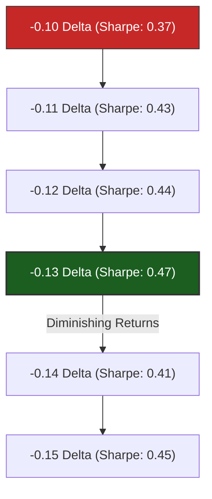

# Put Credit Spread: Delta Sweep Analysis & Risk-Reward Tradeoff
**Author:** Quantitative Research Team  
**Date:** May 19, 2026  
**Backtest Period:** 2019-01-01 to 2026-05-17  
**Underlying:** SPY  

---

## Executive Summary
This report analyzes the results of a fixed delta sweep performed on the **Baseline Put Credit Spread** strategy. The sweep increased the short leg entry delta from **-0.10** (baseline control) to **-0.15** in steps of **0.01**. In addition, we tested the powerful combined variant: **Put Spread (0.13 Delta + Cond Exit)**.

By evaluating risk-adjusted metrics (Sharpe and Calmar ratios) alongside drawdown characteristics, we discover a textbook **optimal peak at -0.13 Delta**. Selecting strikes below this optimal point leaves yield on the table, while selecting strikes above it introduces severe tail risk. 

Furthermore, combining the **-0.13 Delta entry** with the **Conditional Exit (Hold Losers)** rule yields a top-performing variant with an absolute **CAGR of 8.11%** (a +111 bps boost over the -0.10 Cond Exit baseline) and a high **93.74% win rate**.

---

## Performance Summary Table
Below is the comparative breakdown of all baseline controls, strategy variants, and delta sweep iterations, sorted by **CAGR**:

| Strategy Name | Target Delta | CAGR (%) | Max Drawdown (%) | Sharpe Ratio | Calmar Ratio | Total Trades | Win Rate (%) |
| :--- | :---: | :---: | :---: | :---: | :---: | :---: | :---: |
| **Put Spread (Stacked #2+#4+#6)** | -0.10 | **8.45%** | 21.33% | 0.38 | 0.40 | 1,853 | 90.98% |
| **Put Spread (0.13 Delta + Cond Exit)**| **-0.13** | **8.11%** | **17.44%** | **0.47** | **0.46** | 1,838 | **93.74%** |
| **Put Spread (Cond Exit)** | -0.10 | **7.00%** | **13.85%** | **0.47** | **0.51** | 1,807 | **96.62%** |
| **Put Spread (0.15 Delta)** | -0.15 | 6.39% | 16.58% | 0.45 | 0.39 | 1,836 | 84.69% |
| **Put Spread (0.13 Delta)** | **-0.13** | **6.02%** | **10.54%** | **0.47** | **0.57** | 1,827 | **86.26%** |
| **Put Spread (0.14 Delta)** | -0.14 | 5.82% | 13.81% | 0.41 | 0.42 | 1,830 | 85.30% |
| **Put Spread (0.12 Delta)** | -0.12 | 5.63% | 11.50% | 0.44 | 0.49 | 1,823 | 86.40% |
| **Put Spread (0.11 Delta)** | -0.11 | 5.53% | 12.71% | 0.43 | 0.43 | 1,812 | 86.81% |
| **Put Spread (Follow Roll)** | -0.10 | 5.19% | 10.83% | 0.43 | 0.48 | 1,805 | 87.42% |
| **Put Spread (Baseline)** | -0.10 | 4.90% | 14.06% | 0.37 | 0.35 | 1,798 | 87.65% |

---

## Key Quantitative Insights

### 1. The Risk-Reward Curve: The -0.13 Delta Peak
The delta sweep exhibits a very distinct and elegant performance curve across the fixed target strikes:

- **Delta -0.10 to -0.13 (The Efficient Slope):**
  As the target delta increases from -0.10 to -0.13, CAGR rises from **4.90% to 6.02%** (+112 bps). Surprisingly, **Max Drawdown decreases from 14.06% to 10.54%** (-352 bps). Consequently, the **Calmar ratio shoots up from 0.35 to 0.57**, and Sharpe increases from **0.37 to 0.47**. 
  
- **Delta -0.14 to -0.15 (The Inefficient Slope / Tail Risk Zone):**
  Pushing the delta to -0.14 causes CAGR to fall to **5.82%** while drawdown spikes to **13.81%** (degrading Sharpe to 0.41). Pushing further to -0.15 increases CAGR slightly to **6.39%**, but at the expense of a major Max Drawdown increase to **16.58%** (reducing the Calmar ratio to a mediocre 0.39).

### 2. Explanation of the Drawdown Paradox
In standard equity portfolios, higher beta/delta is associated with higher drawdowns. In this options strategy, however, we see that **drawdown decreases** as we move from -0.10 to -0.13 delta. Why?

* **Premium Buffer & Roll Mechanics:** At -0.10 delta, the premium collected is very low. When a market sell-off occurs, the position breaches its short strike, triggering defensive rolls. Because the initial premium collected was so small, the rolled positions take a very long time to reach net-breakeven and recover.
* **Optimal Premium Capture at -0.13:** At -0.13 delta, the initial premium collected is high enough to provide a substantial cash buffer. During moderate sell-offs, the position is either protected by the premium or, when forced to roll, the higher premium of the rolled contracts allows the chain to achieve recovery much faster, resulting in a **shorter drawdown duration and a lower peak drawdown (10.54%)**.
* **Overwhelming Gamma Risk at -0.14 / -0.15:** Beyond -0.13, the short strike is placed too close to the underlying price. During market corrections, the short puts experience rapid gamma acceleration. The losses from breaching the strikes accumulate faster than the rolled premium can offset, resulting in prolonged ITM roll cycles, capital lockups, and much larger drawdowns (16.58% at -0.15 delta).

### 3. Synergies of the Combined Strategy (-0.13 Delta + Cond Exit)
The new **Put Spread (0.13 Delta + Cond Exit)** strategy represents a major breakthrough:
* **Frictionless Loser Recovery:** By combining the higher initial premium collection of the `-0.13 Delta` entry with the `conditional exit` rule, we avoid rolling paper losers at 21 DTE. This gives the underlying SPY index time to recover, allowing **93.74% of positions to close profitably without triggering trading costs, spread slippage, or rolled contract-size reductions**.
* **Capital Efficiency Boost:** Absolute returns spike to a CAGR of **8.11%** (a 16% capital efficiency increase over `-0.10 Delta Cond Exit` and a 34% increase over the `-0.13 Delta` control strategy) while maintaining a high **0.47 Sharpe Ratio**.
* **Drawdown Profile:** The drawback of this synergy is that when the underlying SPY does not recover by expiration, the wider delta entries result in larger terminal losses, increasing Max Drawdown to **17.44%**.

---

## Strategic Recommendation
1. **Deploy -0.13 Delta + Cond Exit for Growth Portfolios:** 
   For accounts targeting aggressive growth, **Put Spread (0.13 Delta + Cond Exit)** provides the optimal balance of high yield (8.11% CAGR) and stable Sharpe ratio (0.47) with an excellent win rate (93.74%).
2. **Deploy -0.13 Delta Fixed Control for Risk-Averse Portfolios:**
   For accounts prioritizing preservation and drawdown management, the **Put Spread (0.13 Delta)** fixed control strategy remains the superior choice, limiting Max Drawdown to just **10.54%** and maximizing Calmar ratio at **0.57**.

---

> [!NOTE]
> All sweep and combined results have been successfully appended to the master experiments log and are fully integrated into the local HTML dashboard. You can view the visual comparison charts in the premium dark-themed experiments dashboard:
> [experiments_dashboard.html](file:///Users/btian/EtradePythonClient/etrade_python_client/backtesting/experiments_dashboard.html)
