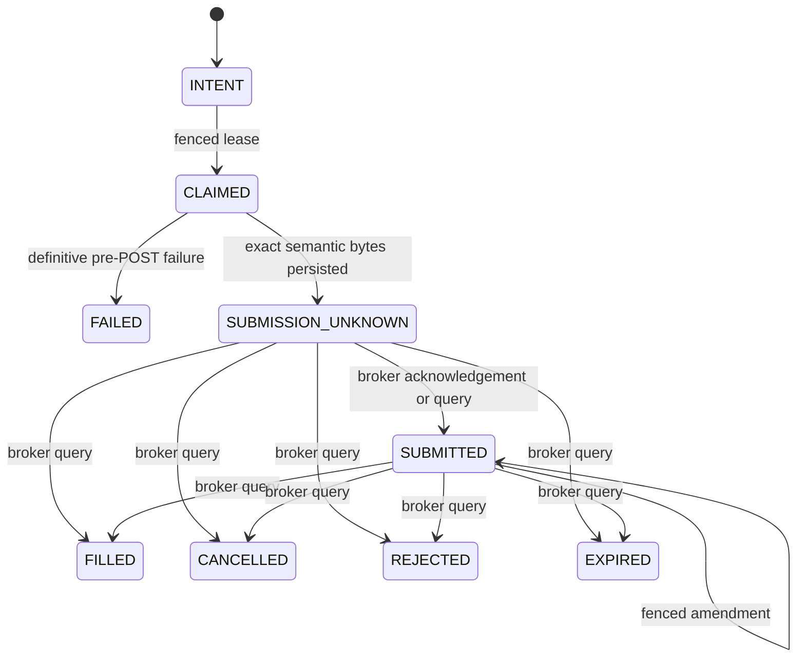

# Durable Order Intent Ledger

**Delivery status:** R7a isolated foundation

**Production status:** not connected to live E*TRADE mutation paths

`live_trading/order_intent_ledger.py` is the durable, broker-agnostic state
machine for order identity, capacity reservation, fencing, and ambiguous broker
outcomes. It performs no network I/O. R7a deliberately does not instantiate the
ledger from the live agent, so it provides no protection to the current order
paths until R7b makes one E*TRADE gateway the sole mutation owner.

## Supported scope

- Explicit `sandbox` or `production` environment and exact account identity.
- Two-leg vertical option spreads with one buy leg and one sell leg.
- Opening credit and debit spreads whose price direction and maximum exposure
  can be derived from immutable order fields.
- No new closing orders until R7b supplies typed position and open-order
  capacity evidence. Previously persisted closing orders remain readable and
  reconcilable after migration, but cannot be newly claimed or amended.
- No equity orders, naked opening options, arbitrary multi-leg spreads, bulk
  cancellation, or terminal reservation release. Unsupported operations fail
  closed.

## State and crash boundary

The gateway must persist `SUBMISSION_UNKNOWN` or an in-doubt amendment
immediately before the corresponding broker mutation. A timeout, malformed
response, process crash, or expired post-capable lease never returns the intent
to a retryable state. A broker query must reconcile it first.

## Enforced invariants

- An idempotency scope/key is permanently bound to one immutable economic
  envelope. Stable client order IDs include account and environment identity.
- Client IDs and broker order IDs cannot be rebound across original orders,
  active amendments, or immutable amendment history.
- Submission and amendment leases use monotonic fencing tokens. Stale workers
  cannot begin, release, acknowledge, or overwrite newer work, even when the
  owner name is reused.
- `BEGIN IMMEDIATE` serializes account-capacity decisions and state
  transitions. New account mutations stop while any submission or amendment is
  unresolved.
- Opening reservations use fresh, typed quote, portfolio, and buying-power
  evidence. The caller's asserted maximum loss cannot be below the exposure
  derived from strike width, price, contract multiplier, and quantity.
- An opening terminal state retains its reservation as
  `FILLED_PENDING_ABSORPTION`. R7a never releases it: neither a newer timestamp
  nor a different account digest proves that a specific partial or terminal
  fill is reflected in positions. R7b must add order-bound position evidence.
- Evidence dataclasses and their security-critical string, timestamp, integer,
  byte, and `Decimal` fields must use exact built-in types. Subclass overrides
  cannot replace validation or comparison behavior.
- Preparation returns a frozen `OutboundAuthorization` containing immutable
  serialized broker-schema bytes. `begin_submission` and `begin_amendment`
  recompute the durable payload, client ID, operation, owner, and fence, then
  persist the exact authorization in the same transaction that enters the
  in-doubt state. R7b must deterministically derive the final E*TRADE XML from
  these bytes and the broker preview ID.
- Order events, broker-order history, amendment history, and outbound
  authorizations are append-only.
- The ledger database must live in an owner-only `0700` directory and remain an
  owner-only regular `0600` file. SQLite sidecars receive the same validation.

## Schema policy

Schema 9 adds append-only outbound authorizations. The only supported migration
is the additive schema 8 to 9 transition, which is restart-safe and tested.
Unknown versions fail closed. Before any future production migration, the
operator runbook must add an atomic backup, integrity check, rollback exercise,
and an explicit version-by-version migration.

## R7b release gates

R7a must not be used as evidence that live execution is production-ready. R7b
must satisfy all of the following before any order-capable process is enabled:

1. A private E*TRADE transport is the only module allowed to call order
   `POST`, `PUT`, or `DELETE` endpoints.
2. The transport derives the exact request body only from the immutable
   authorization plus the broker preview ID; strategy code never receives a
   mutable executable payload.
3. Broker response parsing and `BrokerEvidence` construction are private to the
   gateway. Application callers cannot assert their own reconciliation result.
4. Startup reconciles every durable blocker before accepting a new mutation.
5. Submission, closing-position capacity, terminal position absorption,
   repricing, and per-intent cancellation have durable, crash-tested protocols.
   Bulk cancellation remains disabled.
6. The R6 production arm and exact account identity are revalidated immediately
   before each broker mutation.
7. Static enforcement rejects direct legacy order mutations outside the private
   transport.
8. Broker-fixture tests cover duplicate commands, crash-before/after-POST,
   unknown responses, malformed replies, stale arm/account/capacity evidence,
   amendment/cancel races, partial fills, and restart reconciliation.

The R7a focused suite contains 32 deterministic tests. Independent causal and
security reviews found no remaining reproducible core path to double-submit,
exceed the reservation cap, release opening exposure early, reuse an identifier,
or substitute a different authorized economic payload.
