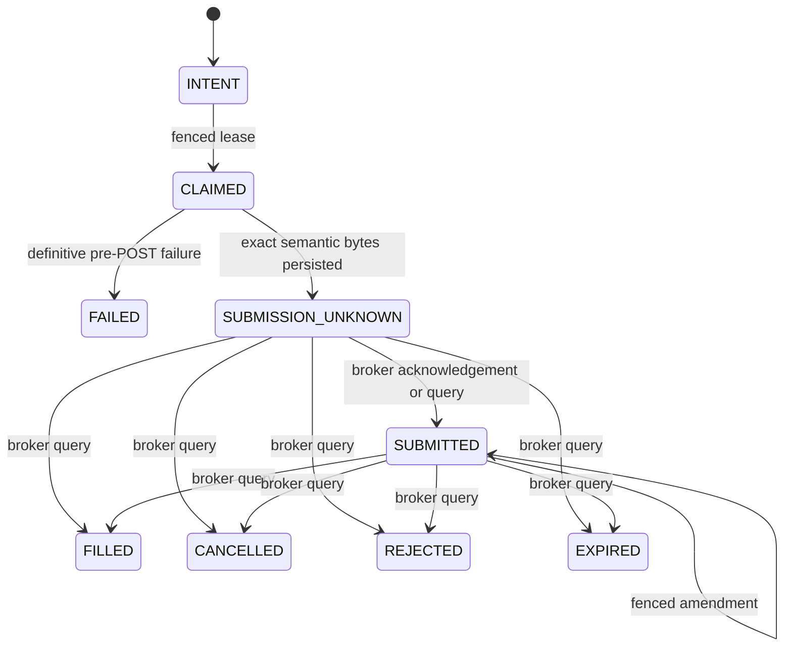

# Durable Order Intent Ledger

**Delivery status:** R7a ledger + R7b transport + R7c coordinator, isolated

**Production status:** not connected to live E*TRADE mutation paths

`live_trading/order_intent_ledger.py` is the durable, broker-agnostic state
machine for order identity, capacity reservation, fencing, and ambiguous broker
outcomes. It performs no network I/O. `etrade_broker_transport.py` now owns the
reviewed no-retry mutation exchange, and `etrade_order_gateway.py` coordinates
opening submissions, price-only amendments, and restart reconciliation. The
live agent still instantiates none of them, so this stack does not yet protect
the current legacy order paths.

## Supported scope

- Explicit `sandbox` or `production` environment and exact account identity.
- Two-leg vertical option spreads with one buy leg and one sell leg.
- Opening credit and debit spreads whose price direction and maximum exposure
  can be derived from immutable order fields.
- No new closing orders until a later slice supplies typed position and open-order
  capacity evidence. Previously persisted closing orders remain readable and
  reconcilable after migration, but cannot be newly claimed or amended.
- No equity orders, naked opening options, arbitrary multi-leg spreads, bulk
  cancellation, or terminal reservation release. Unsupported operations fail
  closed.

## State and crash boundary

The transport persists the exact send attempt and transitions to
`SUBMISSION_UNKNOWN` or an in-doubt amendment immediately before the
corresponding broker mutation. A timeout, malformed response, process crash, or
expired post-capable lease never returns the intent to a retryable state. A
broker query for a durably known broker order ID must prove the exact authorized
economic payload before reconciliation. Because E*TRADE does not echo
`clientOrderId`, an ambiguous placement without a durable broker order ID
remains blocked rather than guessed or retried.

## Enforced invariants

- An idempotency scope/key is permanently bound to one immutable economic
  envelope. Stable client order IDs include account and environment identity.
- Client IDs and broker order IDs cannot be rebound across original orders,
  active amendments, or immutable amendment history.
- Submission and amendment leases use monotonic fencing tokens. Stale workers
  cannot begin, release, acknowledge, or overwrite newer work, even when the
  owner name is reused.
- `BEGIN IMMEDIATE` serializes account-capacity decisions and state
  transitions. New account mutations stop while any submission or amendment is
  unresolved.
- Opening reservations use fresh, typed quote, portfolio, and buying-power
  evidence. The caller's asserted maximum loss cannot be below the exposure
  derived from strike width, price, contract multiplier, and quantity.
- An opening terminal state retains its reservation as
  `FILLED_PENDING_ABSORPTION`. R7a never releases it: neither a newer timestamp
  nor a different account digest proves that a specific partial or terminal
  fill is reflected in positions. R7b must add order-bound position evidence.
- Evidence dataclasses and their security-critical string, timestamp, integer,
  byte, and `Decimal` fields must use exact built-in types. Subclass overrides
  cannot replace validation or comparison behavior.
- Preparation returns a frozen `OutboundAuthorization` containing immutable
  serialized broker-schema bytes. The transport deterministically derives the
  final E*TRADE XML from those bytes and a durably recorded preview ID. Every
  preview/place send is uniquely claimed before I/O; every parsed response is
  recorded before it can update or leave the durable state machine.
- The coordinator requires one immutable account-level opening-risk ceiling.
  Strategy commands cannot raise it. Reconciliation requires the reader's
  normalized order payload to match the durable original, pending amendment, or
  latest completed amendment hash.
- Order events, broker-order history, amendment history, outbound
  authorizations, transport attempts, preview receipts, and response receipts
  are append-only.
- The ledger database must live in an owner-only `0700` directory and remain an
  owner-only regular `0600` file. SQLite sidecars receive the same validation.

## Schema policy

Schema 10 adds append-only transport attempts, broker-preview receipts, and
parsed transport-response receipts. Additive schema 8→9→10 migration is
restart-safe and tested. Unknown versions fail closed. Before any production
migration, the operator runbook must add an atomic backup, integrity check,
rollback exercise, and an explicit version-by-version migration.

## Remaining production release gates

The isolated R7 stack must not be used as evidence that live execution is
production-ready. The following remain required before any order-capable
process is enabled:

1. A concrete private reader must pin the exact E*TRADE origin, runtime
   boundary, environment, and account; completely paginate account/order data;
   persist origin-bound raw/parser receipts; and atomically bind durable read
   evidence to reconciliation and capacity decisions.
2. Position-level fill evidence must safely absorb terminal opening
   reservations, including partial fills, replacements, assignment/exercise,
   and zero-fill proof for cancelled/rejected/expired orders.
3. Closing-position capacity and one-shot per-intent cancellation need durable,
   crash-tested protocols. Bulk cancellation remains disabled.
4. The live composition root must construct the exact ledger, reader,
   transport, and coordinator, and static enforcement must reject direct legacy
   order mutations outside that root.
5. Sandbox restart/crash fixtures must cover pagination drift, stale evidence,
   every nonterminal/terminal broker status, replacement chains, cancellation,
   closing, and process death at each durable/I/O boundary.
6. Operational migration needs a private database backup, integrity check,
   rollback drill, credential rotation/history purge, deployment restart, and
   observation of the exact served/live artifacts.

The current focused ledger/transport/coordinator suite contains 88 deterministic
tests. Independent adversarial reviews found no remaining reproducible
mutation-core path to double-submit, exceed the gateway-owned reservation
ceiling, release opening exposure early, reuse an identifier, substitute a
different authorized economic payload, or clear an amendment merely because
the old broker order is still open. This is source verification only; the
durable reader and live migration gates above remain open.
