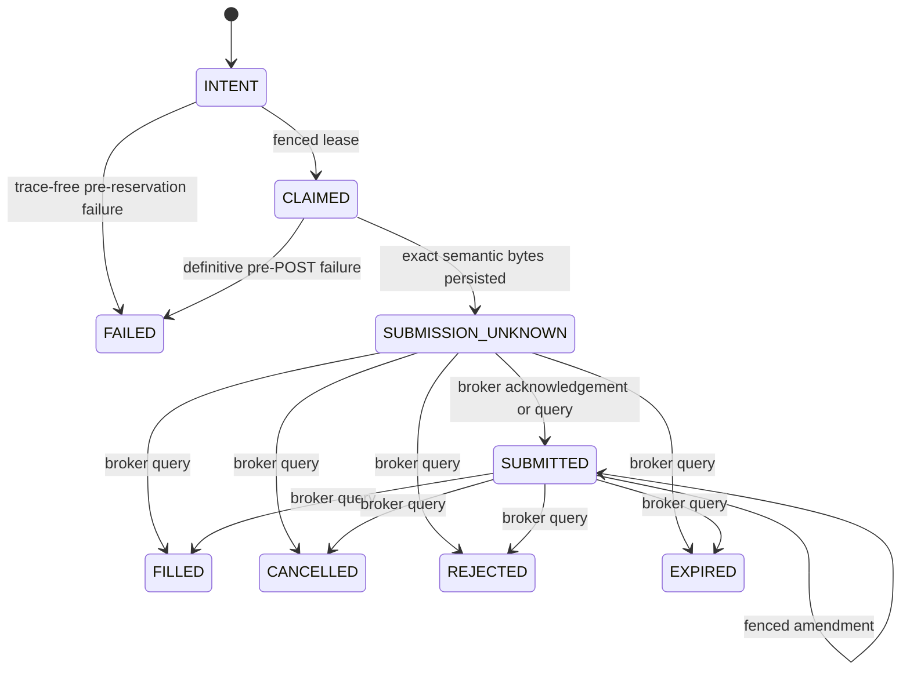

# Durable Order Intent Ledger

**Delivery status:** schema-19 durable execution core, including the historical
schema-16 non-authorizing opening-risk lineage, schema-17 collision guards,
schema-18 account/daily-capacity policy, schema-19 capacity-policy V2,
crash-safe cancellation, exact closing-capacity reservations, terminal
absorption, legacy mutation quarantine, and one narrow supervised
manual-opening composition

**Production status:** SPY/SPX manual credit-spread opening is source-composed
but has not completed a live or sandbox E*TRADE lifecycle; unattended
production trading is not ready

`live_trading/order_intent_ledger.py` is the durable, broker-agnostic state
machine for order identity, capacity reservation, fencing, and ambiguous broker
outcomes. It performs no network I/O. `etrade_broker_transport.py` owns the
reviewed no-retry mutation exchange, `etrade_broker_reader.py` owns the exact
origin-bound GET surface, and `etrade_order_gateway.py` coordinates opening and
closing submissions, opening price-only amendments, per-order cancellation,
and restart reconciliation. The gateway has no public transport property, and
the static mutation boundary confines each exact transport call to one reviewed
private gateway method.

`live_trading/execution_runtime.py` is the sole order-capable composition root.
After schema-2 opt-in and an independently valid environment/account/runtime
safety boundary, it constructs the private ledger, reader, transport, and
gateway, reconciles the gateway, and returns only `ManualOpenService`. That
service can issue a signed short-lived proposal and submit one reviewed
SPY/SPX opening command. It does not expose the transport or the gateway's
closing, cancellation, or repricing methods. Every legacy execute, close,
neutralize, queue/fast-worker, and automatic-strategy path remains an
unconditional tombstone.

## Supported scope

The durable gateway's isolated domain is broader than the capability composed
into the dashboard:

- Explicit `sandbox` or `production` environment and exact account identity.
- Two-leg vertical option spreads with one buy leg and one sell leg.
- Opening credit and debit spreads whose price direction and maximum exposure
  can be derived from immutable order fields.
- Closing credit and debit verticals only when a complete schema-v3 capacity
  read proves both exact OSI contracts, standard 100-share multipliers,
  non-adjusted deliverables, directionally compatible positions, available
  lots, and all active closing orders. An immutable position-capacity
  reservation is created atomically with the intent before preview.
- At most one unabsorbed durable close may touch an exact contract. This keeps a
  later full-fill position delta attributable to one reservation rather than
  guessing across simultaneous closes.
- A one-shot cancellation is supported for known zero-fill opening and closing
  orders. The broker's accepted-cancel warning is nonterminal; capacity remains
  reserved until a later direct order read proves a terminal result.
- Exact zero-fill cancellation/rejection/expiration and exact full-fill
  position absorption are supported for both exposure directions. Partial
  fills, replacement chains, transformed lots, assignment/exercise, and
  ambiguous position evidence remain blocked.
- No equity orders, naked options, arbitrary multi-leg spreads, closing
  amendments, or bulk cancellation. Unsupported operations fail closed.

The currently composed dashboard capability is narrower:

- only `SPY` or `SPX` (`SPX`/`SPXW` broker symbols), `PUT` or `CALL`;
- exactly two standard option legs, `SELL_OPEN` plus `BUY_OPEN`, as a
  `NET_CREDIT`, `GOOD_FOR_DAY` vertical;
- proposal issuance only during an open NYSE regular session;
- one retained, origin-pinned E*TRADE quote response whose two exact contracts
  both have `quoteStatus=REALTIME`, usable non-crossed bid/ask values, exchange
  timestamps no more than five seconds apart, and age within the configured
  quote limit;
- a limit credit derived from the exact two-leg midpoint and sealed, together
  with the quote receipt/snapshot hashes and per-leg timestamps, into an
  HMAC-signed proposal whose expiry is bounded by the oldest quote;
- authenticated operator confirmation with the independent action PIN,
  quantity and per-order loss checks, and proposal-bound durable idempotency;
  and
- exactly one `submit_opening` call through the durable gateway, where a fresh
  account-capacity read is obtained before reservation and may still deny the
  order without broker mutation.

Debit openings, closes, neutralization, cancellation, and price changes are
not exposed by this service. In particular, the gateway's isolated
price-amendment machinery does not make repricing available to the dashboard.
The signed `proposal_id` is the durable idempotency key. The browser-generated
UUID `request_id` only correlates one HTTP request/response and cannot create a
second durable order for the same proposal.

## State and crash boundary



The transport persists the exact send attempt and transitions to
`SUBMISSION_UNKNOWN` or an in-doubt amendment immediately before the
corresponding broker mutation. A timeout, malformed response, process crash, or
expired post-capable lease never returns the intent to a retryable state. A
broker query for a durably known broker order ID must prove the exact authorized
economic payload before reconciliation. Because E*TRADE does not echo
`clientOrderId`, an ambiguous placement without a durable broker order ID
remains blocked rather than guessed or retried.

## Enforced invariants

- An idempotency scope/key is permanently bound to one immutable economic
  envelope. Stable client order IDs include account and environment identity.
- Client IDs and broker order IDs cannot be rebound across original orders,
  active amendments, or immutable amendment history.
- Submission and amendment leases use monotonic fencing tokens. Stale workers
  cannot begin, release, acknowledge, or overwrite newer work, even when the
  owner name is reused.
- `BEGIN IMMEDIATE` serializes account-capacity decisions and state
  transitions. New account mutations stop while any submission or amendment is
  unresolved.
- Fresh schema-19 opening reservations require an exact allowed
  `OPENING_MAX_LOSS_V2` capacity decision. For an otherwise supported
  capacity-v3 account snapshot, the usable account cap is:

  ```text
  min(
    raw broker buying power,
    max(
      0,
      immutable account budget
        - external position risk
        - external order risk
        - represented managed filled risk
    )
  )
  ```

  Active local reservations are not folded into that formula; `reserve_margin`
  subtracts them separately and atomically when deciding whether the new
  reservation fits. The policy never adds represented risk back to broker
  buying power. Unsupported or ambiguous positions, orders, or managed states
  produce a zero cap.
- The immutable account budget and daily budget are independent checks.
  `max_account_open_risk_cents` bounds current account opening exposure.
  `max_daily_loss_cents` is retained under its compatibility name but means a
  New York calendar-day ceiling on newly authorized maximum loss. It is not
  realized or marked P&L, is not a “trading-day” counter, and is not reduced to
  the lesser of the account budget. Every reservation created during that
  calendar-day window consumes daily authorization; a later failed, rejected,
  cancelled, or released reservation does not refund it.
- Opening reservations use fresh, typed quote, portfolio, and buying-power
  evidence. Their caller-asserted maximum loss cannot be below the exposure
  derived from strike width, price, contract multiplier, and quantity. The
  supervised manual-open composition first validates its signed exact
  two-leg quote proposal, quantity, and per-order loss ceiling, then asks the
  gateway for fresh capacity at final submit. Proposal issuance itself does
  not read capacity, and an apparently valid confirmation may therefore fail
  safely before any broker send. This path remains outside the complete
  pure-risk proof: full portfolio Greeks, concentration, marked daily P&L, and
  regime authorization are not composed, and schema-2 opt-in plus operator
  confirmation do not fill that evidence gap.
- Schema 15 can atomically persist an exact allowed `RiskDecision`, its
  request/policy/aggregate and component evidence hashes, exact standard
  vertical payload/economics, account identity, capacity decision/manifest,
  portfolio state digest, and calculated collateral/max-loss amounts. The
  append-only record is deliberately `INDEPENDENT_EVIDENCE_PENDING`; it creates
  no margin reservation, consumes no account cap, and cannot be claimed,
  previewed, or placed. Current durable reads do not independently replay raw
  quotes or the portfolio open-risk, concentration, delta, daily-limit, and
  conflict-set aggregates consumed by policy; a caller-supplied digest is not
  promoted to broker evidence. A future promotion must atomically revalidate
  fresh independent evidence and reserve capacity rather than upgrading this
  historical proof in place.
- Schema 16 adds an append-only, evidence-only quote and aggregate lineage. It
  retains the exact E*TRADE quote-response bytes, credential-free route/query,
  request and response times, raw-response hash, and installed parser
  schema/code/config hashes. The ledger reruns the strict parser before
  accepting the receipt, requires exactly the two unadjusted standard
  contracts in the opening vertical, and cross-binds the resulting
  `QuoteSnapshotEvidence` to the schema-15 prerequisite.
- The schema-16 lineage independently replays the complete capacity-v3
  manifest and records the broker buying power, exact option positions,
  requested-contract position conflicts, requested-contract active-order
  conflicts, and the ledger's currently retained reservation/claim subset.
  These are diagnostics, not placement authority. The row is append-only and
  can only be `INDEPENDENT_EVIDENCE_PENDING`.
- The current manual proposal path separately composes the reviewed broker
  reader and the same strict retained-byte quote parser to authorize only the
  proposal's two-leg economics. That does not upgrade a historical schema-16
  pure-risk prerequisite, prove the missing portfolio aggregates below, or
  make the V2 regime advisory an execution authorization.
- The following policy inputs still cannot be completely reconstructed from
  the retained E*TRADE fields: risk of pre-existing broker positions, risk of
  active broker opening orders, full portfolio and symbol delta, marked daily
  P&L including fees/commissions, and exchange-session daily order/new-risk
  counters across legacy paths. Schema 16 persists these exact typed blockers:
  `BROKER_POSITION_OPEN_RISK_NOT_REPLAYABLE`,
  `BROKER_OPEN_ORDER_OPEN_RISK_NOT_REPLAYABLE`,
  `PORTFOLIO_DELTA_NOT_REPLAYABLE`, `SYMBOL_DELTA_NOT_REPLAYABLE`,
  `DAILY_PNL_NOT_REPLAYABLE`, and
  `DAILY_SESSION_BOUNDARY_NOT_DURABLE`. The offline-only slice also records
  `QUOTE_ACQUISITION_CHANNEL_NOT_COMPOSED` and
  `QUOTE_MARKET_DATA_ENTITLEMENT_NOT_DURABLE`: retained bytes and a credential-
  free request hash are not proof that the future live collector used the
  reviewed OAuth/runtime boundary or held the required market-data rights.
  Stale prerequisite evidence adds
  `PREREQUISITE_STALE_AT_LINEAGE_RECORD`.
- Closing reservations are content-addressed and bind the intent payload to the
  complete capacity evidence, exact contracts/lots, active broker closes, and
  projected post-fill positions. A second process cannot reserve an overlapping
  contract. A never-claimed reservation whose evidence expires can only become
  an append-only `FAILED`/void outcome; the same idempotency key stays bound,
  and a new attempt needs a fresh key and fresh evidence.
- An opening terminal state retains its reservation as
  `FILLED_PENDING_ABSORPTION`. Schema 12 releases it only after a fresh,
  exact order re-query proves either zero filled quantity with complete cancel
  arithmetic, or a complete balanced fill whose order-bound position lots are
  present in a newer stable portfolio snapshot. Full-fill margin remains in
  account risk utilization after release, so restart cannot recycle it into a
  new opening order.
- A closing terminal state likewise retains its immutable claim. A complete
  zero-fill terminal read releases it without a portfolio read. A full fill
  requires a capacity-v3 request that began after the terminal evidence and
  proves the exact before/after quantity change for both contracts. Release is
  an immutable absorption receipt; partial, replacement-linked, or conflicting
  evidence stays blocked.
- Evidence dataclasses and their security-critical string, timestamp, integer,
  byte, and `Decimal` fields must use exact built-in types. Subclass overrides
  cannot replace validation or comparison behavior.
- Preparation returns a frozen `OutboundAuthorization` containing immutable
  serialized broker-schema bytes. The transport deterministically derives the
  final E*TRADE XML from those bytes and a durably recorded preview ID. Every
  preview/place send is uniquely claimed before I/O; every parsed response is
  recorded before it can update or leave the durable state machine.
- The coordinator requires one immutable account-level opening-risk ceiling.
  Strategy commands cannot raise it. Reconciliation requires the reader's
  normalized order payload to match the durable original, pending amendment, or
  latest completed amendment hash.
- Capacity can be set only from a content-addressed broker-read manifest. A
  complete manifest brackets two independent scans with exact account-list
  reads; fully traverses balance, every portfolio page, and all reviewed active
  order status lanes; and requires both economic scans to match. Moving balance
  effective timestamps are freshness-checked separately from economic
  stability.
- Every usable broker GET is pinned to the configured E*TRADE origin and exact
  account, has no redirects/retries/ambient session state, runs in a bounded
  disposable process, and is persisted before its result can leave the reader.
  The ledger deterministically reruns the installed parser over the raw bytes
  before accepting the normalized receipt.
- Known-order reconciliation performs only the direct lookup for the already
  durable broker order ID. A 404, partial fill, replacement ambiguity, payload
  mismatch, or undocumented shape remains unresolved and cannot clear a
  blocker.
- Order events, broker-order history, amendment history, outbound
  authorizations, transport attempts, preview receipts, mutation responses,
  broker-read responses, read manifests, and capacity decisions are
  append-only.
- SQLite conflict resolution is part of that boundary. Every append-only row
  has an exact `BEFORE INSERT` collision guard over its primary identity and
  every declared alternate unique identity, so `REPLACE`, `INSERT OR REPLACE`,
  and other colliding inserts cannot delete the old row before the
  update/delete guards run.
- The ledger database must live in an owner-only `0700` directory and remain an
  owner-only regular `0600` file. SQLite sidecars receive the same validation.

### Durable-table inventory

The complete append-only/immutable inventory is:

- `order_events`, `broker_order_history`, and `amendment_history`;
- `outbound_authorizations`, `transport_send_attempts`,
  `broker_preview_receipts`, and `transport_response_receipts`;
- `broker_read_receipts`, `broker_read_manifests`,
  `broker_read_manifest_members`, and `capacity_decisions`;
- `opening_risk_prerequisites`, `opening_quote_receipts`, and
  `opening_risk_lineages`;
- `reservation_absorptions`, `closing_reservations`,
  `closing_reservation_voids`, and `closing_reservation_absorptions`; and
- `cancel_authorizations`, `cancel_send_attempts`,
  `cancel_response_receipts`, and `cancel_resolutions`.

`order_intents`, `margin_reservations`, and `order_cancellations` are durable
state-machine rows, not append-only evidence. Their reviewed transitions remain
ordinary `UPDATE`s, while deletion and colliding reinsertion are forbidden so
conflict resolution cannot reset the state machine or rebind its immutable
identity. `reservation_caps` and `amendment_leases` are explicitly mutable
operational projections; the former advances through a checked upsert and the
latter is acquired, updated, and deleted through its lease protocol.
`ledger_metadata` is mutable only inside an attested schema migration.

## Schema policy

Schema 16 added append-only `opening_quote_receipts` and
`opening_risk_lineages`, while retaining schema-15
`opening_risk_prerequisites` and exact intent, capacity-decision, and manifest
cross-binding guards. These rows are persistence prerequisites, never
placement authority or capacity claims. Schema 17 added collision guards for
the complete immutable/durable inventory and made current-schema trigger loss
a startup error.

Schema 18 added the capacity-v3 account-wide policy record: independent
account and New York calendar-day authorization budgets, replayable policy
inputs, external position/order risk, represented managed risk, and immutable
policy/decision hashes. Its original `OPENING_MAX_LOSS_V1` arithmetic is now
superseded because it could add represented managed risk back to broker buying
power and did not subtract that represented risk from the account budget.

Schema 19 makes `OPENING_MAX_LOSS_V2` the only policy that can authorize a
fresh reservation or submission claim. V1 rows remain immutable and are
accepted only for exact historical replay and reconciliation. During the
18→19 migration:

- a V1 opening reservation in `INTENT` with no fence, broker ID, lease,
  authorization, send attempt, preview/response receipt, broker-order history,
  or other submission trace is moved to `FAILED` and released with explicit
  schema-19 migration provenance; and
- any V1 reservation with a submission trace is moved to
  `SUBMISSION_UNKNOWN`, keeps its risk reserved, and requires reconciliation.

No migration guesses that a traced request was not sent. Fresh schema 19 and
genuine schema 8–18 migrations install and verify the complete exact trigger
set. Additive migration is one explicit SQLite transaction and verifies
required columns, foreign keys, append-only triggers, journal mode,
foreign-key integrity, and `quick_check` before version promotion. Unknown or
malformed schemas fail closed. An already-versioned schema-19 database with a
missing or altered required trigger is treated as tampered and refuses
startup; initialization does not silently repair current-schema evidence
guards. A production operator must still take an atomic private backup and
complete a rollback drill before migration.

Schema 8/9 opening intents that predate durable reservations are migrated with
a conservative reservation equal to their immutable maximum exposure. Live
states remain active and terminal states remain pending absorption. Those
records have no fabricated capacity decision: full-fill absorption therefore
stays blocked, while a fresh exact zero-fill terminal can still release risk.

## Remaining production release gates

The narrow supervised composition must not be used as evidence that unattended
live execution is production-ready. The following remain required before that
broader production claim:

1. Partial fills, replacements, transformed lots, and assignment/exercise
   remain unsupported and blocked; supervised recovery procedures are still
   required for those states.
2. Bulk cancellation and closing-order repricing remain disabled. Their absence
   must be explicit in the operator UI and runbook.
3. The reviewed composition root now constructs the exact ledger, reader,
   transport, and coordinator only for supervised manual opening, while
   returning the narrow service rather than its collaborators. Static
   containment must continue to reject transport bypass, reflection, legacy
   mutation, and tombstone drift.
4. Full opening authorization still needs the missing independent aggregate
   sources named above. Schema 19 safely caps the narrower manual path, but it
   does not compose the full pure policy for Greeks, concentration, marked
   P&L, or regime authorization. A later promotion must keep historical
   records immutable, revalidate fresh complete evidence, and atomically
   create a separate authorization plus capacity reservation before the
   repository can claim independently evidenced unattended entry.
5. Sandbox restart/crash fixtures must cover pagination drift, stale evidence,
   every nonterminal/terminal broker status, replacement chains, cancellation,
   closing, and process death at each durable/I/O boundary.
6. Operational migration needs a private database backup, integrity check,
   rollback drill, credential rotation/history purge, deployment restart, and
   observation of the exact served/live artifacts.

The focused ledger/reader/transport/coordinator suites exercise raw-parser
binding, pagination and marker drift, lot-aware two-scan stability, schema
rollback, exact payload/fill reconciliation, terminal absorption, retained
filled risk, closing-contract capacity, one-shot cancellation, mutation
fencing, and crash/timeout behavior. R7f adds mutation-boundary, dashboard,
legacy-tombstone, deployment-containment, and real local-handler visual
verification. This is source verification only. The supervised manual-open
composition has not been proven through an E*TRADE sandbox or live
preview/place/fill/reconciliation/restart cycle; partial/complex terminal
states, complete independent risk evidence, and operational migration gates
above remain open.
