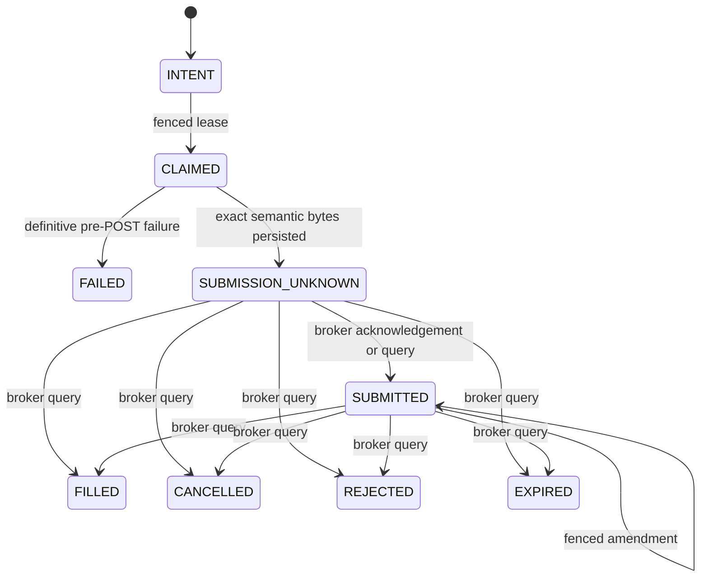

# Durable Order Intent Ledger

**Delivery status:** R7 durable execution core plus schema-15 non-authorizing
opening-risk persistence, crash-safe cancellation, exact closing-capacity
reservations, terminal absorption, and legacy mutation quarantine, isolated

**Production status:** not connected to live E*TRADE mutation paths

`live_trading/order_intent_ledger.py` is the durable, broker-agnostic state
machine for order identity, capacity reservation, fencing, and ambiguous broker
outcomes. It performs no network I/O. `etrade_broker_transport.py` owns the
reviewed no-retry mutation exchange, `etrade_broker_reader.py` owns the exact
origin-bound GET surface, and `etrade_order_gateway.py` coordinates opening and
closing submissions, opening price-only amendments, per-order cancellation,
and restart reconciliation. The gateway has no public transport property, and
the static mutation boundary confines each exact transport call to one reviewed
private gateway method. The live agent still instantiates none of these
components. Every known legacy mutation path is an unconditional tombstone, so
the current source remains read-only rather than silently falling back around
the durable stack.

## Supported scope

- Explicit `sandbox` or `production` environment and exact account identity.
- Two-leg vertical option spreads with one buy leg and one sell leg.
- Opening credit and debit spreads whose price direction and maximum exposure
  can be derived from immutable order fields.
- Closing credit and debit verticals only when a complete schema-v3 capacity
  read proves both exact OSI contracts, standard 100-share multipliers,
  non-adjusted deliverables, directionally compatible positions, available
  lots, and all active closing orders. An immutable position-capacity
  reservation is created atomically with the intent before preview.
- At most one unabsorbed durable close may touch an exact contract. This keeps a
  later full-fill position delta attributable to one reservation rather than
  guessing across simultaneous closes.
- A one-shot cancellation is supported for known zero-fill opening and closing
  orders. The broker's accepted-cancel warning is nonterminal; capacity remains
  reserved until a later direct order read proves a terminal result.
- Exact zero-fill cancellation/rejection/expiration and exact full-fill
  position absorption are supported for both exposure directions. Partial
  fills, replacement chains, transformed lots, assignment/exercise, and
  ambiguous position evidence remain blocked.
- No equity orders, naked options, arbitrary multi-leg spreads, closing
  amendments, or bulk cancellation. Unsupported operations fail closed.

## State and crash boundary

The transport persists the exact send attempt and transitions to
`SUBMISSION_UNKNOWN` or an in-doubt amendment immediately before the
corresponding broker mutation. A timeout, malformed response, process crash, or
expired post-capable lease never returns the intent to a retryable state. A
broker query for a durably known broker order ID must prove the exact authorized
economic payload before reconciliation. Because E*TRADE does not echo
`clientOrderId`, an ambiguous placement without a durable broker order ID
remains blocked rather than guessed or retried.

## Enforced invariants

- An idempotency scope/key is permanently bound to one immutable economic
  envelope. Stable client order IDs include account and environment identity.
- Client IDs and broker order IDs cannot be rebound across original orders,
  active amendments, or immutable amendment history.
- Submission and amendment leases use monotonic fencing tokens. Stale workers
  cannot begin, release, acknowledge, or overwrite newer work, even when the
  owner name is reused.
- `BEGIN IMMEDIATE` serializes account-capacity decisions and state
  transitions. New account mutations stop while any submission or amendment is
  unresolved.
- Legacy opening reservations use fresh, typed quote, portfolio, and
  buying-power evidence. Their caller-asserted maximum loss cannot be below the
  exposure derived from strike width, price, contract multiplier, and
  quantity. They remain outside the new pure-risk proof and no production
  composition root uses either path.
- Schema 15 can atomically persist an exact allowed `RiskDecision`, its
  request/policy/aggregate and component evidence hashes, exact standard
  vertical payload/economics, account identity, capacity decision/manifest,
  portfolio state digest, and calculated collateral/max-loss amounts. The
  append-only record is deliberately `INDEPENDENT_EVIDENCE_PENDING`; it creates
  no margin reservation, consumes no account cap, and cannot be claimed,
  previewed, or placed. Current durable reads do not independently replay raw
  quotes or the portfolio open-risk, concentration, delta, daily-limit, and
  conflict-set aggregates consumed by policy; a caller-supplied digest is not
  promoted to broker evidence. A future promotion must atomically revalidate
  fresh independent evidence and reserve capacity rather than upgrading this
  historical proof in place.
- Closing reservations are content-addressed and bind the intent payload to the
  complete capacity evidence, exact contracts/lots, active broker closes, and
  projected post-fill positions. A second process cannot reserve an overlapping
  contract. A never-claimed reservation whose evidence expires can only become
  an append-only `FAILED`/void outcome; the same idempotency key stays bound,
  and a new attempt needs a fresh key and fresh evidence.
- An opening terminal state retains its reservation as
  `FILLED_PENDING_ABSORPTION`. Schema 12 releases it only after a fresh,
  exact order re-query proves either zero filled quantity with complete cancel
  arithmetic, or a complete balanced fill whose order-bound position lots are
  present in a newer stable portfolio snapshot. Full-fill margin remains in
  account risk utilization after release, so restart cannot recycle it into a
  new opening order.
- A closing terminal state likewise retains its immutable claim. A complete
  zero-fill terminal read releases it without a portfolio read. A full fill
  requires a capacity-v3 request that began after the terminal evidence and
  proves the exact before/after quantity change for both contracts. Release is
  an immutable absorption receipt; partial, replacement-linked, or conflicting
  evidence stays blocked.
- Evidence dataclasses and their security-critical string, timestamp, integer,
  byte, and `Decimal` fields must use exact built-in types. Subclass overrides
  cannot replace validation or comparison behavior.
- Preparation returns a frozen `OutboundAuthorization` containing immutable
  serialized broker-schema bytes. The transport deterministically derives the
  final E*TRADE XML from those bytes and a durably recorded preview ID. Every
  preview/place send is uniquely claimed before I/O; every parsed response is
  recorded before it can update or leave the durable state machine.
- The coordinator requires one immutable account-level opening-risk ceiling.
  Strategy commands cannot raise it. Reconciliation requires the reader's
  normalized order payload to match the durable original, pending amendment, or
  latest completed amendment hash.
- Capacity can be set only from a content-addressed broker-read manifest. A
  complete manifest brackets two independent scans with exact account-list
  reads; fully traverses balance, every portfolio page, and all reviewed active
  order status lanes; and requires both economic scans to match. Moving balance
  effective timestamps are freshness-checked separately from economic
  stability.
- Every usable broker GET is pinned to the configured E*TRADE origin and exact
  account, has no redirects/retries/ambient session state, runs in a bounded
  disposable process, and is persisted before its result can leave the reader.
  The ledger deterministically reruns the installed parser over the raw bytes
  before accepting the normalized receipt.
- Known-order reconciliation performs only the direct lookup for the already
  durable broker order ID. A 404, partial fill, replacement ambiguity, payload
  mismatch, or undocumented shape remains unresolved and cannot clear a
  blocker.
- Order events, broker-order history, amendment history, outbound
  authorizations, transport attempts, preview receipts, mutation responses,
  broker-read responses, read manifests, and capacity decisions are
  append-only.
- The ledger database must live in an owner-only `0700` directory and remain an
  owner-only regular `0600` file. SQLite sidecars receive the same validation.

## Schema policy

Schema 15 adds append-only `opening_risk_prerequisites` and exact intent,
capacity-decision, and manifest cross-binding guards. These rows are
persistence prerequisites, never placement authority or capacity claims.
It retains schema 14 immutable closing reservations, pre-place void receipts,
and terminal closing-absorption receipts; schema 13 cancellation records;
schema 12 opening terminal-absorption receipts; schema 11 raw broker-read
receipts and semantic manifests; and the existing durable capacity decisions.
Additive schema 8→9→10→11→12→13→14→15 migration is one explicit SQLite
transaction and verifies required columns, foreign keys, append-only triggers,
journal mode, foreign-key integrity, and `quick_check` before version
promotion. Unknown or malformed schemas fail closed. A production operator
must still take an atomic private backup and complete a rollback drill before
migration.

Schema 8/9 opening intents that predate durable reservations are migrated with
a conservative reservation equal to their immutable maximum exposure. Live
states remain active and terminal states remain pending absorption. Those
records have no fabricated capacity decision: full-fill absorption therefore
stays blocked, while a fresh exact zero-fill terminal can still release risk.

## Remaining production release gates

The isolated R7 stack must not be used as evidence that live execution is
production-ready. The following remain required before any order-capable
process is enabled:

1. Partial fills, replacements, transformed lots, and assignment/exercise
   remain unsupported and blocked; supervised recovery procedures are still
   required for those states.
2. Bulk cancellation and closing-order repricing remain disabled. Their absence
   must be explicit in the operator UI and runbook.
3. The live composition root must construct the exact ledger, reader,
   transport, and coordinator. R7f already rejects direct legacy mutation,
   transport bypass, reflection, and tombstone drift across all tracked
   application Python in CI; the future root must preserve that gate.
4. Opening placement needs durable raw quote manifests and an independently
   replayable derivation of every portfolio-risk aggregate consumed by the pure
   policy. A later schema must keep the persisted prerequisite historical,
   revalidate fresh evidence, and atomically create a separate authorization
   plus capacity reservation before any send can become eligible.
5. Sandbox restart/crash fixtures must cover pagination drift, stale evidence,
   every nonterminal/terminal broker status, replacement chains, cancellation,
   closing, and process death at each durable/I/O boundary.
6. Operational migration needs a private database backup, integrity check,
   rollback drill, credential rotation/history purge, deployment restart, and
   observation of the exact served/live artifacts.

The focused ledger/reader/transport/coordinator suites exercise raw-parser
binding, pagination and marker drift, lot-aware two-scan stability, schema
rollback, exact payload/fill reconciliation, terminal absorption, retained
filled risk, closing-contract capacity, one-shot cancellation, mutation
fencing, and crash/timeout behavior. R7f adds mutation-boundary, dashboard,
legacy-tombstone, deployment-containment, and real local-handler visual
verification. This is source verification only; partial/complex terminal
states, live composition, and operational migration gates above remain open.
