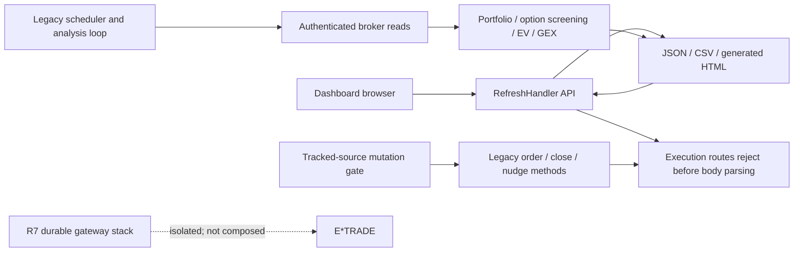
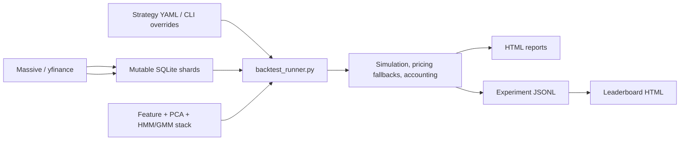
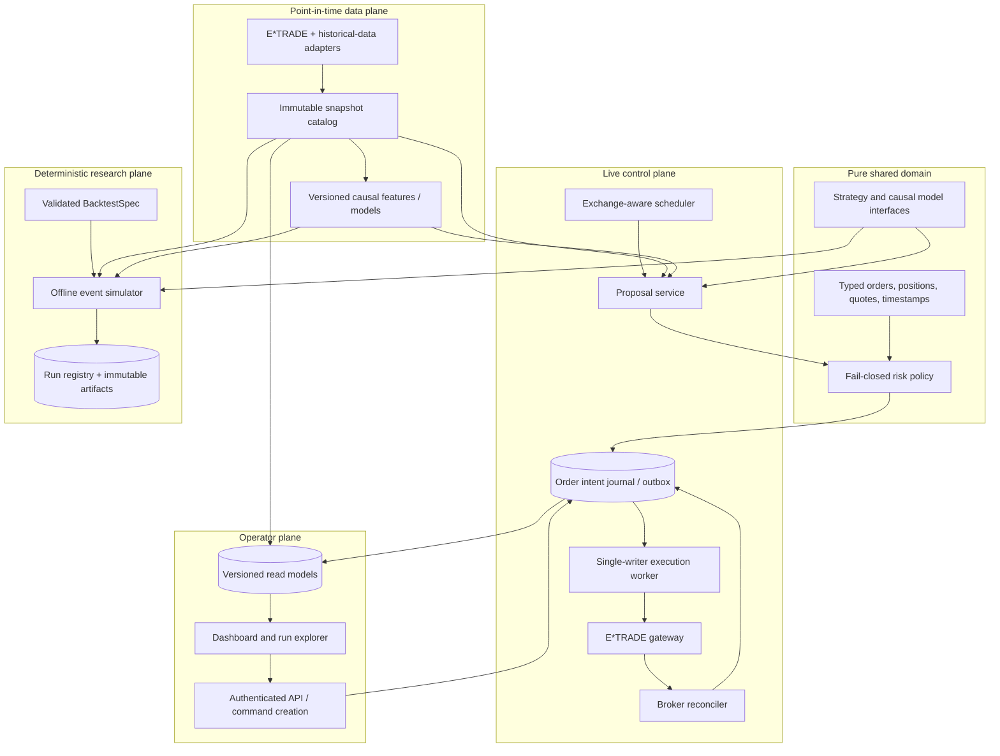

# E*TRADE System Production-Readiness Review and Upgrade Plan

**Audit date:** 2026-07-25

**Scope:** live E*TRADE trading, dashboard/API, historical options backtesting,
market-regime/EV research, packaging, security, CI/CD, deployment, and operations.
Evidence paths are relative to `etrade_python_client/`; `../` denotes the Git
root.

## Executive decision

The repository is **not ready for unattended live trading**. It has a useful
research engine and several strong incident-driven safeguards, but there are
stop-ship risks in account selection, live arming, pre-trade controls,
idempotency, secret handling, broker failure behavior, and deployment.

Existing regime-aware backtest results are also **not yet eligible for investment
claims**. The canonical path contains good causal mechanisms, but the complete
five-field causal record is not stored per run, historical contract selection
uses information through expiration, preprocessing still makes some
full-sample choices, and the final regime overlay is not consistently matched to
the return buckets used by EV logic.

The detector-specific replacement design and 2026 causal shadow replay are in
`docs/regime_detection_v2_design.md`.

This plan treats production readiness as a sequence of enforceable gates:

1. Contain live risk and make all unknown states fail closed.
2. Establish a clean, reproducible build and test baseline.
3. Put broker I/O, risk decisions, and order transitions behind durable
   boundaries.
4. Separate point-in-time data acquisition from deterministic simulation.
5. Promote through sandbox, shadow, paper, and tightly bounded live canaries.

Until Phase 0 exits, automatic live execution should remain disabled. Until the
backtest validity gates exit, regime-aware reports should be labeled
`UNVERIFIED` rather than ranked beside valid experiments.

## Delivery status as of 2026-07-26

R5 / PR #28 established a clean dependency/import baseline and passed 134 tests
in clean CI. R6 implements the first live-startup containment slice, and
R7a–R7f add an isolated durable execution core plus a repository-wide legacy
mutation quarantine:

- `sandbox` or `production` must be selected explicitly; missing or conflicting
  mode input fails before OAuth construction.
- Production requires an exact account ID, account key, and institution type
  plus an owner-only, HMAC-signed, versioned arm document bound to that identity.
  Its maximum lifetime is 15 minutes.
- The selected identity and unexpired arm are checked at startup and on account
  refresh. Compatibility-client broker mutations are no longer operative.
- The dashboard binds to loopback, does not launch ngrok automatically, and
  does not grant wildcard CORS. It is permanently read-only: auto-open is
  forced off, execution controls and mutation queue call sites are removed, and
  retained historical execution routes reject before body parsing or side
  effects.
- Hardcoded OAuth credentials were removed from the current versions of two
  legacy utilities in favor of local configuration or environment variables.
- Shared client logs use owner-only files and retain only redacted headers plus
  fingerprints for order payloads, account/order bodies, and account-bearing
  URLs. The older interactive order client and spread executable are
  quarantined.

These changes do **not** satisfy Phase 0 or make the repository production
ready. R7a–R7e preserve the arm/account check and add isolated durable intent identity,
capacity reservations, mutation fencing, direct known-order reconciliation,
raw read provenance, and exact zero/full terminal-risk absorption, but no live
caller is composed through that stack. R7f makes 30 legacy mutation surfaces
exact unconditional tombstones, removes the gateway's public transport
property, and adds a deterministic AST gate across every tracked application
Python source. Raw broker mutation remains permitted only in the hardened
transport and exact transport calls only in the gateway. Service installation
and remote restart are suspended.
The current local dashboard settings are intentionally rejected until stronger
credentials are provisioned. GitHub reports the repository as public on
2026-07-26, and OAuth keys retained in its public history must be treated as
compromised: external revoke/rotate is required, followed by a coordinated
history purge and downstream cleanup. No live service restart, deployment,
E*TRADE mutation, deployed restart, or exact deployed-dashboard verification
has been performed. The real local handler and generated positions artifact
were inspected at desktop and mobile widths for R7f, including the fixed
same-origin iframe policy and fixed eight-digit PIN input; that is source
verification only.

## What is worth preserving

This is not a rewrite-from-zero recommendation. The following foundations are
valuable:

- `RELIABILITY.md` defines strong invariants for partial pagination, preserving
  last-confirmed data, synchronization health, atomic publication, and visual
  verification of the exact served dashboard.
- Executed-order reconciliation rejects incomplete page sets and preserves
  confirmed cache state
  (`live_trading/spy_position_tracker.py:791-924,1230-1282`).
- The gains cache is atomically replaced
  (`live_trading/spy_position_tracker.py:747-760`).
- Portfolio-producing dashboard paths can demand a successful broker response
  (`accounts/accounts_bo.py:1863-1902`).
- Dashboard sessions are signed, `HttpOnly`, `SameSite`, conditionally `Secure`,
  and delivered with no-store headers
  (`live_trading/etrade_cover_call_new.py:959-1001,2101-2115`).
- Broker order placement normally requires a valid preview ID
  (`order/order_bo.py:370-393`).
- Historical data uses sharded SQLite/WAL, and the Massive client already has
  TLS verification, bounded concurrency, timeout/backoff primitives, and an
  offline mode (`backtesting/massive_api_client.py:44-87,173-210`).
- The canonical backtest runner has a correct one-trading-day lag helper and
  resolved-forward-outcome censoring
  (`backtesting/backtest_runner.py:50-133`).
- The expanding HMM path trains on prefixes, emits the last posterior, aligns
  states, and records useful drift/fallback diagnostics
  (`live_trading/ev_engine.py:908-1082`).
- Causal PCA workers fit prior rows and align component signs
  (`live_trading/ev_engine.py:286-337,774-870`).

## Current architecture

### Live path



Historically, most of this flow resided in the 5,787-line
`live_trading/etrade_cover_call_new.py`. The same process owns OAuth, the local
dashboard, scheduling, market reads, generated HTML, global state, model
diagnostics, and retained historical order code. `accounts/accounts_bo.py`
(7,821 lines) combines broker access, option screening, payload construction,
and dashboard rendering. R7f removes the operative dashboard/scheduler broker
mutation call sites and tombstones the legacy order methods, so this path is
now read-only. The monolith remains a maintainability and data-integrity risk,
but it cannot be treated as an execution service.

### Backtest and regime path



The 4,397-line runner combines online acquisition, cache mutation, regime
training, strike selection, fills, trade lifecycle, metrics, rendering, and
experiment logging. A run therefore cannot currently be replayed as a pure
function of an immutable input manifest.

### Operational path

The initial audit found a systemd installer that launched the monolith with
`--no-sandbox --trade`, code sync directly from the mutable working tree,
competing package definitions, a tracked virtual environment, and a
network-oriented CI baseline. At that point 1,506 tracked files were under
`venv/`.

R7f now suspends service installation and remote restart. R8a removes 1,531
generated, runtime, environment, package-metadata, and backup paths from the
index without deleting their local copies. Code-only sync rejects tracked
working-tree changes and presents rsync with an archive of one resolved `HEAD`
commit, so untracked or ignored scratch code cannot enter a new transfer.
Atomic versioned releases and exact remote cleanup remain required before
deployment can be re-enabled.

## Stop-ship risk register

| ID | Area | Finding | Evidence | Required release condition |
|---|---|---|---|---|
| P0-L1 | Live mode | Omitting `--sandbox` resolves to live, while the service explicitly starts `--no-sandbox --trade`; there is no expiring arm state or account-bound approval. | `live_trading/etrade_cover_call_new.py:4010-4011,4216-4239`; `deploy/install_pi_service.sh:37` | Production boots read-only and unarmed; a short-lived arm operation is bound to environment, account, risk limits, and normalized order intent. |
| P0-L2 | Account identity | The brokerage account is selected by mutable list index `1`. | `accounts/accounts_bo.py:1137-1151`; `live_trading/etrade_cover_call_new.py:4315-4317` | Startup and every placement verify an allowlisted `accountIdKey` and environment; mismatch yields zero broker mutations. |
| P0-L3 | Risk | There is no single fail-closed pre-trade decision covering quantity, max loss, margin, daily loss, delta, concentration, liquidity, quote age, calendar, and data completeness. | `live_trading/etrade_cover_call_new.py:2241-2258,2263-2294,4873-4892,5293-5382` | Every order passes one pure `RiskDecision`; every deny reason is persisted and tested. |
| P0-L4 | Idempotency | In-memory request IDs are not deduplicated and broker client IDs are random; an uncertain POST or restart can duplicate an order. | `live_trading/etrade_cover_call_new.py:721-746`; `accounts/accounts_bo.py:4890-4907`; `order/order_bo.py:516-554` | Stable intent ID, durable outbox, unique constraint, and reconcile-before-retry produce exactly one broker order across retries and restart. |
| P0-L5 | Cascading actions | `INSUFFICIENT_FUNDS` triggers an unbounded loop that automatically closes unrelated high-margin positions and retries. | `live_trading/etrade_cover_call_new.py:3078-3181,3626-3639` | Automatic margin release is removed or separately approved; all retries have attempt, time, and capital budgets. |
| P0-L6 | Fail-open data | Position-conflict and quote-refresh failures can be treated as no conflict or a usable stale price. | `accounts/accounts_bo.py:6333-6362`; `live_trading/etrade_cover_call_new.py:3231-3234,3269-3272` | Unknown portfolio, quote, calendar, model, or authorization state blocks new exposure. |
| P0-L7 | Secrets | Broker/dashboard secrets and runtime state are broadly readable; request headers, responses, verifier data, and payloads can be logged. | `live_trading/etrade_cover_call_new.py:4164-4170`; `accounts/accounts_bo.py:1118-1128,1888-1905`; `order/order_bo.py:208-229` | Rotate affected credentials, enforce secret-store or `0600` fallback, redact allowlisted structured logs, and pass working-tree/history/artifact/log secret scans. |
| P0-L8 | Model contract | The healthy probability-engine path returns five values while the live caller unpacks three; exceptions produce an empty diagnostic result and scheduling continues. | `live_trading/ev_engine.py:1759-1762,1814-1815`; `live_trading/etrade_cover_call_new.py:5293-5383` | Typed model output, contract tests, and fail-closed strategy dependency: a strategy that requires the model cannot schedule when it is unavailable or invalid. |
| P0-B1 | Point-in-time universe | Contract lists are requested `as_of` expiration, not the trade decision time. | `backtesting/backtest_runner.py:1100-1115` | Contract eligibility is determined from a snapshot whose `available_at <= decision_time`. |
| P0-B2 | Look-ahead filtering | Strike filtering uses underlying min/max from first targeted date through expiration. | `backtesting/backtest_runner.py:1133-1181` | Fetch optimization cannot affect the eligible point-in-time universe or use future market values. |
| P0-B3 | Cache truth | Failed, empty, offline, or partial requests can be marked complete; one end-date row can imply full range coverage. | `backtesting/massive_api_client.py:256-333,359-371,785-789`; `backtesting/sharded_option_data_cache.py:915-926` | Attempt and confirmed-success records are distinct; partial/failed reads never advance coverage; expected ranges/pages are proven. |
| P0-B4 | Fill fidelity | “Strict NBBO” can resolve to a cached daily close, and two daily closes can be labeled synchronized. | `backtesting/massive_api_client.py:123-171,803-853`; `backtesting/backtest_runner.py:2577-2608` | Strict NBBO accepts only timestamped observed bid/ask; synchronized fills enforce a configured timestamp delta. |
| P0-B5 | Causal features | Feature dropping, fractional-d selection, and PCA dimension selection make full-request-sample choices. | `live_trading/data_ingestion.py:793-854,920-982`; `live_trading/ev_engine.py:759-769` | Prefix-invariance tests prove adding future rows cannot change earlier features, dimensions, states, or EV. |
| P0-B6 | Regime taxonomy | Trades use final stress-overlay regime IDs while return buckets are grouped by raw HMM state IDs. | `backtesting/backtest_runner.py:136-172,2310-2330`; `live_trading/ev_engine.py:1657-1666` | Raw archetype and final overlay are separate types; bucket key and trade regime must share the exact taxonomy/version. |
| P0-B7 | Market-data rights | Public/individual Massive and Cboe terms do not by themselves establish permission for retained, non-display, strategy-derived use. API access is being mistaken for production entitlement. | `docs/regime_data_provider_entitlements.md`; provider terms linked there | Before the first scheduled request, record a current agreement covering the subscriber, dataset, non-display strategy use, raw retention, derived signals, and deletion duties. Missing or expired rights fail closed. |
| P0-O1 | Reproducibility | Package metadata is incomplete/conflicting, runtime dependencies can be installed during a run, and critical tests/deploy/docs are untracked. | `../pyproject.toml:5-13`; `../setup.py:1-8`; `backtesting/run_comparison.py:6-10`; `../.github/workflows/ci.yml:13-31` | A clean clone builds an immutable artifact and runs all offline gates with one documented command. |

P0 means the issue blocks unattended live execution or causal certification.
P1 and P2 findings are captured in the phased work below; they include bounded
broker timeouts, complete pagination, durable state, web hardening,
observability, atomic publication, schema validation, dependency locking,
deployment rollback, and decomposition of the three monoliths.

R6 partially mitigates P0-L1, P0-L2, and P0-L7 in the current source. Their
release conditions remain open: the placement-time compatibility guard is not
yet a durable, centralized mutation gateway; affected OAuth keys have not been revoked or rotated;
public history has not been purged; and no deployed process has been verified.
P0-L3 through P0-L6 and P0-L8 remain stop-ship issues.

## Required regime-aware causal record

Every regime-aware run must persist the following fields and pass them before
the result is marked `VALID`.

| Mandatory field | Current status | Upgrade requirement |
|---|---|---|
| Training/calibration end date | **Implemented for R4 V2 annotations only.** The typed signal records the last selection-fold session from the pinned artifact. Legacy action paths remain unverified. | Store the cutoff for every model/refit and a calibration-policy hash. |
| Test date range | **Implemented for R4 V2 annotations only.** The retrospective range is copied from the immutable plan; the prospective holdout is not complete. | Store calibration, validation, and locked test ranges plus selection lineage. |
| Inference method | **Implemented for R4 V2 annotations only.** Calibrated signals record `causal_prefix_filter`; raw research signals leave it null and abstain. Legacy paths remain mixed. | Enumerate and store `walk_forward_filter`, prohibit smoothed/Viterbi history for backtest decisions. |
| Regime lag | **Enforced for R4 V2 annotations.** The adapter proves close T maps to the exact next NYSE session and never fills a gap. Legacy scripts can still pass same-day states. | Persist `lag_trading_days >= 1` and assert it at trade-entry construction. |
| Return-bucket causality | **Explicitly not used in R4.** Typed signals record `not_used_shadow_annotation`; the non-regime empirical helper now requires outcomes resolved strictly before entry. Legacy HMM/overlay buckets remain invalid end-to-end. | Store `as_of`, horizon convention, resolved cutoff, taxonomy/version, and assert only resolved outcomes enter the matching final-regime bucket. |

If any field is absent, the run status is `UNVERIFIED`. If a gate is known to
fail, the status is `INVALID`. Only `VALID` runs appear in performance
leaderboards.

## Target production architecture

Use a **modular monolith with separate processes and one transactional database**
on the current Pi/VM first. Kubernetes and distributed messaging are not
required. SQLite WAL is sufficient while one host and one execution writer are
guaranteed; move to PostgreSQL only when multi-host operation is required.



### Boundary 1: typed configuration and secrets

- One canonical package definition and one schema-versioned configuration model.
- Explicit modes: `sandbox`, `shadow`, `paper`, `live`.
- Production always boots `unarmed`.
- Exact account allowlist by `accountIdKey`; no positional selection.
- Immutable startup settings; migrations are explicit and transactional.
- Secrets come from the service/OS secret store. Local development fallbacks are
  `0600`, never logged, and validated at startup.
- Strategy, data, model, execution, and risk policies are separate typed
  sections; unknown keys and invalid ranges are errors.

The exact schema-version-1 contract, four-mode capability table, immutable path
rules, and service-environment/local-fallback secret boundary are documented in
[`runtime_configuration.md`](runtime_configuration.md). Version 1 deliberately
grants no broker-mutation authority in any mode. In particular, `live` is an
unarmed startup declaration and configuration cannot replace the independent
short-lived production arm.

R6 implements a narrow compatibility boundary around the existing monolith:
explicit environment selection; exact production account identity; a
versioned, signed arm document with a maximum 15-minute lifetime; refresh-time
and order-call revalidation; strong dashboard credential validation; and
owner-only local files. It does not yet provide the complete typed
configuration model or an OS secret-store integration. The isolated R7
gateway, transport, reader, and ledger now provide stable intent identity and
durable reconciliation evidence, but live composition and static enforcement
must still replace the compatibility order paths.

### Boundary 2: E*TRADE gateway

One private gateway owns the broker boundary. Its read adapter and mutation
transport are the only modules below that gateway permitted to make broker
HTTP calls. Together they own:

- OAuth lifecycle and environment binding.
- Connect/read/total deadlines.
- Typed response validation and explicit `Success`, `ConfirmedEmpty`,
  `Partial`, `Unauthorized`, `RateLimited`, `TransientFailure`, and
  `PermanentFailure` outcomes.
- Complete pagination and request-volume budgets.
- One recorded exchange per read attempt; callers may begin a new attempt only
  from durable state, never through hidden transport retries.
- No blind retry of mutating POSTs.
- Redacted structured logging and correlation IDs.
- `place_once(intent_id)`: an unknown response with a durable broker ID is
  reconciled by direct ID lookup before any further mutation. Because E*TRADE
  does not echo the client order ID, an unknown response without a durable
  broker ID remains blocked for supervised resolution and is never guessed or
  retried.

### Boundary 3: canonical snapshots

Use immutable records such as `PortfolioSnapshot`, `QuoteSnapshot`,
`OptionChainSnapshot`, and `ModelSnapshot`. Every record carries:

- event/market timestamp;
- `available_at` and `ingested_at`;
- source and environment;
- completeness/page counts;
- schema version and checksum;
- last attempt and last confirmed success;
- data-vintage and feature/model version IDs.

Dashboard requests read snapshots. They do not trigger broker work or mutate the
source of truth.

R5 implements this boundary narrowly for the Regime V2 shadow lane: the
authenticated dashboard reads one descriptor-validated, owner-only sealed
signal through a separate same-origin endpoint. It cannot call the provider
gateway, detector, HMM/EV/GEX paths, account objects, refresh queues, or order
code. The rest of the dashboard still violates this target boundary and
remains in scope for Phase 2.

### Boundary 4: pure risk decision

Every manual and automatic intent calls:

```text
RiskDecision evaluate(OrderIntent, PortfolioSnapshot, QuoteSnapshot,
                      MarketState, RiskLimits)
```

The decision is deterministic, persisted, and includes allow/deny reasons.
Required gates include:

- live arm and exact environment/account;
- exchange calendar/session and timezone;
- complete/fresh portfolio and quote snapshots;
- quote age, bid/ask width, liquidity, and bounded price;
- symbol/strategy allowlists;
- quantity, notional, spread max loss, margin, delta, concentration;
- position conflict, duplicate intent, and open-order interaction;
- daily order, realized-loss, and new-risk budgets;
- model/regime provenance when a strategy depends on it;
- global and per-strategy kill switches.

Risk overlays may reduce exposure or block a trade. A crisis/panic state must not
increase exposure.

### Boundary 5: durable order state machine

The browser and scheduler create commands; neither calls E*TRADE directly.
A single writer per account advances:

```text
PROPOSED
  -> RISK_REJECTED | APPROVED
  -> PREVIEWED
  -> SUBMITTING
  -> SUBMITTED | UNKNOWN
  -> WORKING | PARTIAL
  -> FILLED | CANCELED | REJECTED | EXPIRED
```

`UNKNOWN` can transition only after broker reconciliation. Persist the normalized
intent, idempotency key, preview, broker IDs, price budget, every transition,
actor, timestamps, retries, and reconciliation generation. Repricing has one
owner and absolute slippage/debit/credit/time limits.

Implementation status: schema 12 currently supports isolated opening and
price-only reprice flows with `INTENT`, `CLAIMED`, `FAILED`,
`SUBMISSION_UNKNOWN`, `SUBMITTED`, and terminal states. Terminal-fill
absorption is limited to exact zero fills or complete balanced fills with newer
order-bound position lots; partial/replacement/assignment states stay blocked.
New closing intents, cancellation, and live composition remain fail-closed
release gates.

### Boundary 6: deterministic backtesting

- Data acquisition and validation produce an immutable `DataSnapshot`.
- The simulator has no network, filesystem discovery, rendering, or cache
  mutation.
- The same strategy/risk domain logic is used in replay and live proposal
  generation.
- Contract eligibility is point-in-time and based on `available_at`.
- Every fill records observed bid/ask/trade timestamps, source, synchronization
  delta, slippage, fees, and fallback class.
- Strict modes do not silently degrade. Fallback policies are explicit
  sensitivity scenarios and reported separately.
- Missing/partial data makes a run `INVALID` when thresholds are exceeded.

### Boundary 7: experiment and model registry

Each run has a unique immutable manifest containing:

- Git commit plus dirty-diff hash;
- package version, dependency-lock hash, platform, and seed;
- strategy/risk/execution config and schema versions;
- data snapshot/checksum and coverage report;
- feature, scaler, PCA, HMM/GMM, taxonomy, and model hashes;
- the five mandatory causal fields;
- fill-source/fallback distribution;
- validity status and reasons;
- metrics, trade ledger, logs, and artifact checksums.

The model bundle for every refit stores the exact scaler, PCA, model class,
chosen K, seed, training cutoff, feature hash, data vintage, state alignment,
drift/fallback state, and output taxonomy. Cache keys include all of these
fields. Artifacts are written atomically and authenticity-checked before load.

### Boundary 8: web and operations

- Read-only dashboard by default; scoped command permission for mutations.
- Password hashing or SSO, CSRF protection, body limits, rate limiting, TLS, and
  restrictive CORS.
- Explicit confirmation shows environment, redacted account, contracts,
  quantity, maximum loss, price bounds, quote age/source, and risk decision.
- `/healthz` is process health only; `/readyz` verifies account, auth,
  reconciliation, snapshot freshness, mode, and arm state without performing
  broker work.
- Structured redacted logs, immutable execution audit, and metrics for broker
  latency/errors/429s, OAuth age, snapshot age, queue depth, risk denials,
  in-flight orders, reconciliation gaps, and model status.
- Build once, deploy a signed/versioned wheel or image, health-check the new
  version, atomically switch, and retain one-command rollback.

## Sequenced migration

Estimates assume one or two engineers and are planning ranges, not delivery
commitments. Phases can overlap only after the preceding safety gate is met.

### Phase 0 — containment and evidence (1–3 days)

Deliver:

1. Disable persisted automatic live opening and automatic margin release.
2. Default all entry points and services to read-only/unarmed.
3. Add exact account binding, hard quantity/notional/max-loss/margin/daily-loss
   ceilings, and a local kill switch around the existing placement path.
4. Add explicit broker timeouts and finite retry budgets.
5. Serialize submissions and reserve a stable intent ID before preview.
6. Make unknown model, calendar, portfolio, conflict, quote, or auth state deny.
7. Fix the live EV return-value contract and remove the second repricer.
8. Restrict permissions, preserve security evidence, rotate affected credential
   categories, and replace sensitive logs.
9. Mark historical regime-aware artifacts `UNVERIFIED`.
10. Disable or bind the unauthenticated experiment manager to localhost until
    authentication and authorization exist.
11. Track the reliability ledger, tests, dashboard template, schemas, deployment
    files, and canonical strategy configs.

Exit gate:

- Wrong/reordered account fixture cannot arm or submit.
- Repeating one command across retry and restart yields one broker order.
- Every direct broker call has a timeout.
- Each required dependency failure yields zero submissions.
- Secret scans of history, working tree, build output, and logs are clean.
- Existing 11 focused reliability tests remain green.

R6/R7f status: explicit mode, exact identity, short-lived signed arm,
refresh-time revalidation, loopback dashboard, restrictive CORS, strong local
credential checks, owner-only/redacted client logging, unconditional legacy
mutation tombstones, read-only UI/routes, a tracked-source mutation gate, and
deployment install/restart suspension are implemented in source. Phase 0
remains open because no durable gateway is composed into a production process,
the full pure pre-trade and failure policy is incomplete, closing/cancellation
protocols are absent, exposed keys still require external revoke/rotate and
coordinated history cleanup, the current local settings fail the new policy,
and no deployed service has been restarted or verified.

### Phase 1 — reproducible repository baseline (week 1)

Implementation is split into four reviewable stacked changes: R8a removes
tracked generated/runtime state without deleting local copies and adds an index
hygiene gate; R8b establishes the single package definition and frozen lock;
R8c validates a built artifact in deterministic offline CI; R8d introduces
typed configuration and explicit runtime-state paths. This avoids mixing more
than 1,500 mechanical index removals with packaging/runtime behavior.

R8a removes 1,531 audited index entries while preserving every local file,
narrows the `yfinance` cache ignore so the root package collision stays
visible, and adds a dependency-free pre-install CI check over NUL-delimited Git
index paths. The same slice changes sync-only deployment to a clean committed
archive and fails before remote work when tracked state is dirty. This is index
hygiene, not a Git-history purge; exposed credentials still require external
revocation/rotation and coordinated all-ref cleanup.

R8b makes `etrade_python_client/` the only package source root and
`../pyproject.toml` the only direct package/dependency definition. Ten
compatibility packages are explicitly allowlisted; the wheel includes only the
dashboard template and three strategy YAML files beyond Python sources. The
empty root `accounts` and `yfinance` shadows, misspelled package initializers,
legacy `setup.py`, and per-directory requirement inputs are removed. CPython
3.10.20, direct dependencies, build tools, and complete runtime/test graphs are
pinned; every resolved distribution has an accepted hash. `pyetrade` and
`rauth` are the only source-distribution exceptions and build under a separate
hash-locked toolchain with isolation disabled. Runtime package installation is
removed, Polygon import is credential-free, and Pi bootstrap joins service
installation/restart in failing closed.

R8c makes the release artifact the functional-test boundary. CI now runs on a
fixed Ubuntu image with read-only repository permission and immutable action
SHAs, builds one wheel and one sdist without build isolation, compares their
payload bytes and metadata with the committed Git tree, verifies wheel RECORD
hashes, proves byte-for-byte reproducible builds, rebuilds the same wheel from
the inspected sdist, installs the wheel, and requires `pip check`.
Repository-policy tests remain source-aware, while every other maintained test
runs from the repository root with source imports unavailable. Runtime smoke
and functional tests run as a non-root user inside a loopback-only Linux
network namespace with an isolated home/temp area and a whitelisted child
environment; the runtime virtual environment has no pip, setuptools, or wheel.
A Python socket guard adds deterministic diagnostics.
Canonical live imports are checked from an empty owner-only directory and may
not create backtest/cache directories. Integration-marked tests are excluded
explicitly. Remaining runtime-state paths move under typed configuration in
R8d.

R8d defines one strict JSON startup contract with separate strategy, data,
model, execution, and risk sections; exact account allowlisting; and paths
resolved relative to the configuration file rather than the process working
directory. Its packaged example is a valid disabled `paper` configuration and
contains no credentials. Operational configuration, secret fallbacks, OAuth
state, arms, databases, and logs remain excluded from release artifacts. R8d
does not compose the durable gateway and does not change the R7f mutation
quarantine.

Deliver:

1. Choose one package root and one `../pyproject.toml`; remove legacy
   `../setup.py`.
2. Stop tracking virtual environments and generated bytecode; publish a
   separate cache/artifact retention policy.
3. Lock runtime and development dependencies with hashes.
4. Remove runtime package installation.
5. Make offline unit/contract tests the default; mark network and broker tests
   explicitly.
6. Add formatting/lint, typing for safety boundaries, package-build/install
   smoke, coverage, secret scan, dependency audit, and static security checks.
7. Provide example configuration containing no credentials and a single
   operator/runbook entry point.

Exit gate:

- A clean checkout builds and passes offline CI with one documented command.
- Build/test leave a clean worktree.
- Core domain coverage is at least 80%; execution/risk/config safety paths at
  least 95% branch coverage.
- No high/critical security or dependency findings.
- The built artifact contains every required runtime template/schema and no
  cache, credential, report, or local environment.

### Phase 2 — broker and snapshot foundations (weeks 2–3)

Status: partially delivered. R7b–R7e provide the isolated bounded mutation
transport, strict origin-bound reader, durable raw/parser receipts, explicit
pagination, lot-aware two-scan capacity manifests, and exact terminal order
evidence. Shared OAuth recovery, general snapshot read models,
health/readiness, graceful shutdown, metrics, and live composition remain
open.

Deliver:

1. Extract the typed E*TRADE gateway.
2. Add categorized failures, common OAuth recovery, complete pagination,
   timeouts, rate budgets, and redaction.
3. Add transactional snapshot tables and atomic last-success publication.
4. Move dashboard reads to snapshot read models.
5. Add health/readiness, graceful shutdown, and operational metrics.

Exit gate:

- Injected 401, 403, 404, 429, 5xx, timeout, malformed response, and
  mid-pagination failure never erase confirmed data or advance coverage.
- A hung request cannot exceed its total deadline.
- Readiness is false for wrong account, stale auth/data, failed reconciliation,
  or invalid environment.
- `SIGTERM` drains or durably records in-flight work within 30 seconds.

### Phase 3 — durable live control plane (weeks 3–5)

Status: partially delivered. R7a–R7f provide the schema-12 ledger, stable
opening intent identity, outbox-style send claims, reconciliation, capacity
reservations, a single isolated reprice owner, and exact zero/full terminal-risk
absorption with retained filled-margin accounting. R7f also removes all current
legacy mutation call sites and makes future bypasses fail CI. Partial/complex
terminal states, closing/cancellation, the broader pure risk policy, process
decomposition, a single reviewed composition root, dashboard command creation,
and hardened live deployment remain open.

Deliver:

1. Implement command/outbox/order/fill/reconciliation tables and migrations.
2. Route dashboard/scheduler mutations through durable commands.
3. Add the pure risk engine and full limit set.
4. Implement exactly-once intent semantics and reconcile-before-retry.
5. Enforce one repricing owner and bounded price/time policies.
6. Separate scheduler, execution worker, reconciler, and web service processes.
7. Harden dashboard authentication, CSRF, rate limiting, TLS, and permissions.

Exit gate:

- Crash/power-loss/restart tests show no duplicate or lost orders.
- Every in-flight order reconciles after restart.
- Stale/partial upstream state blocks new risk and preserves last-confirmed
  display state.
- Kill-switch and daily-arm drills stop new submissions without preventing
  reconciliation/cancel controls.
- Sandbox preview/place/change/cancel/fill lifecycle is fully audited.

### Phase 4 — causally valid deterministic research (weeks 3–6)

Deliver:

1. Build the immutable point-in-time data catalog and coverage ledger.
2. Repair contract-universe timing, strike filtering, cache completeness,
   strict NBBO, and synchronized pricing.
3. Move transform/feature/PCA/model choices inside causal refits or freeze them
   before the OOS interval.
4. Separate raw archetype state from final stress-overlay state and unify return
   bucket taxonomy.
5. Replace permissive YAML parsing with typed strategy/backtest schemas.
6. Extract the pure offline event simulator.
7. Replace mutable JSONL experiments with the complete run registry.
8. Remove/deprecate the second `live_trading/ev_plots.py` backtest path and
   quarantine legacy globally fitted scratch workflows.

Exit gate:

- Adding future rows cannot change any earlier feature, state, probability, EV,
  or trade decision.
- Each run passes all five causal fields and declares `VALID`, `INVALID`, or
  `UNVERIFIED`.
- Strict NBBO cannot return OHLCV/theoretical values.
- Same manifest produces identical input tables, trade ledger, and metrics
  twice.
- Cache-on/off parity and no-network simulator tests pass.
- Golden accounting, assignment, expiration, roll, fee, slippage, and margin
  scenarios pass.

### Phase 5 — release engineering and operator usability (weeks 5–7)

Deliver:

1. Build/version/sign once; deploy immutable artifacts through hardened systemd
   units.
2. Add health-checked atomic activation and automatic rollback.
3. Supervise the tunnel/reverse proxy outside the application.
4. Add encrypted backups, tested restore, SLOs, alerts, and runbooks.
5. Redesign the dashboard around environment/account/arm state, data freshness,
   risk decisions, intent/order timelines, reconciliation, and experiment
   provenance.

Exit gate:

- Rollback completes in under five minutes.
- Demonstrated restore meets RPO <= 15 minutes and RTO <= 30 minutes.
- The exact served dashboard is visually verified for live/sandbox identity,
  stale/degraded state, risk denial, command confirmation, and order lifecycle.
- Seven to ten trading days of shadow/paper operation produce zero duplicate
  orders and 100% broker reconciliation.

### Phase 6 — staged live promotion

Promotion sequence:

1. sandbox end-to-end;
2. live read-only;
3. shadow proposals with broker reconciliation;
4. manual approval with one account, one strategy, and tiny notional;
5. bounded canary with daily review;
6. broader automation only after exit criteria remain green.

Any account mismatch, unknown POST, reconciliation gap, stale required snapshot,
expired arm, broken risk invariant, or missing causal/model provenance
automatically rolls the system back to read-only.

## Implementation queue

Use small, independently releasable changes:

1. **PR 0 — Evidence baseline:** inventory tracked/untracked runtime sources,
   freeze legacy regime artifacts, capture current behavior with fixtures.
2. **PR 1 — Live containment:** unarmed default, exact account binding, kill
   switch, hard ceilings, no automatic margin release.
3. **PR 2 — Secret and log containment:** rotation checklist, file modes,
   structured redaction, history/artifact/log scanning.
4. **PR 3 — Broker result types:** deadlines, typed failures, common auth,
   pagination completeness, no ambiguous empty results.
5. **PR 4 — Durable intent facade:** stable IDs, dedupe, outbox, placement
   reconciliation, bounded repricing.
6. **PR 5 — Risk engine:** pure typed limits and exhaustive allow/deny tests;
   route every old placement call through it.
7. **PR 6 — Snapshot/read split:** transactional snapshots and dashboard-only
   read models.
8. **PR 7 — Reproducible build/CI:** canonical package, lock, offline gates,
   immutable artifact.
9. **PR 8 — Historical data correctness:** immutable catalog, coverage ledger,
   contract availability, NBBO/synchronization provenance.
10. **PR 9 — Causal/model correctness:** prefix-invariant preprocessing,
    versioned model bundles, taxonomy-safe resolved buckets.
11. **PR 10 — Pure simulator/registry:** no-network replay, complete manifest,
    validity gates, artifact checksums.
12. **PR 11 — Hardened web/deploy:** separate units, auth, health, metrics,
    rollback, restore, and operator runbooks.

The existing monoliths should remain behind compatibility facades while these
boundaries are extracted. Remove old paths only after golden tests and
shadow-parity prove equivalent intended behavior.

The current stacked delivery names the source-level startup containment slice
R6. R7a–R7e implement an isolated schema-12 execution core: strict
vertical-spread validation, stable intent/client identity, durable capacity
reservations, monotonic submission/amendment fences, exact immutable outbound
authorization, a no-retry mutation transport, an opening/reprice coordinator,
an origin-bound durable E*TRADE reader, and order/lot-bound zero/full terminal
absorption. The reader records bounded raw responses, the ledger independently
replays their strict parser, and capacity or reconciliation can use only a
semantically complete content-addressed manifest. Full fills retain their
reserved margin in utilization after absorption. R7f quarantines the old
execution system: 30 fixed mutation surfaces are reject-only tombstones, raw
mutation I/O is statically confined to the transport, the gateway no longer
exposes its transport, dashboard mutation routes and controls are inert, and
install/restart tooling fails closed. No live caller instantiates the durable
stack.

The next R7 safety boundaries are closing-position capacity and one-shot
per-intent cancellation. Only after those protocols pass restart/crash tests
may a reviewed live composition root own the gateway. The direct-legacy
mutation prohibition is already enforced and must remain green. See
`docs/order_intent_ledger.md`.

## Test and verification matrix

| Layer | Required tests |
|---|---|
| Broker adapter | OAuth expiry, 401/403/404/429/5xx, timeout, malformed body, partial pagination, rate budget, redaction |
| Execution | duplicate command, uncertain POST, crash before/after POST, restart reconciliation, single repricer, bounded slippage, kill switch |
| Risk | account/environment mismatch, stale snapshots, closed/holiday/early-close market, quote spread/age, quantity/notional/max-loss/margin/delta/daily-loss/concentration limits |
| Data cache | attempt vs success, partial-page preservation, middle-of-range holes, checksums, schema migration, cache-on/off parity |
| Causality | feature/PCA/HMM prefix invariance, final-prefix posterior, one-day lag, resolved-only buckets, taxonomy/version mismatch, complete cache-key invalidation |
| Simulator | deterministic golden trade ledger, accounting invariants, expiration/assignment/rolls, fees/slippage, missing-data invalidation, no network |
| Packaging | clean build/install, import smoke, template/schema inclusion, locked dependency resolution, secret/artifact exclusion |
| Web | authentication, authorization, CSRF, rate/body limits, restrictive CORS, read-only behavior, command confirmation |
| Operations | readiness transitions, graceful shutdown, rollback, backup/restore, alert drills, clock/DST/holiday behavior |
| Artifacts | atomic generation, provenance visible, exact served HTML and chart/canvas visually inspected |

## Production definition of done

The repository is production-ready only when:

- no order can reach E*TRADE without an active live arm, exact account match,
  complete fresh inputs, a persisted allow decision, and a stable intent ID;
- uncertain broker mutations are reconciled before retry;
- failures preserve last-confirmed data and block new exposure;
- every order is owned by one durable restart-safe state machine;
- secrets and full account/OAuth/order payloads do not appear in source, logs,
  history, or artifacts;
- every backtest is reproducible from an immutable manifest and every
  regime-aware claim passes the five causal fields;
- a clean checkout builds, tests, packages, deploys, health-checks, and rolls
  back without local workstation state;
- operations have tested kill, restore, rollback, and incident procedures;
- shadow/paper evidence and a bounded live canary meet all reconciliation and
  safety gates.

## Audit limitations

This review used static source/configuration inspection and the existing focused
offline reliability tests. It did not call E*TRADE, Massive, Yahoo, or Cboe; did
not submit or alter orders; did not run a full historical backtest; did not
inspect the deployed Pi; and did not restart the user's deployed dashboard.
R5 later added an isolated browser verification of the actual dashboard handler
and source template for both a sealed synthetic advisory and the missing-signal
failure state. That proves the code/HTML path, not deployment or live provider
operation. Its PR #28 clean CI job passed 134 tests.

R6/R7f have not restarted or inspected the deployed dashboard, called E*TRADE, or
exercised a live/sandbox mutation. Current-source credential removal also does
not establish secret hygiene while the repository remains public and the old
keys remain in Git history. External revoke/rotate, coordinated history purge,
strong local credential reprovisioning, the remaining R7
partial/closing/cancellation protocols, durable-gateway composition, and
deployment verification remain required. The isolated R7a–R7e stack has
focused deterministic coverage and independent causal/security review,
including exact zero/full terminal absorption, but it has no production call
site and is not live-execution evidence. R7f was rendered through an isolated
real local handler and generated positions artifact at desktop and mobile
widths, and its disabled endpoint returned the fixed `503` schema; this does
not verify the user's deployed artifact. The remaining actions belong to the
staged acceptance gates above.

The working tree began heavily modified and contains important untracked local
work. R8a leaves those files in place and removes only the audited generated
and runtime paths from Git tracking; it does not run a broad clean, reset, or
add operation.
