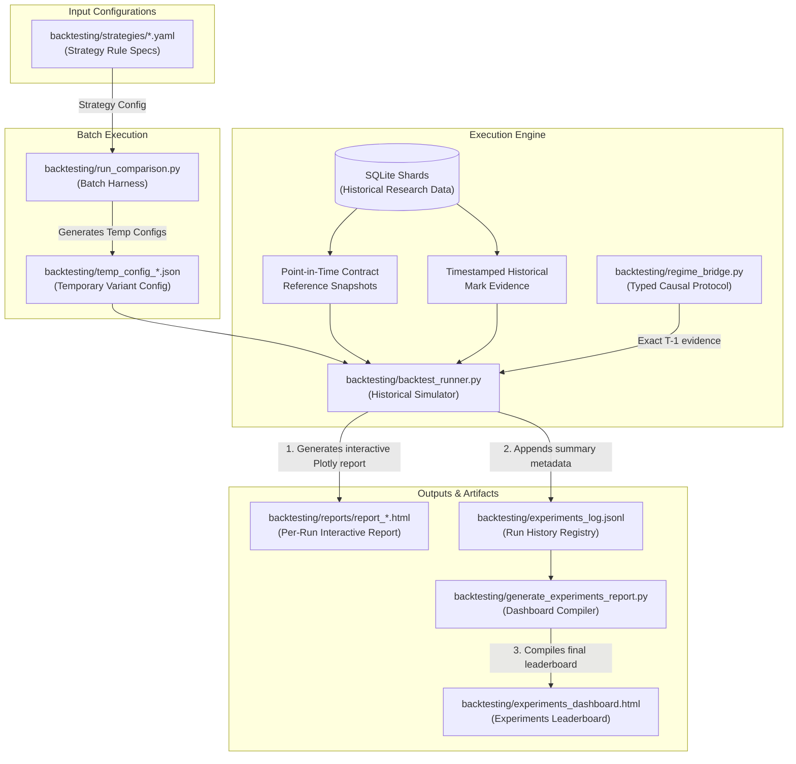
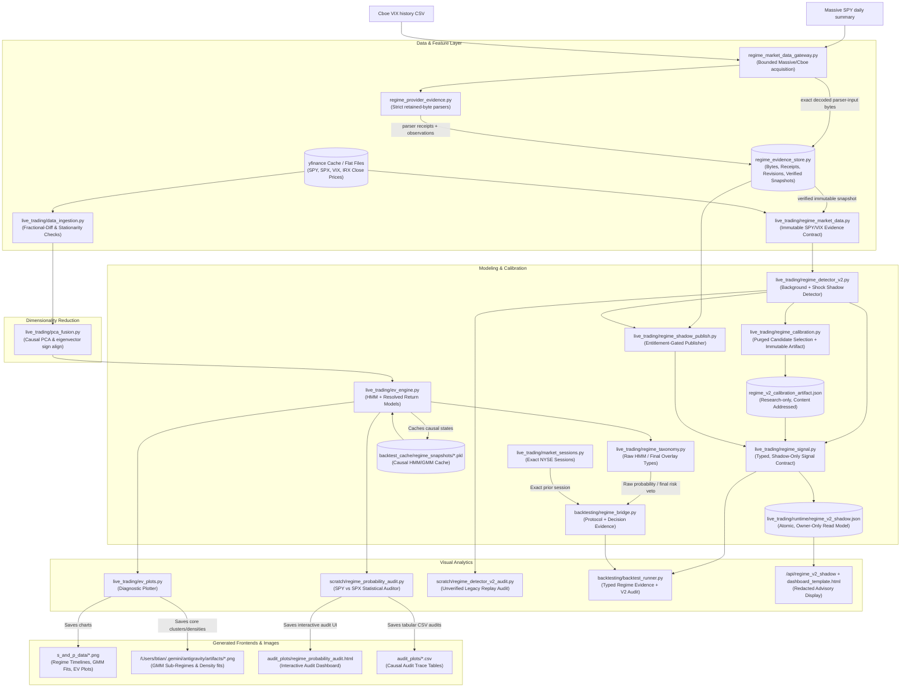
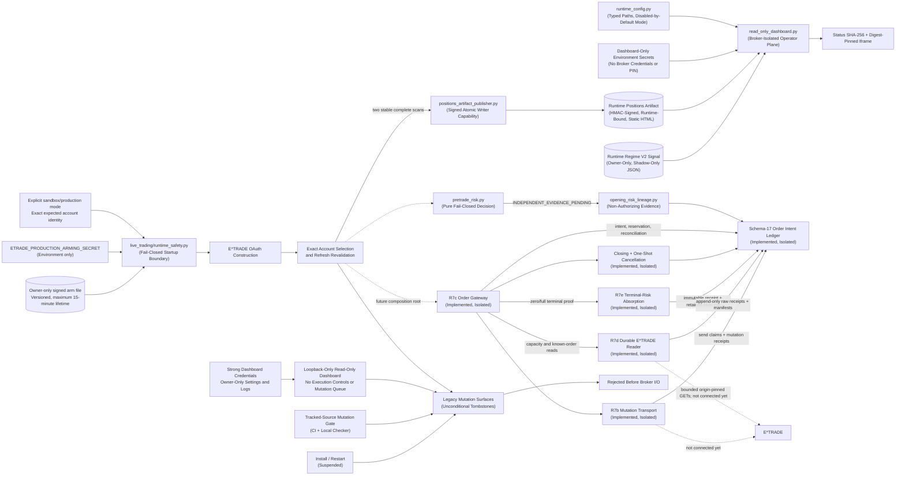

# Project Overview

This repository contains three related domains:

1. **A historical option-strategy research simulator** with explicit
   point-in-time and historical-mark evidence boundaries.
2. **A causal market-regime and expected-value research stack** using a
   Gaussian HMM plus separate regime-conditioned return models.
3. **Fail-closed E*TRADE safety infrastructure** for a future live control
   plane. Its durable order core is isolated and has no live caller.

This document serves as the high-level map of the repository, illustrating the end-to-end architecture, visual execution flows, command shortcuts, and the direct associations between backend scripts and frontend UI/HTML artifacts.

Unattended live trading is not approved. Historical execution and regime-aware
performance remain `UNVERIFIED`; neither is investment-performance evidence.

---

## 🗺️ Architectural Flows

### 1. Backtesting Stack & Artifact Flow
The backtesting stack evaluates YAML-configured research strategies and compiles
results into interactive Plotly HTML dashboards. Historical marks are not
executable-fill claims.



### 2. Regime Detection, EV Engine, & Audit Flow
The Market Regime Detection (MRD) stack uses a Gaussian HMM for raw states and
separate GMMs for regime-conditioned returns. Raw HMM identities, final risk
overlays, and V2 shadow signals are distinct types. The final overlay may only
veto or reduce risk; only an exact taxonomy-bound raw HMM state may select a
resolved return bucket.

The separate V2 shadow path validates immutable
SPY/VIX evidence and separates persistent background stress from fast event
shocks. It is not connected to order execution. The provider-backed path is a
library-only, entitlement-gated shadow collector; it does not schedule itself
or read credentials at import time.



### 3. Live Startup Safety & Mutation Quarantine

R6 adds a fail-closed boundary around startup and account refresh. R7f then
quarantines every known compatibility mutation path: legacy order methods are
unconditional tombstones, dashboard execution routes return a fixed
authenticated `503 LEGACY_EXECUTION_DISABLED` response before reading the body,
the UI is permanently read-only, and service installation/restart is
suspended. The environment must still be explicit. Production additionally
requires an owner-only, HMAC-signed, short-lived arm document whose exact
account ID, account key, and institution type match both the command line and
the broker response.



This is source-level containment, not a production-readiness claim. Every
retained legacy mutation method rejects unconditionally; there is no
configuration or operator override. A tracked-source AST gate permits raw
broker mutation only in the reviewed transport and exact transport calls only
inside the gateway.

The isolated schema-17 core now covers durable opening and closing identity,
capacity reservations, one-send claims, known-order reconciliation, opening
repricing, one-shot cancellation, and exact zero/full terminal absorption.
Filled opening risk remains counted, and a filled close requires an exact newer
position delta before capacity is released. The pure pretrade domain evaluates
typed authority, quote, portfolio, and overlay evidence. Its persisted opening
lineage is deliberately `INDEPENDENT_EVIDENCE_PENDING` and cannot reserve,
preview, or place an order.

No live code instantiates this stack. Partial fills, replacement chains,
transformed lots, assignment/exercise, complete independent portfolio and
market evidence, a reviewed composition root, sandbox lifecycle proof, and
operational migration remain mandatory. The deployed service has not been
restarted or inspected with this source.

R8e-A adds a separate packaged operator process rather than composing unarmed
production through the legacy agent. It validates typed configuration and all
owner-only runtime directories before resolving three dashboard-only
environment secrets plus the artifact-verification key, imports no
broker/provider client, binds only
`127.0.0.1`, and serves descriptor-verified static position and Regime V2
artifacts. Login is rate-limited, sessions are bounded and HMAC-signed, legacy
mutation routes remain fixed failures, and malformed, stale, future-dated,
changing, linked, nonregular, oversized, or executable artifacts fail closed.
R8e-B adds the hardened display-only positions path: the legacy broker monitor
requires two consecutive complete scans with identical contract identity and
quantity, creates a primitive display-only DTO, signs the exact HTML, and
publishes it through a descriptor-relative owner-only lock and durable atomic
replacement. The dashboard authenticates environment/account/runtime binding
and source freshness, then pins the iframe request to the exact SHA-256 from
status so concurrent replacement fails closed instead of mixing generations.
The signed metadata also binds the exact installed renderer/verifier source
digest, and the browser hides a previously verified iframe on source expiry or
status-poll failure.
The fourth dashboard-process secret is the shared artifact HMAC key. This is
still source/local-handler verification: the publisher remains coupled to the
legacy monitor and no Pi deployment or restart has occurred.

---

## 🛠️ Stack Component Descriptions

### 1. Backtesting Stack

*   **Strategy Specifications** (`backtesting/strategies/*.yaml`): YAML files (e.g., `baseline_put_spread.yaml`, `put_call_credit_spread.yaml`) defining trade structure, short/long delta targets, margin caps, early profit exits, DTEs, and rolling behavior. The regime-unaware baseline remains the experimental control.
*   **Batch Harness** ([`run_comparison.py`](file:///Users/btian/EtradePythonClient/etrade_python_client/backtesting/run_comparison.py)): Orchestrates parameters sweeps. It maps out variants, writes temporary configuration JSONs, and triggers the `backtest_runner.py` for each variant before compiling the leaderboard.
*   **Historical Simulator** ([`backtest_runner.py`](file:///Users/btian/EtradePythonClient/etrade_python_client/backtesting/backtest_runner.py)): Simulates daily trade lifecycles, margin, PnL, and reports. Point-in-time contract snapshots contain the eligible universe. Entry and exit mark policies are explicit, and every run remains `UNVERIFIED`.
*   **Historical Mark Evidence** ([`historical_fill_evidence.md`](file:///Users/btian/EtradePythonClient/etrade_python_client/docs/historical_fill_evidence.md)): `strict_nbbo` accepts only exact, timestamped, in-session, close-fresh observed quotes with bounded leg skew. It validates a two- or three-contract historical mark, never executable quantity or fill. Research fallbacks and expiration settlement proxies remain separately labeled and uncertified.
*   **Typed Regime Bridge** ([`regime_bridge.py`](file:///Users/btian/EtradePythonClient/etrade_python_client/backtesting/regime_bridge.py)): Persists an immutable calibration/test/inference/lag protocol plus per-decision evidence. It uses the exact prior NYSE session, never fills a missing signal, permits the final overlay only to reduce risk, and permits only the exact raw HMM taxonomy to select a return bucket. Missing required evidence blocks regime-aware openings.
*   **Dashboard Compiler** ([`generate_experiments_report.py`](file:///Users/btian/EtradePythonClient/etrade_python_client/backtesting/generate_experiments_report.py)): Reads the flat-file JSONL experiments log and compiles a central HTML dashboard leaderboard for comparison.
*   **Experiment Manager** ([`experiment_manager.py`](file:///Users/btian/EtradePythonClient/etrade_python_client/backtesting/experiment_manager.py)): A utility script providing CLI commands to delete, rebuild, or manage individual runs in the experiments log.

### 2. Regime Detection & EV Engine

*   **Data Ingestion** ([`data_ingestion.py`](file:///Users/btian/EtradePythonClient/etrade_python_client/live_trading/data_ingestion.py)): Ingests raw market series (SPY, SPX, VIX, IRX) and transforms them to stationary inputs (log returns, fractional differencing) while running ADF (Augmented Dickey-Fuller) stationarity assertions.
*   **PCA Fusion** ([`pca_fusion.py`](file:///Users/btian/EtradePythonClient/etrade_python_client/live_trading/pca_fusion.py)): Projects scaled stationary features into mathematically orthogonal components using rolling/expanding window PCA, enforcing eigenvector sign alignment over consecutive steps.
*   **Core Engine** ([`ev_engine.py`](file:///Users/btian/EtradePythonClient/etrade_python_client/live_trading/ev_engine.py)): Fits Gaussian HMM states on explicit causal prefixes and separate GMM conditional-return models. Return outcomes must resolve strictly before the requested as-of session; an omitted as-of date fails closed.
*   **Regime Taxonomy** ([`regime_taxonomy.py`](file:///Users/btian/EtradePythonClient/etrade_python_client/live_trading/regime_taxonomy.py)): Binds every raw state to the exact fitted model, feature manifest, training cutoff, ordered labels, pipeline, and parameters. `FinalRiskRegimeRef` is a separate closed namespace and cannot index raw return buckets.
*   **Market Sessions** ([`market_sessions.py`](file:///Users/btian/EtradePythonClient/etrade_python_client/live_trading/market_sessions.py)): Resolves completed and prior NYSE sessions, including holidays and early closes, without carry-forward substitution.
*   **V2 Evidence Contract** ([`regime_market_data.py`](file:///Users/btian/EtradePythonClient/etrade_python_client/live_trading/regime_market_data.py)): Defines exact NYSE/Cboe clocks, immutable source observations, deterministic input hashes, and policy-bound provenance metadata.
*   **V2 Provider Gateway and Parsers** ([`regime_market_data_gateway.py`](file:///Users/btian/EtradePythonClient/etrade_python_client/live_trading/regime_market_data_gateway.py), [`regime_provider_evidence.py`](file:///Users/btian/EtradePythonClient/etrade_python_client/live_trading/regime_provider_evidence.py)): A caller-invoked, bounded Massive SPY/Cboe VIX acquisition library. It captures exact decoded parser-input bytes before retry decisions, retains credential-free fetch receipts, and derives strict parser receipts. It has no scheduler, import-time network call, or execution link.
*   **V2 Evidence Store** ([`regime_evidence_store.py`](file:///Users/btian/EtradePythonClient/etrade_python_client/live_trading/regime_evidence_store.py)): Persists raw BLOBs, source attempts/health, fetch and parser receipts, append-only corrections, and channel-scoped verified snapshots in SQLite. It replays retained bytes before a `shadow` publication; one-leg failures preserve the previously verified head.
*   **V2 Shadow Detector** ([`regime_detector_v2.py`](file:///Users/btian/EtradePythonClient/etrade_python_client/live_trading/regime_detector_v2.py)): Produces independent background and shock states from causal daily SPY/VIX inputs. Every current output is execution-ineligible.
*   **V2 Causal Calibration** ([`regime_calibration.py`](file:///Users/btian/EtradePythonClient/etrade_python_client/live_trading/regime_calibration.py)): Evaluates a predeclared detector grid on purged, resolved-only future-risk outcomes; binds detector/build, data-prefix, calendar, source-policy, plan, and artifact hashes; and keeps the selected profile research-only. The frozen protocol is `docs/regime_v2_calibration_plan.json`.
*   **V2 Typed Signal Contract** ([`regime_signal.py`](file:///Users/btian/EtradePythonClient/etrade_python_client/live_trading/regime_signal.py)): Converts a structurally valid close-T detector trace into immutable background-plus-shock annotations keyed only to the exact next NYSE session. It preserves artifact, source, evidence, runtime, and causal lineage; never maps into HMM integers; never fills missing sessions; and has no action projection.
*   **V2 Shadow Publisher** ([`regime_shadow_publish.py`](file:///Users/btian/EtradePythonClient/etrade_python_client/live_trading/regime_shadow_publish.py)): Requires an externally validated entitlement capability before provider I/O, advances only an exact newly verified decision-time snapshot, seals only a non-unavailable tail signal, and preserves the prior read model on every failure.
*   **V2 Dashboard Read Model** ([`regime_shadow_store.py`](file:///Users/btian/EtradePythonClient/etrade_python_client/live_trading/regime_shadow_store.py)): Atomically publishes and descriptor-validates an owner-only sealed signal. The authenticated dashboard consumes a fixed redacted projection from a separate same-origin endpoint; missing, unsafe, future, or stale state is explicitly unavailable and cannot authorize execution.
*   **Plotting & Diagnostics** ([`ev_plots.py`](file:///Users/btian/EtradePythonClient/etrade_python_client/live_trading/ev_plots.py)): Produces research visualizations of raw HMM states, separately labeled final overlays, return distributions, and EV curves. Provider-backed runs are explicit integration/research operations.
*   **Regime Audit** ([`regime_probability_audit.py`](file:///Users/btian/EtradePythonClient/etrade_python_client/scratch/regime_probability_audit.py)): Produces an `UNVERIFIED` research audit of SPY/SPX distributions and option-assignment estimates. It is not investment or execution evidence.
*   **V2 Legacy Replay Audit** ([`regime_detector_v2_audit.py`](file:///Users/btian/EtradePythonClient/etrade_python_client/scratch/regime_detector_v2_audit.py)): Wraps legacy cache values in an explicitly unverified snapshot, surfaces conflicts/quarantined rows, and compares the two-timescale shadow result with the old overlay.

The provider-backed route begins with an explicit `snapshot_start` bootstrap or
incremental history assembly: each candidate must cover the complete contiguous
NYSE range through its new endpoint, not merely the newest session. Observing a
response after the NYSE/Cboe close is the availability policy, not a provider
finality promise; later provider corrections append a revision and require a
new verified snapshot. The [provider entitlement gate](regime_data_provider_entitlements.md)
is unresolved, so retained provider data and all derived V2 outputs remain
shadow/research-only and cannot affect E*TRADE order eligibility.

### 3. Live Runtime Safety

*   **Runtime Safety Boundary** ([`runtime_safety.py`](file:///Users/btian/EtradePythonClient/etrade_python_client/live_trading/runtime_safety.py)): Resolves an explicit `sandbox` or `production` environment before OAuth construction. Production requires an exact account identity plus a versioned, signed arm file with a bounded lifetime; unsafe, missing, mismatched, future, or expired proof fails closed. The operator CLI writes the arm atomically as an owner-only file without accepting the signing secret as a command-line argument.
*   **Account Identity Revalidation** ([`accounts_bo.py`](file:///Users/btian/EtradePythonClient/etrade_python_client/accounts/accounts_bo.py), [`runtime_safety.py`](file:///Users/btian/EtradePythonClient/etrade_python_client/live_trading/runtime_safety.py)): Selects production accounts by exact account ID, account key, and institution type instead of a mutable list index. The live process revalidates the armed identity after startup and account refresh. Compatibility order mutations are now disabled; the isolated R7 reader, gateway, and transport preserve the same identity boundary for future composition.
*   **Durable Order Intent Ledger** ([`order_intent_ledger.py`](file:///Users/btian/EtradePythonClient/etrade_python_client/live_trading/order_intent_ledger.py), [`order_intent_ledger.md`](file:///Users/btian/EtradePythonClient/etrade_python_client/docs/order_intent_ledger.md)): Schema 17 provides stable opening/closing identities, capacity reservations, monotonic submission/amendment/cancellation fences, immutable authorizations and receipts, exact terminal absorption, and collision guards over durable evidence. Ambiguous mutations are reconciliation-only.
*   **Hardened Mutation Transport** ([`etrade_broker_transport.py`](file:///Users/btian/EtradePythonClient/etrade_python_client/live_trading/etrade_broker_transport.py)): R7b is the only reviewed adapter permitted to derive E*TRADE mutation XML from a durable authorization. It disables ambient proxies, cookies, hooks, redirects, and retries; revalidates the armed account; claims the exact send before I/O; bounds the exchange in an isolated process; and records the parsed result before returning.
*   **Order Gateway** ([`etrade_order_gateway.py`](file:///Users/btian/EtradePythonClient/etrade_python_client/live_trading/etrade_order_gateway.py)): Coordinates isolated opening and closing submissions, opening price-only amendments, one-shot per-order cancellation, and restart reconciliation. Zero-fill terminals need no capacity read; full fills require exact newer order-bound position evidence. Partial, replacement-linked, stale, or ambiguous evidence remains blocked. The gateway is intentionally unreachable from the live agent.
*   **Durable E*TRADE Reader** ([`etrade_broker_reader.py`](file:///Users/btian/EtradePythonClient/etrade_python_client/live_trading/etrade_broker_reader.py)): R7d performs only exact origin-pinned, no-retry GETs in bounded disposable processes. R7e adds exact per-leg fill quantities/timestamps and requests `lotsRequired=true`; position lots retain order and leg identity, signed quantities, and canonical provenance across both stability scans. Known-order reconciliation still uses only a direct lookup of the durable broker order ID; missing, incomplete, ambiguous, or mismatched evidence remains blocked.
*   **Pure Pretrade Risk** ([`pretrade_risk.py`](file:///Users/btian/EtradePythonClient/etrade_python_client/live_trading/pretrade_risk.py)): Deterministically evaluates typed authority, quote, portfolio, risk-overlay, strategy, quantity, loss, margin, concentration, delta, liquidity, freshness, calendar, and budget evidence. Unknown or mismatched inputs deny.
*   **Opening-Risk Evidence Lineage** ([`opening_risk_lineage.py`](file:///Users/btian/EtradePythonClient/etrade_python_client/live_trading/opening_risk_lineage.py)): Schema 16 evidence retained inside schema 17 strictly replays recorded E*TRADE option-quote bytes with parser provenance and cross-binds the result to capacity evidence and the ledger. It remains `INDEPENDENT_EVIDENCE_PENDING`: no reviewed live quote collector or durable entitlement is composed, and retained broker fields cannot reconstruct all existing-position/open-order risk, Greeks, daily marked P&L, or exchange-session counters.
*   **Legacy Mutation Quarantine** ([`runtime_safety.py`](file:///Users/btian/EtradePythonClient/etrade_python_client/live_trading/runtime_safety.py), [`check_etrade_mutation_boundary.py`](file:///Users/btian/EtradePythonClient/etrade_python_client/scripts/check_etrade_mutation_boundary.py)): R7f makes every known legacy order, scheduler, close, repricing, and cancellation surface an exact unconditional tombstone. CI scans every tracked application Python file, including tracked scratch, for raw mutation I/O, request literals, forbidden transport access, reflection, and tombstone drift.
*   **Read-Only Dashboard Containment** ([`etrade_cover_call_new.py`](file:///Users/btian/EtradePythonClient/etrade_python_client/live_trading/etrade_cover_call_new.py), [`dashboard_template.html`](file:///Users/btian/EtradePythonClient/etrade_python_client/live_trading/dashboard_template.html)): Serves the dashboard on loopback only, does not start ngrok automatically, and does not grant wildcard CORS. The UI has no execute/close/neutralize controls, persisted auto-open is forced off, and five historical execution routes reject before body parsing or side effects. Current generated positions are frameable only by the same-origin dashboard and label every position read-only; missing, oversized, or pre-containment artifacts become a fixed `503` fallback whose CSP disables scripts, network connections, and form actions.
*   **Typed Runtime Configuration** ([`runtime_config.py`](file:///Users/btian/EtradePythonClient/etrade_python_client/live_trading/runtime_config.py), [`runtime_configuration.md`](file:///Users/btian/EtradePythonClient/etrade_python_client/docs/runtime_configuration.md)): R8d defines one strict, credential-free startup document for mode, account allowlist, disabled-by-default strategy/execution, risk ceilings, and a single runtime root. Derived state paths are absolute and configuration-relative; directories are pre-provisioned owner-only. Full execution secrets and the narrower dashboard-only environment resolver are separate APIs.
*   **Broker-Isolated Operator Plane** ([`runtime_composition.py`](file:///Users/btian/EtradePythonClient/etrade_python_client/live_trading/runtime_composition.py), [`read_only_dashboard.py`](file:///Users/btian/EtradePythonClient/etrade_python_client/live_trading/read_only_dashboard.py), [`positions_artifact.py`](file:///Users/btian/EtradePythonClient/etrade_python_client/live_trading/positions_artifact.py), [`positions_artifact_publisher.py`](file:///Users/btian/EtradePythonClient/etrade_python_client/live_trading/positions_artifact_publisher.py), [`read_only_dashboard.md`](file:///Users/btian/EtradePythonClient/etrade_python_client/docs/read_only_dashboard.md)): R8e-A/R8e-B provide a standalone loopback dashboard plus one narrow writer capability in the transitional broker monitor. The dashboard reads no broker credentials or action PIN, imports no broker/provider/writer capability, rate-limits login, and rejects every mutation surface. The publisher requires two stable page-complete scans, compares exact option OSI/adjustment/multiplier/deliverable identity, rejects nonstandard adjusted contracts, signs exact deterministic bytes, binds them to environment/account/config/runtime identity, and replaces the owner-only artifact atomically. Descriptor-relative readers authenticate the signature and freshness, revalidate identity and metadata after bounded nonblocking reads, and serve only the status-pinned digest.
*   **Repository, Content, and Exact-Tree Hygiene** ([`check_repo_hygiene.py`](file:///Users/btian/EtradePythonClient/etrade_python_client/scripts/check_repo_hygiene.py), [`check_secret_content.py`](file:///Users/btian/EtradePythonClient/etrade_python_client/scripts/check_secret_content.py)): The pre-install gate rejects unsafe tracked paths and scans exact Git index/tree blobs for credential content. Release archives receive bounded member and content checks. This covers current release content, not Git history, external caches, logs, or credential revocation.
*   **Canonical Package and Dependency Locks** ([`pyproject.toml`](file:///Users/btian/EtradePythonClient/pyproject.toml), [`requirements/README.md`](file:///Users/btian/EtradePythonClient/requirements/README.md)): R8b makes `etrade_python_client/` the sole source root, explicitly allowlists ten flat compatibility packages, removes local `accounts`/`yfinance` collisions and legacy package inputs, pins CPython 3.10.20, and commits hash-locked runtime/test graphs. Package data is explicit: strategy YAML, the legacy contained dashboard, the broker-isolated dashboard, and the credential-free runtime example. Polygon modules import without a credential or network call and fail only when a client is explicitly constructed without a key.
*   **Artifact-First Offline CI** ([`ci.yml`](file:///Users/btian/EtradePythonClient/.github/workflows/ci.yml), [`check_release_artifacts.py`](file:///Users/btian/EtradePythonClient/etrade_python_client/scripts/check_release_artifacts.py)): R8c builds reproducible wheel and sdist artifacts on a fixed runner with immutable action SHAs, compares every distributed source/data byte with the committed Git tree, verifies wheel RECORD and distribution metadata, rejects archive links, unsafe paths, unreviewed package roots, tests, scratch, and local state, and rebuilds the same wheel from the inspected sdist. Clean-runtime smoke removes build-only installers and runs with a whitelisted environment; it and the functional tests execute from installed artifacts as the non-root runner in a loopback-only Linux network namespace. Repository-policy tests remain a separate source-aware gate.
*   **Versioned Stopped Release** ([`sync_to_pi.sh`](file:///Users/btian/EtradePythonClient/etrade_python_client/deploy/sync_to_pi.sh), [`pi_release.sh`](file:///Users/btian/EtradePythonClient/etrade_python_client/deploy/pi_release.sh), [`README_pi.md`](file:///Users/btian/EtradePythonClient/etrade_python_client/deploy/README_pi.md)): Remote restart, installation, bootstrap, and private-state transfer remain disabled. Code publication rejects tracked changes and unsafe exact-tree paths/content, archives one resolved `HEAD`, names the release with the commit plus archive SHA-256, and extracts into an owner-read-only version directory. Selection uses checked atomic generation changes. Service ownership/path migration, signed provenance, application health checks, Pi rehearsal, state migration/retention, rollback drills, and power-loss durability remain required.
*   **Credential Source Cleanup** ([`etrade_check_option.py`](file:///Users/btian/EtradePythonClient/etrade_python_client/live_trading/etrade_check_option.py), [`etrade_option_chains.py`](file:///Users/btian/EtradePythonClient/etrade_python_client/live_trading/etrade_option_chains.py)): Hardcoded OAuth values are absent from current source, which now requires local configuration or environment variables. The repository is still public. Previously exposed keys remain compromised until externally revoked and rotated; coordinated history purge and downstream cleanup are separate mandatory work.

---

## ⚡ Core Command Cheat-Sheet (Quick Reference)

### Canonical Offline Source Checks

Run from `etrade_python_client/` in the hash-locked test environment:

```bash
python scripts/check_secret_content.py --start .
python scripts/check_repo_hygiene.py --start .
python scripts/check_etrade_mutation_boundary.py
ETRADE_TEST_NETWORK=deny MASSIVE_OFFLINE_ONLY=1 \
  python -m pytest -q -m "not integration" tests
```

The complete artifact-first release sequence is in the Git-root
[`README.md`](../../README.md#offline-verification).

### Explicit Integration / Research Commands

The commands below may acquire provider data, populate local caches, or consume
uncertified research inputs. Invoke them intentionally. They are not part of
the default offline gate and do not prove provider provenance, historical
execution, deployment, or live readiness.

### Backtesting Commands
```bash
# Run a research comparison sweep (clears log by default)
python backtesting/run_comparison.py

# Run the sweep but append results instead of clearing the leaderboard
python backtesting/run_comparison.py --retain-existing-results

# Run one UNVERIFIED historical research variant
python backtesting/backtest_runner.py --strategy baseline_put_spread --start 2020-01-01 --end 2026-05-23 --log

# Rebuild the experiments dashboard leaderboard from the log file
python backtesting/generate_experiments_report.py
```

### Regime Detection & EV Diagnostic Commands
```bash
# Plot an UNVERIFIED HMM research timeline
python live_trading/ev_plots.py --timeline

# Plot Daily Return Histograms and Student-t fits bucketed by HMM state
python live_trading/ev_plots.py --distributions

# Plot a research timeline with GMM return fits
python live_trading/ev_plots.py --regime-log-return-gmm

# Plot GMM Mixture Component Density Curves vs Horizon Returns
python live_trading/ev_plots.py --gmm-dist
```

`--gmm-plots`, `--calibrate`, and `--samples` are stable fail-closed
tombstones. Their legacy implementations used forward-outcome or feature paths
that do not satisfy the typed exact-as-of protocol.

### Quantitative Audit Commands
```bash
# Run the SPY vs SPX quantitative regime probability & option assignment audit
python scratch/regime_probability_audit.py

# Run the read-only V2 background/shock replay (always unverified)
python scratch/regime_detector_v2_audit.py

# Reproduce the frozen R3 calibration and its 2026 case studies
python scratch/regime_detector_v2_calibrate.py
```

---

## 🔗 Backend-to-Frontend Artifact Mapping

When the user mentions a specific **dashboard**, **HTML**, or **chart**, check this mapping table to locate the file and understand which backend script generates it:

| Frontend UI / Artifact | Generated By | Primary Purpose & Contents |
| :--- | :--- | :--- |
| **[`experiments_dashboard.html`](file:///Users/btian/EtradePythonClient/etrade_python_client/backtesting/experiments_dashboard.html)** | `generate_experiments_report.py` | Research leaderboard. Compiles statistics and links for simulated variants; current results remain `UNVERIFIED`. |
| **[`backtesting/reports/report_*.html`](file:///Users/btian/EtradePythonClient/etrade_python_client/backtesting/reports/)** | `backtest_runner.py` | One `UNVERIFIED` simulation report with trade logs, curves, details, configuration, and available causal/mark evidence. |
| **[`audit_plots/regime_probability_audit.html`](file:///Users/btian/EtradePythonClient/etrade_python_client/audit_plots/regime_probability_audit.html)** | `regime_probability_audit.py` | Interactive statistical dashboard comparing SPY & SPX. Displays distribution overlays, moments tables, and option assignment edges. |
| **[`live_trading/dashboard_template.html`](file:///Users/btian/EtradePythonClient/etrade_python_client/live_trading/dashboard_template.html)** | `RefreshHandler` serves the source template; `/api/positions` serves the generated positions artifact; `/api/regime_v2_shadow` reads `live_trading/runtime/regime_v2_shadow.json` | Authenticated, loopback-only, permanently read-only dashboard. It has no order controls, forces auto-open off, and returns a fixed fail-closed response from retained historical execution routes. The V2 card displays a redacted background-plus-shock advisory that cannot authorize execution. |
| **[`live_trading/read_only_dashboard.html`](file:///Users/btian/EtradePythonClient/etrade_python_client/live_trading/read_only_dashboard.html)** | `read_only_dashboard.py` serves the packaged shell; `positions_artifact.py` authenticates the runtime read model | Broker-isolated operator UI. Status reports the verified artifact digest; the shell fetches only that digest and loads it into a sandboxed iframe after success. A publication race returns a fixed fail-closed fallback rather than a mixed generation. |
| **`runtime_root/artifacts/positions.html`** | `positions_artifact_publisher.py`, composed by the transitional `etrade_cover_call_new.py` monitor | Owner-only, deterministic, exact-byte HMAC-signed display projection of two identity-and-quantity-stable complete E*TRADE portfolio scans. It contains no account, position, order, URL, OAuth, or action capability and is never an execution or risk snapshot. |
| **[`research_reports/regime_v2_calibration_artifact.json`](file:///Users/btian/EtradePythonClient/etrade_python_client/research_reports/regime_v2_calibration_artifact.json)** | `regime_detector_v2_calibrate.py` | Canonical R3 candidate metrics, causal folds, selected baseline, provenance limitations, and execution-ineligible promotion status. |
| **[`s_and_p_data/regime_timeline_2015.png`](file:///Users/btian/EtradePythonClient/etrade_python_client/s_and_p_data/regime_timeline_2015.png)** | `ev_plots.py --timeline` | `UNVERIFIED` research rendering of raw HMM states and separately labeled final overlays over SPY and VIX. |
| **[`s_and_p_data/spy_return_distributions_by_hmm.png`](file:///Users/btian/EtradePythonClient/etrade_python_client/s_and_p_data/spy_return_distributions_by_hmm.png)** | `ev_plots.py --distributions` | Multi-panel histogram displaying daily returns bucketed by HMM state and overlaid with fitted fat-tailed Student-t densities. |
| **[`s_and_p_data/regime_log_return_timeline.png`](file:///Users/btian/EtradePythonClient/etrade_python_client/s_and_p_data/regime_log_return_timeline.png)** | `ev_plots.py --regime-log-return-gmm` | `UNVERIFIED` research timeline including posterior raw-HMM state probabilities. |
| **[`s_and_p_data/regime_log_return_gmm_fits.png`](file:///Users/btian/EtradePythonClient/etrade_python_client/s_and_p_data/regime_log_return_gmm_fits.png)** | `ev_plots.py --regime-log-return-gmm` | Subplot layout displaying BIC-selected Gaussian Mixture density components fitted over each HMM state's daily log returns. |
| **[`/Users/btian/.gemini/antigravity/artifacts/gmm_distribution_fits.png`](file:///Users/btian/.gemini/antigravity/artifacts/gmm_distribution_fits.png)** | `ev_plots.py --gmm-dist` | Empirical density histograms of horizon returns overlaid with multi-component Gaussian mixture probability curves. |

---

## 📜 Causal Operating Contract

When writing code or verifying backtests/plots, ensure the following core quantitative boundaries are **never** breached:

> [!WARNING]
> **No Look-Ahead Volatility Centering**
> All moving averages, standard deviations, or volatility feature smoothing (e.g. VIX or realized vol filters) must be strictly trailing (`center=False`). Centering a rolling filter leaks future information.

> [!CAUTION]
> **Walk-Forward Validation Only**
> Do not use global scaler transformations or Viterbi-smoothed histories (`model.predict()`) to generate historical backtest regime states. You must run causal walk-forward scaling and out-of-sample forward filtering (`model.predict_proba()[-1]`), lagging daily states by 1 trading day before trade entry to mimic real-world execution.

> [!CAUTION]
> **Separate Raw State from Final Risk Overlay**
> A return bucket must match the exact raw-HMM taxonomy that produced its
> state. The final three-state overlay may veto or reduce risk only; it must
> never select a raw bucket or increase/replace exposure.

Every regime-aware result must persist its calibration cutoff, test range,
inference method, exact signal timestamp/lag, and strictly resolved return-bucket
cutoff. Missing fields keep the result `UNVERIFIED`; none of these records can
authorize E*TRADE execution.
