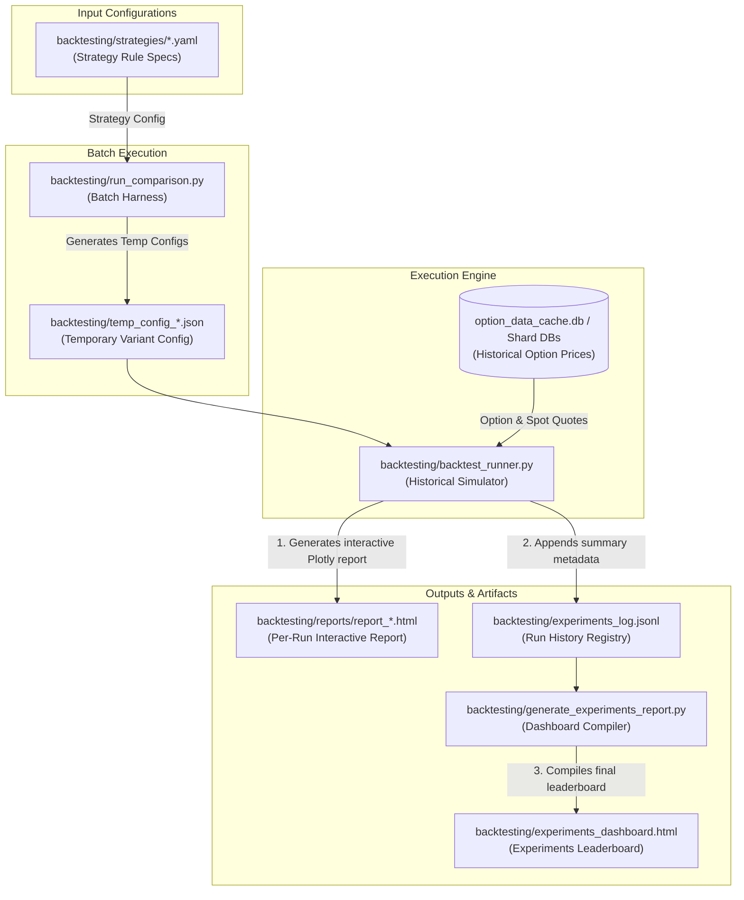
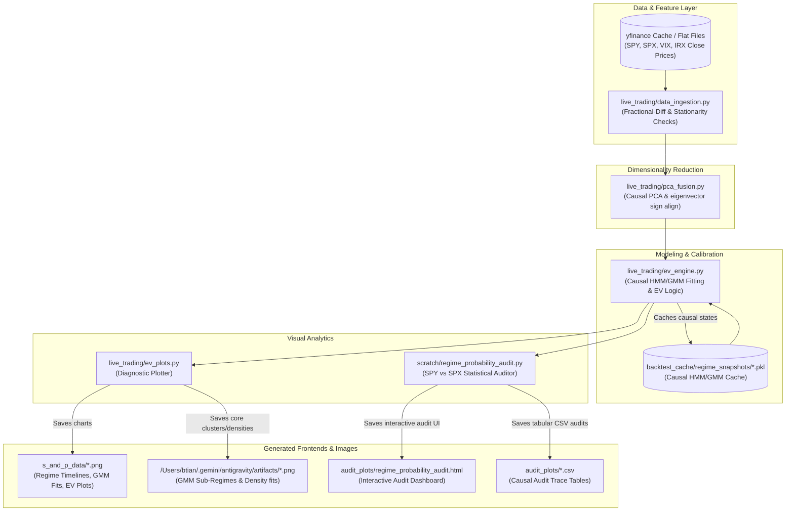

# Project Overview

This repository houses two major quantitative trading systems:
1. **A historical option strategy backtesting stack** (highly simulated, multi-variant testing harness).
2. **A causal market-regime detection & expected value (EV) engine** (featuring Hidden Markov Models, Gaussian Mixture Models, and option pricing calculations).

This document serves as the high-level map of the repository, illustrating the end-to-end architecture, visual execution flows, command shortcuts, and the direct associations between backend scripts and frontend UI/HTML artifacts.

---

## 🗺️ Architectural Flows

### 1. Backtesting Stack & Artifact Flow
The backtesting stack evaluates option strategies (configured via YAML) across a range of parameters (variants) and compiles the results into interactive Plotly HTML dashboards.



### 2. Regime Detection, EV Engine, & Audit Flow
The Market Regime Detection (MRD) stack ingests market indices, cleanses them for stationarity, runs causal PCA, trains rolling HMM state models, fits GMM probability densities to forward returns, and generates diagnostic charts and audits.



---

## 🛠️ Stack Component Descriptions

### 1. Backtesting Stack

*   **Strategy Specifications** (`backtesting/strategies/*.yaml`): YAML files (e.g., `baseline_put_spread.yaml`, `put_call_credit_spread.yaml`) defining trade structure, short/long delta targets, margin caps, early profit exits, DTEs, and rolling behavior. This is the stable configuration layer.
*   **Batch Harness** ([`run_comparison.py`](file:///Users/btian/EtradePythonClient/etrade_python_client/backtesting/run_comparison.py)): Orchestrates parameters sweeps. It maps out variants, writes temporary configuration JSONs, and triggers the `backtest_runner.py` for each variant before compiling the leaderboard.
*   **Historical Simulator** ([`backtest_runner.py`](file:///Users/btian/EtradePythonClient/etrade_python_client/backtesting/backtest_runner.py)): The core execution engine. It simulates daily trade lifecycles, parses the option chain databases, applies margin math, tracks PnL, logs trade events, and generates an interactive, detailed HTML report.
*   **Dashboard Compiler** ([`generate_experiments_report.py`](file:///Users/btian/EtradePythonClient/etrade_python_client/backtesting/generate_experiments_report.py)): Reads the flat-file JSONL experiments log and compiles a central HTML dashboard leaderboard for comparison.
*   **Experiment Manager** ([`experiment_manager.py`](file:///Users/btian/EtradePythonClient/etrade_python_client/backtesting/experiment_manager.py)): A utility script providing CLI commands to delete, rebuild, or manage individual runs in the experiments log.

### 2. Regime Detection & EV Engine

*   **Data Ingestion** ([`data_ingestion.py`](file:///Users/btian/EtradePythonClient/etrade_python_client/live_trading/data_ingestion.py)): Ingests raw market series (SPY, SPX, VIX, IRX) and transforms them to stationary inputs (log returns, fractional differencing) while running ADF (Augmented Dickey-Fuller) stationarity assertions.
*   **PCA Fusion** ([`pca_fusion.py`](file:///Users/btian/EtradePythonClient/etrade_python_client/live_trading/pca_fusion.py)): Projects scaled stationary features into mathematically orthogonal components using rolling/expanding window PCA, enforcing eigenvector sign alignment over consecutive steps.
*   **Core Engine** ([`ev_engine.py`](file:///Users/btian/EtradePythonClient/etrade_python_client/live_trading/ev_engine.py)): Implements walk-forward Hidden Markov Model (HMM) fits, deterministic state mapping (by variance/VIX to prevent label switching), and GMM (Gaussian Mixture Model) conditional forward return density estimates to calculate quantitative Expected Values (EV) for OTM puts.
*   **Plotting & Diagnostics** ([`ev_plots.py`](file:///Users/btian/EtradePythonClient/etrade_python_client/live_trading/ev_plots.py)): Orchestrates visualizations of regime timelines, HMM state returns, GMM distribution fits, and Expected Value curves. It is also equipped to trigger out-of-sample calibration backtests.
*   **Regime Audit** ([`regime_probability_audit.py`](file:///Users/btian/EtradePythonClient/etrade_python_client/scratch/regime_probability_audit.py)): A rigorous statistical audit script that merges SPY/SPX data, fits a causal walk-forward HMM, checks for statistical equivalence via Kolmogorov-Smirnov (KS) tests, audits options assignment frequencies against BS/Skew probabilities, and compiles a comprehensive audit report.

---

## ⚡ Core Command Cheat-Sheet (Quick Reference)

Use these standard commands in the shell to run processes and refresh the UI artifacts:

### Backtesting Commands
```bash
# Run the complete batch strategy comparison sweep (clears log by default)
python backtesting/run_comparison.py

# Run the sweep but append results instead of clearing the leaderboard
python backtesting/run_comparison.py --retain-existing-results

# Run a single backtest variant directly (e.g. baseline_put_spread from 2020-2026)
python backtesting/backtest_runner.py --strategy baseline_put_spread --start 2020-01-01 --end 2026-05-23 --log

# Rebuild the experiments dashboard leaderboard from the log file
python backtesting/generate_experiments_report.py
```

### Regime Detection & EV Diagnostic Commands
```bash
# Plot the 2015-Present Causal HMM Regime Timeline (SPY & VIX overlay)
python live_trading/ev_plots.py --timeline

# Plot Daily Return Histograms and Student-t fits bucketed by HMM state
python live_trading/ev_plots.py --distributions

# Plot the Causal Timeline along with BIC-Selected GMM Fits on Log Returns
python live_trading/ev_plots.py --regime-log-return-gmm

# Plot GMM Sub-Regime Cluster Scatterplots (Horizon MAE Returns)
python live_trading/ev_plots.py --gmm-plots

# Plot GMM Mixture Component Density Curves vs Horizon Returns
python live_trading/ev_plots.py --gmm-dist
```

### Quantitative Audit Commands
```bash
# Run the SPY vs SPX quantitative regime probability & option assignment audit
python scratch/regime_probability_audit.py
```

---

## 🔗 Backend-to-Frontend Artifact Mapping

When the user mentions a specific **dashboard**, **HTML**, or **chart**, check this mapping table to locate the file and understand which backend script generates it:

| Frontend UI / Artifact | Generated By | Primary Purpose & Contents |
| :--- | :--- | :--- |
| **[`experiments_dashboard.html`](file:///Users/btian/EtradePythonClient/etrade_python_client/backtesting/experiments_dashboard.html)** | `generate_experiments_report.py` | The main leaderboard. Compiles terminal statistics, margin metrics, drawdowns, Sharpe ratios, and links for all simulated variants in the log. |
| **[`backtesting/reports/report_*.html`](file:///Users/btian/EtradePythonClient/etrade_python_client/backtesting/reports/)** | `backtest_runner.py` | Single backtest interactive report. Contains step-by-step trade logs, equity curves, drawdown curves, trade-by-trade details, and embedded strategy config details. |
| **[`audit_plots/regime_probability_audit.html`](file:///Users/btian/EtradePythonClient/etrade_python_client/audit_plots/regime_probability_audit.html)** | `regime_probability_audit.py` | Interactive statistical dashboard comparing SPY & SPX. Displays distribution overlays, moments tables, and option assignment edges. |
| **[`s_and_p_data/regime_timeline_2015.png`](file:///Users/btian/EtradePythonClient/etrade_python_client/s_and_p_data/regime_timeline_2015.png)** | `ev_plots.py --timeline` | Visually maps out-of-sample HMM regimes (Expansion, Decline, Panic) as background colors overlaid on SPY Close and VIX. |
| **[`s_and_p_data/spy_return_distributions_by_hmm.png`](file:///Users/btian/EtradePythonClient/etrade_python_client/s_and_p_data/spy_return_distributions_by_hmm.png)** | `ev_plots.py --distributions` | Multi-panel histogram displaying daily returns bucketed by HMM state and overlaid with fitted fat-tailed Student-t densities. |
| **[`s_and_p_data/regime_log_return_timeline.png`](file:///Users/btian/EtradePythonClient/etrade_python_client/s_and_p_data/regime_log_return_timeline.png)** | `ev_plots.py --regime-log-return-gmm` | Causal regime timeline from 2015-Present including posterior HMM state probability stacked areas. |
| **[`s_and_p_data/regime_log_return_gmm_fits.png`](file:///Users/btian/EtradePythonClient/etrade_python_client/s_and_p_data/regime_log_return_gmm_fits.png)** | `ev_plots.py --regime-log-return-gmm` | Subplot layout displaying BIC-selected Gaussian Mixture density components fitted over each HMM state's daily log returns. |
| **[`/Users/btian/.gemini/antigravity/artifacts/gmm_regime_clusters.png`](file:///Users/btian/.gemini/antigravity/artifacts/gmm_regime_clusters.png)** | `ev_plots.py --gmm-plots` | Scatterplots of horizon returns over time, colored by their sub-component classification to reveal internal sub-regimes. |
| **[`/Users/btian/.gemini/antigravity/artifacts/gmm_distribution_fits.png`](file:///Users/btian/.gemini/antigravity/artifacts/gmm_distribution_fits.png)** | `ev_plots.py --gmm-dist` | Empirical density histograms of horizon returns overlaid with multi-component Gaussian mixture probability curves. |

---

## 📜 Causal Operating Contract

When writing code or verifying backtests/plots, ensure the following core quantitative boundaries are **never** breached:

> [!WARNING]
> **No Look-Ahead Volatility Centering**
> All moving averages, standard deviations, or volatility feature smoothing (e.g. VIX or realized vol filters) must be strictly trailing (`center=False`). Centering a rolling filter leaks future information.

> [!CAUTION]
> **Walk-Forward Validation Only**
> Do not use global scaler transformations or Viterbi-smoothed histories (`model.predict()`) to generate historical backtest regime states. You must run causal walk-forward scaling and out-of-sample forward filtering (`model.predict_proba()[-1]`), lagging daily states by 1 trading day before trade entry to mimic real-world execution.
