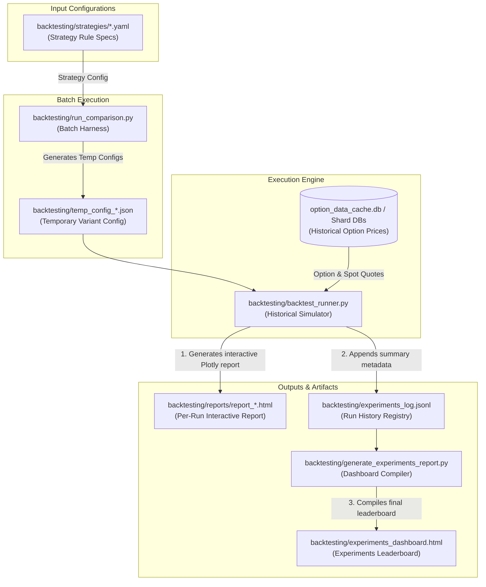
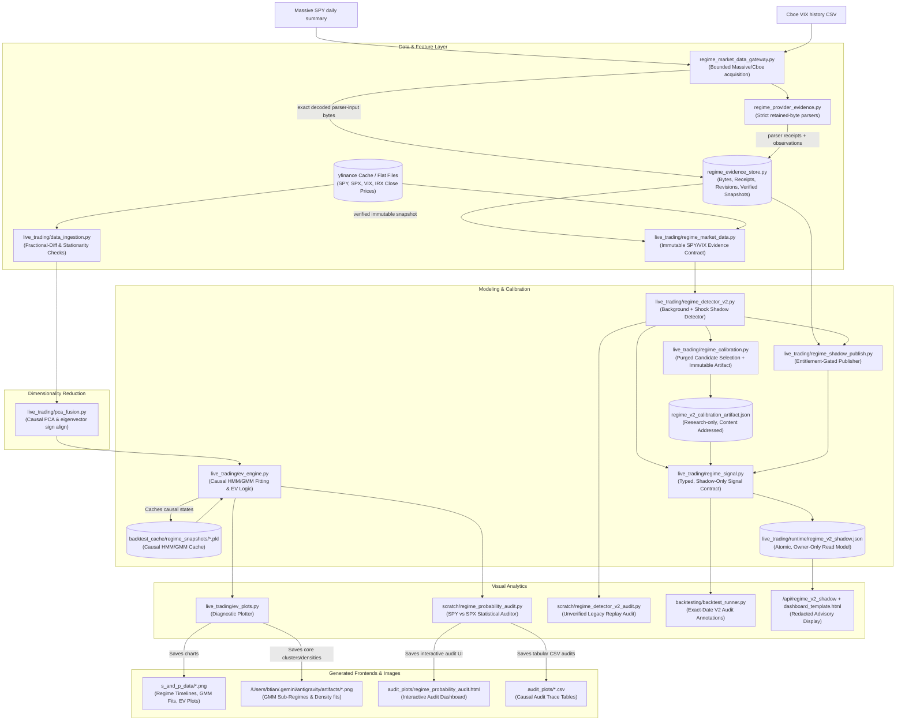
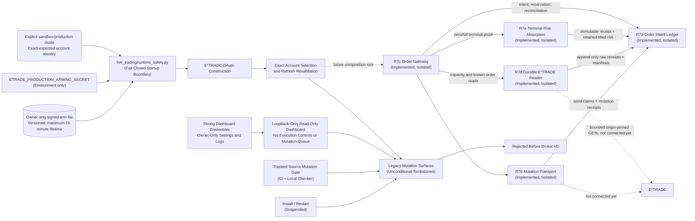

# Project Overview

This repository houses two major quantitative trading systems:
1. **A historical option strategy backtesting stack** (highly simulated, multi-variant testing harness).
2. **A causal market-regime detection & expected value (EV) engine** (featuring Hidden Markov Models, Gaussian Mixture Models, and option pricing calculations).

This document serves as the high-level map of the repository, illustrating the end-to-end architecture, visual execution flows, command shortcuts, and the direct associations between backend scripts and frontend UI/HTML artifacts.

---

## 🗺️ Architectural Flows

### 1. Backtesting Stack & Artifact Flow
The backtesting stack evaluates option strategies (configured via YAML) across a range of parameters (variants) and compiles the results into interactive Plotly HTML dashboards.



### 2. Regime Detection, EV Engine, & Audit Flow
The Market Regime Detection (MRD) stack retains the existing causal HMM/GMM
research path and adds a separate V2 shadow path. V2 validates immutable
SPY/VIX evidence and separates persistent background stress from fast event
shocks. It is not connected to order execution. The provider-backed path is a
library-only, entitlement-gated shadow collector; it does not schedule itself
or read credentials at import time.



### 3. Live Startup Safety & Mutation Quarantine

R6 adds a fail-closed boundary around startup and account refresh. R7f then
quarantines every known compatibility mutation path: legacy order methods are
unconditional tombstones, dashboard execution routes return a fixed
authenticated `503 LEGACY_EXECUTION_DISABLED` response before reading the body,
the UI is permanently read-only, and service installation/restart is
suspended. The environment must still be explicit. Production additionally
requires an owner-only, HMAC-signed, short-lived arm document whose exact
account ID, account key, and institution type match both the command line and
the broker response.



This is source-level containment, not a production-readiness claim. R7f removes
the live monolith's operative broker-mutation call sites and makes all retained
compatibility methods reject without configuration or operator override. A
tracked-source AST gate permits raw broker mutation only in the reviewed
transport and exact transport calls only in the gateway. The dashboard and
generated position artifact were rendered through the real local handler at
desktop and mobile widths; this was isolated source verification, not
inspection of the deployed Pi. R7a adds the durable intent ledger. R7b adds a private, no-retry
mutation transport that claims every send before broker I/O and persists parsed
responses. R7c composes those components into an opening/reprice coordinator
with a gateway-owned risk ceiling, exact environment/account binding,
restart reconciliation, and exact economic-term comparison. No live code
instantiates this stack. R7d adds the concrete origin-bound reader: every
usable GET is durably recorded as bounded raw bytes, independently reparsed by
the ledger, and grouped into a semantically complete manifest before it can
authorize capacity or reconciliation. R7e releases zero-fill terminal risk or
absorbs a complete balanced fill only from a fresh exact order read plus newer
order-bound position lots; absorbed full-fill margin remains counted against
account risk. Partial/replacement/assignment states, cancellation/closing
protocols, the single live composition root, a pure full pre-trade risk policy,
and operational migration remain mandatory before live wiring. The deployed
service has not been restarted or inspected with R6 or R7.

---

## 🛠️ Stack Component Descriptions

### 1. Backtesting Stack

*   **Strategy Specifications** (`backtesting/strategies/*.yaml`): YAML files (e.g., `baseline_put_spread.yaml`, `put_call_credit_spread.yaml`) defining trade structure, short/long delta targets, margin caps, early profit exits, DTEs, and rolling behavior. This is the stable configuration layer.
*   **Batch Harness** ([`run_comparison.py`](file:///Users/btian/EtradePythonClient/etrade_python_client/backtesting/run_comparison.py)): Orchestrates parameters sweeps. It maps out variants, writes temporary configuration JSONs, and triggers the `backtest_runner.py` for each variant before compiling the leaderboard.
*   **Historical Simulator** ([`backtest_runner.py`](file:///Users/btian/EtradePythonClient/etrade_python_client/backtesting/backtest_runner.py)): The core execution engine. It simulates daily trade lifecycles, parses the option chain databases, applies margin math, tracks PnL, logs trade events, and generates an interactive, detailed HTML report. V2 regime signals enter through a separate typed, exact-date audit lane and cannot alter the legacy strategy path in R4.
*   **Dashboard Compiler** ([`generate_experiments_report.py`](file:///Users/btian/EtradePythonClient/etrade_python_client/backtesting/generate_experiments_report.py)): Reads the flat-file JSONL experiments log and compiles a central HTML dashboard leaderboard for comparison.
*   **Experiment Manager** ([`experiment_manager.py`](file:///Users/btian/EtradePythonClient/etrade_python_client/backtesting/experiment_manager.py)): A utility script providing CLI commands to delete, rebuild, or manage individual runs in the experiments log.

### 2. Regime Detection & EV Engine

*   **Data Ingestion** ([`data_ingestion.py`](file:///Users/btian/EtradePythonClient/etrade_python_client/live_trading/data_ingestion.py)): Ingests raw market series (SPY, SPX, VIX, IRX) and transforms them to stationary inputs (log returns, fractional differencing) while running ADF (Augmented Dickey-Fuller) stationarity assertions.
*   **PCA Fusion** ([`pca_fusion.py`](file:///Users/btian/EtradePythonClient/etrade_python_client/live_trading/pca_fusion.py)): Projects scaled stationary features into mathematically orthogonal components using rolling/expanding window PCA, enforcing eigenvector sign alignment over consecutive steps.
*   **Core Engine** ([`ev_engine.py`](file:///Users/btian/EtradePythonClient/etrade_python_client/live_trading/ev_engine.py)): Implements walk-forward Hidden Markov Model (HMM) fits, deterministic state mapping (by variance/VIX to prevent label switching), and GMM (Gaussian Mixture Model) conditional forward return density estimates to calculate quantitative Expected Values (EV) for OTM puts.
*   **V2 Evidence Contract** ([`regime_market_data.py`](file:///Users/btian/EtradePythonClient/etrade_python_client/live_trading/regime_market_data.py)): Defines exact NYSE/Cboe clocks, immutable source observations, deterministic input hashes, and policy-bound provenance metadata.
*   **V2 Provider Gateway and Parsers** ([`regime_market_data_gateway.py`](file:///Users/btian/EtradePythonClient/etrade_python_client/live_trading/regime_market_data_gateway.py), [`regime_provider_evidence.py`](file:///Users/btian/EtradePythonClient/etrade_python_client/live_trading/regime_provider_evidence.py)): A caller-invoked, bounded Massive SPY/Cboe VIX acquisition library. It captures exact decoded parser-input bytes before retry decisions, retains credential-free fetch receipts, and derives strict parser receipts. It has no scheduler, import-time network call, or execution link.
*   **V2 Evidence Store** ([`regime_evidence_store.py`](file:///Users/btian/EtradePythonClient/etrade_python_client/live_trading/regime_evidence_store.py)): Persists raw BLOBs, source attempts/health, fetch and parser receipts, append-only corrections, and channel-scoped verified snapshots in SQLite. It replays retained bytes before a `shadow` publication; one-leg failures preserve the previously verified head.
*   **V2 Shadow Detector** ([`regime_detector_v2.py`](file:///Users/btian/EtradePythonClient/etrade_python_client/live_trading/regime_detector_v2.py)): Produces independent background and shock states from causal daily SPY/VIX inputs. Every current output is execution-ineligible.
*   **V2 Causal Calibration** ([`regime_calibration.py`](file:///Users/btian/EtradePythonClient/etrade_python_client/live_trading/regime_calibration.py)): Evaluates a predeclared detector grid on purged, resolved-only future-risk outcomes; binds detector/build, data-prefix, calendar, source-policy, plan, and artifact hashes; and keeps the selected profile research-only. The frozen protocol is `docs/regime_v2_calibration_plan.json`.
*   **V2 Typed Signal Contract** ([`regime_signal.py`](file:///Users/btian/EtradePythonClient/etrade_python_client/live_trading/regime_signal.py)): Converts a structurally valid close-T detector trace into immutable background-plus-shock annotations keyed only to the exact next NYSE session. It preserves artifact, source, evidence, runtime, and causal lineage; never maps into HMM integers; never fills missing sessions; and has no action projection.
*   **V2 Shadow Publisher** ([`regime_shadow_publish.py`](file:///Users/btian/EtradePythonClient/etrade_python_client/live_trading/regime_shadow_publish.py)): Requires an externally validated entitlement capability before provider I/O, advances only an exact newly verified decision-time snapshot, seals only a non-unavailable tail signal, and preserves the prior read model on every failure.
*   **V2 Dashboard Read Model** ([`regime_shadow_store.py`](file:///Users/btian/EtradePythonClient/etrade_python_client/live_trading/regime_shadow_store.py)): Atomically publishes and descriptor-validates an owner-only sealed signal. The authenticated dashboard consumes a fixed redacted projection from a separate same-origin endpoint; missing, unsafe, future, or stale state is explicitly unavailable and cannot authorize execution.
*   **Plotting & Diagnostics** ([`ev_plots.py`](file:///Users/btian/EtradePythonClient/etrade_python_client/live_trading/ev_plots.py)): Orchestrates visualizations of regime timelines, HMM state returns, GMM distribution fits, and Expected Value curves. It is also equipped to trigger out-of-sample calibration backtests.
*   **Regime Audit** ([`regime_probability_audit.py`](file:///Users/btian/EtradePythonClient/etrade_python_client/scratch/regime_probability_audit.py)): A rigorous statistical audit script that merges SPY/SPX data, fits a causal walk-forward HMM, checks for statistical equivalence via Kolmogorov-Smirnov (KS) tests, audits options assignment frequencies against BS/Skew probabilities, and compiles a comprehensive audit report.
*   **V2 Legacy Replay Audit** ([`regime_detector_v2_audit.py`](file:///Users/btian/EtradePythonClient/etrade_python_client/scratch/regime_detector_v2_audit.py)): Wraps legacy cache values in an explicitly unverified snapshot, surfaces conflicts/quarantined rows, and compares the two-timescale shadow result with the old overlay.

The provider-backed route begins with an explicit `snapshot_start` bootstrap or
incremental history assembly: each candidate must cover the complete contiguous
NYSE range through its new endpoint, not merely the newest session. Observing a
response after the NYSE/Cboe close is the availability policy, not a provider
finality promise; later provider corrections append a revision and require a
new verified snapshot. The [provider entitlement gate](regime_data_provider_entitlements.md)
is unresolved, so retained provider data and all derived V2 outputs remain
shadow/research-only and cannot affect E*TRADE order eligibility.

### 3. Live Runtime Safety

*   **Runtime Safety Boundary** ([`runtime_safety.py`](file:///Users/btian/EtradePythonClient/etrade_python_client/live_trading/runtime_safety.py)): Resolves an explicit `sandbox` or `production` environment before OAuth construction. Production requires an exact account identity plus a versioned, signed arm file with a bounded lifetime; unsafe, missing, mismatched, future, or expired proof fails closed. The operator CLI writes the arm atomically as an owner-only file without accepting the signing secret as a command-line argument.
*   **Account Identity Revalidation** ([`accounts_bo.py`](file:///Users/btian/EtradePythonClient/etrade_python_client/accounts/accounts_bo.py), [`runtime_safety.py`](file:///Users/btian/EtradePythonClient/etrade_python_client/live_trading/runtime_safety.py)): Selects production accounts by exact account ID, account key, and institution type instead of a mutable list index. The live process revalidates the armed identity after startup and account refresh. Compatibility order mutations are now disabled; the isolated R7 reader, gateway, and transport preserve the same identity boundary for future composition.
*   **Durable Order Intent Ledger** ([`order_intent_ledger.py`](file:///Users/btian/EtradePythonClient/etrade_python_client/live_trading/order_intent_ledger.py), [`order_intent_ledger.md`](file:///Users/btian/EtradePythonClient/etrade_python_client/docs/order_intent_ledger.md)): R7a provides strict vertical-spread validation, account capacity reservations, stable identifiers, monotonic submission/amendment fences, immutable outbound authorizations, exact send/response receipts, and reconciliation-only handling after an ambiguous mutation.
*   **Hardened Mutation Transport** ([`etrade_broker_transport.py`](file:///Users/btian/EtradePythonClient/etrade_python_client/live_trading/etrade_broker_transport.py)): R7b is the only reviewed adapter permitted to derive E*TRADE mutation XML from a durable authorization. It disables ambient proxies, cookies, hooks, redirects, and retries; revalidates the armed account; claims the exact send before I/O; bounds the exchange in an isolated process; and records the parsed result before returning.
*   **Order Gateway** ([`etrade_order_gateway.py`](file:///Users/btian/EtradePythonClient/etrade_python_client/live_trading/etrade_order_gateway.py)): R7c coordinates opening submissions and price-only amendments through the exact transport. R7e extends read-only startup reconciliation with deterministic terminal-reservation absorption: zero-fill terminals need no capacity read, while full fills require a newer lot-aware capacity decision bound to the same order. Startup stays blocked on partial, replacement-linked, stale, or ambiguous evidence. R7f removes the public transport property. This component remains intentionally unreachable from the live agent until closing/cancellation, live composition, and operational validation are delivered.
*   **Durable E*TRADE Reader** ([`etrade_broker_reader.py`](file:///Users/btian/EtradePythonClient/etrade_python_client/live_trading/etrade_broker_reader.py)): R7d performs only exact origin-pinned, no-retry GETs in bounded disposable processes. R7e adds exact per-leg fill quantities/timestamps and requests `lotsRequired=true`; position lots retain order and leg identity, signed quantities, and canonical provenance across both stability scans. Known-order reconciliation still uses only a direct lookup of the durable broker order ID; missing, incomplete, ambiguous, or mismatched evidence remains blocked.
*   **Legacy Mutation Quarantine** ([`runtime_safety.py`](file:///Users/btian/EtradePythonClient/etrade_python_client/live_trading/runtime_safety.py), [`check_etrade_mutation_boundary.py`](file:///Users/btian/EtradePythonClient/etrade_python_client/scripts/check_etrade_mutation_boundary.py)): R7f makes every known legacy order, scheduler, close, repricing, and cancellation surface an exact unconditional tombstone. CI scans every tracked application Python file, including tracked scratch, for raw mutation I/O, request literals, forbidden transport access, reflection, and tombstone drift.
*   **Read-Only Dashboard Containment** ([`etrade_cover_call_new.py`](file:///Users/btian/EtradePythonClient/etrade_python_client/live_trading/etrade_cover_call_new.py), [`dashboard_template.html`](file:///Users/btian/EtradePythonClient/etrade_python_client/live_trading/dashboard_template.html)): Serves the dashboard on loopback only, does not start ngrok automatically, and does not grant wildcard CORS. The UI has no execute/close/neutralize controls, persisted auto-open is forced off, and five historical execution routes reject before body parsing or side effects. Current generated positions are frameable only by the same-origin dashboard and label every position read-only; missing, oversized, or pre-containment artifacts become a fixed `503` fallback whose CSP disables scripts, network connections, and form actions.
*   **Repository Index Hygiene** ([`check_repo_hygiene.py`](file:///Users/btian/EtradePythonClient/etrade_python_client/scripts/check_repo_hygiene.py)): R8a removes 1,531 generated/runtime paths from tracking while preserving their local files. A dependency-free pre-install CI gate reads NUL-delimited Git index paths and rejects ignored tracked content plus explicit virtual-environment, package-metadata, secret/state, cache/database, log, document, and backup artifacts.
*   **Canonical Package and Dependency Locks** ([`pyproject.toml`](file:///Users/btian/EtradePythonClient/pyproject.toml), [`requirements/README.md`](file:///Users/btian/EtradePythonClient/requirements/README.md)): R8b makes `etrade_python_client/` the sole source root, explicitly allowlists ten flat compatibility packages, includes only the dashboard template and strategy YAML data, removes local `accounts`/`yfinance` collisions and legacy package inputs, pins CPython 3.10.20, and commits hash-locked runtime/test graphs. Polygon modules import without a credential or network call and fail only when a client is explicitly constructed without a key.
*   **Immutable Sync-Only Snapshot** ([`sync_to_pi.sh`](file:///Users/btian/EtradePythonClient/etrade_python_client/deploy/sync_to_pi.sh)): Remote restart remains disabled. Code-only synchronization rejects tracked changes and archives one resolved `HEAD` commit into an owner-only temporary directory before rsync, preventing ignored or untracked working-tree scripts from entering a transfer. Versioned atomic activation is still required before deployment can be re-enabled.
*   **Credential Source Cleanup** ([`etrade_check_option.py`](file:///Users/btian/EtradePythonClient/etrade_python_client/live_trading/etrade_check_option.py), [`etrade_option_chains.py`](file:///Users/btian/EtradePythonClient/etrade_python_client/live_trading/etrade_option_chains.py)): Removes hardcoded OAuth credentials from the current source and requires local configuration or environment variables. Because the repository is currently public and those values remain in Git history, the affected keys must be treated as compromised until they are revoked and rotated externally; a coordinated history purge remains separate follow-up work.

---

## ⚡ Core Command Cheat-Sheet (Quick Reference)

Use these standard commands in the shell to run processes and refresh the UI artifacts:

### Backtesting Commands
```bash
# Run the complete batch strategy comparison sweep (clears log by default)
python backtesting/run_comparison.py

# Run the sweep but append results instead of clearing the leaderboard
python backtesting/run_comparison.py --retain-existing-results

# Run a single backtest variant directly (e.g. baseline_put_spread from 2020-2026)
python backtesting/backtest_runner.py --strategy baseline_put_spread --start 2020-01-01 --end 2026-05-23 --log

# Rebuild the experiments dashboard leaderboard from the log file
python backtesting/generate_experiments_report.py
```

### Regime Detection & EV Diagnostic Commands
```bash
# Plot the 2015-Present Causal HMM Regime Timeline (SPY & VIX overlay)
python live_trading/ev_plots.py --timeline

# Plot Daily Return Histograms and Student-t fits bucketed by HMM state
python live_trading/ev_plots.py --distributions

# Plot the Causal Timeline along with BIC-Selected GMM Fits on Log Returns
python live_trading/ev_plots.py --regime-log-return-gmm

# Plot GMM Sub-Regime Cluster Scatterplots (Horizon MAE Returns)
python live_trading/ev_plots.py --gmm-plots

# Plot GMM Mixture Component Density Curves vs Horizon Returns
python live_trading/ev_plots.py --gmm-dist
```

### Quantitative Audit Commands
```bash
# Run the SPY vs SPX quantitative regime probability & option assignment audit
python scratch/regime_probability_audit.py

# Run the read-only V2 background/shock replay (always unverified)
python scratch/regime_detector_v2_audit.py

# Reproduce the frozen R3 calibration and its 2026 case studies
python scratch/regime_detector_v2_calibrate.py
```

---

## 🔗 Backend-to-Frontend Artifact Mapping

When the user mentions a specific **dashboard**, **HTML**, or **chart**, check this mapping table to locate the file and understand which backend script generates it:

| Frontend UI / Artifact | Generated By | Primary Purpose & Contents |
| :--- | :--- | :--- |
| **[`experiments_dashboard.html`](file:///Users/btian/EtradePythonClient/etrade_python_client/backtesting/experiments_dashboard.html)** | `generate_experiments_report.py` | The main leaderboard. Compiles terminal statistics, margin metrics, drawdowns, Sharpe ratios, and links for all simulated variants in the log. |
| **[`backtesting/reports/report_*.html`](file:///Users/btian/EtradePythonClient/etrade_python_client/backtesting/reports/)** | `backtest_runner.py` | Single backtest interactive report. Contains step-by-step trade logs, equity curves, drawdown curves, trade-by-trade details, and embedded strategy config details. |
| **[`audit_plots/regime_probability_audit.html`](file:///Users/btian/EtradePythonClient/etrade_python_client/audit_plots/regime_probability_audit.html)** | `regime_probability_audit.py` | Interactive statistical dashboard comparing SPY & SPX. Displays distribution overlays, moments tables, and option assignment edges. |
| **[`live_trading/dashboard_template.html`](file:///Users/btian/EtradePythonClient/etrade_python_client/live_trading/dashboard_template.html)** | `RefreshHandler` serves the source template; `/api/positions` serves the generated positions artifact; `/api/regime_v2_shadow` reads `live_trading/runtime/regime_v2_shadow.json` | Authenticated, loopback-only, permanently read-only dashboard. It has no order controls, forces auto-open off, and returns a fixed fail-closed response from retained historical execution routes. The V2 card displays a redacted background-plus-shock advisory that cannot authorize execution. |
| **[`research_reports/regime_v2_calibration_artifact.json`](file:///Users/btian/EtradePythonClient/etrade_python_client/research_reports/regime_v2_calibration_artifact.json)** | `regime_detector_v2_calibrate.py` | Canonical R3 candidate metrics, causal folds, selected baseline, provenance limitations, and execution-ineligible promotion status. |
| **[`s_and_p_data/regime_timeline_2015.png`](file:///Users/btian/EtradePythonClient/etrade_python_client/s_and_p_data/regime_timeline_2015.png)** | `ev_plots.py --timeline` | Visually maps out-of-sample HMM regimes (Expansion, Decline, Panic) as background colors overlaid on SPY Close and VIX. |
| **[`s_and_p_data/spy_return_distributions_by_hmm.png`](file:///Users/btian/EtradePythonClient/etrade_python_client/s_and_p_data/spy_return_distributions_by_hmm.png)** | `ev_plots.py --distributions` | Multi-panel histogram displaying daily returns bucketed by HMM state and overlaid with fitted fat-tailed Student-t densities. |
| **[`s_and_p_data/regime_log_return_timeline.png`](file:///Users/btian/EtradePythonClient/etrade_python_client/s_and_p_data/regime_log_return_timeline.png)** | `ev_plots.py --regime-log-return-gmm` | Causal regime timeline from 2015-Present including posterior HMM state probability stacked areas. |
| **[`s_and_p_data/regime_log_return_gmm_fits.png`](file:///Users/btian/EtradePythonClient/etrade_python_client/s_and_p_data/regime_log_return_gmm_fits.png)** | `ev_plots.py --regime-log-return-gmm` | Subplot layout displaying BIC-selected Gaussian Mixture density components fitted over each HMM state's daily log returns. |
| **[`/Users/btian/.gemini/antigravity/artifacts/gmm_regime_clusters.png`](file:///Users/btian/.gemini/antigravity/artifacts/gmm_regime_clusters.png)** | `ev_plots.py --gmm-plots` | Scatterplots of horizon returns over time, colored by their sub-component classification to reveal internal sub-regimes. |
| **[`/Users/btian/.gemini/antigravity/artifacts/gmm_distribution_fits.png`](file:///Users/btian/.gemini/antigravity/artifacts/gmm_distribution_fits.png)** | `ev_plots.py --gmm-dist` | Empirical density histograms of horizon returns overlaid with multi-component Gaussian mixture probability curves. |

---

## 📜 Causal Operating Contract

When writing code or verifying backtests/plots, ensure the following core quantitative boundaries are **never** breached:

> [!WARNING]
> **No Look-Ahead Volatility Centering**
> All moving averages, standard deviations, or volatility feature smoothing (e.g. VIX or realized vol filters) must be strictly trailing (`center=False`). Centering a rolling filter leaks future information.

> [!CAUTION]
> **Walk-Forward Validation Only**
> Do not use global scaler transformations or Viterbi-smoothed histories (`model.predict()`) to generate historical backtest regime states. You must run causal walk-forward scaling and out-of-sample forward filtering (`model.predict_proba()[-1]`), lagging daily states by 1 trading day before trade entry to mimic real-world execution.
