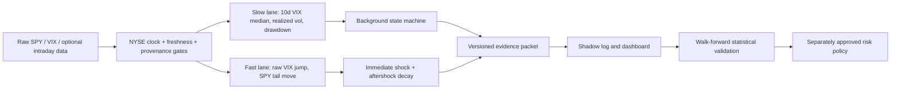

# Regime Detection V2: Persistent Climate + Event Shock

**Review date:** 2026-07-26

**Status:** shadow-mode detector plus evidence contract; not connected to order execution
**Related roadmap:** `docs/production_readiness_upgrade_plan.md`

## Decision

The current regime mechanism should not be repaired by tuning another
three-state Gaussian HMM. The central modeling error is that one latent label is
being asked to represent two processes with different time scales:

1. A persistent volatility climate that lasts days or weeks.
2. A fast news/event shock that can appear and mean-revert within one session.

The replacement should return two independent states:

```text
background_state = calm | elevated | persistent_stress
shock_state      = unavailable | none | active | aftershock
```

This produces combinations that are both statistically and operationally
meaningful:

- `calm + none`
- `calm + active`
- `elevated + intermittent shocks`
- `persistent_stress + active`

For the market behavior in the user example, this is the difference between a
multi-week stress climate and a calmer climate that still experiences isolated
VIX jumps.

The first production candidate should be a small, causal, interpretable score
and state machine. A robust duration model can be evaluated later as a
challenger. This sequence makes failures observable and keeps model output
auditable while the repository's market-data clock is repaired.

## What the 2026 tape says

The local audit combines the longer SPY/VIX Parquet history with the fresher
dashboard cache and gives the dashboard cache priority on overlapping dates.
The latest observation is the July 24, 2026 close.

The cache does not persist trustworthy per-symbol `available_at` provenance.
The replay therefore wraps normalized cache values and historical finalization
assumptions in an immutable evidence snapshot marked `UNVERIFIED`; its results
are diagnostic and explicitly ineligible to drive a live order. A filesystem
modification time is never treated as market-data provenance.

| Window | Observed behavior | Legacy overlay | V2 shadow result |
|---|---|---|---|
| Mar 20–Apr 7, 12 sessions | VIX median 25.97, maximum 31.05; mean V2 background score 0.916 | 9 `cautious_decline`, 3 `expansion` | 12/12 `persistent_stress`; 3 fresh shocks |
| Full April, 21 sessions | VIX median 18.92; early stress followed by rapid normalization | 20 `expansion`, 1 `cautious_decline` | 18 `persistent_stress`, then 3 `elevated` because exit requires confirmation |
| Jun 15–Jul 24, 28 sessions | VIX median 16.81, maximum 19.49; five VIX increases above 10% | 28/28 `expansion` | 22 `elevated`, 6 `calm`; all five jumps detected |
| Jul 9–Jul 24, 12 sessions | Mean background score 0.494; three VIX increases above 10% | 12/12 `expansion` | Jul 17 and Jul 23 were `calm + active`; Jul 24 was `calm + aftershock` |

The recent raw shock dates were:

| Date | VIX close | Daily VIX change | V2 background | V2 shock |
|---|---:|---:|---|---|
| 2026-06-17 | 18.44 | +12.37% | elevated | active |
| 2026-06-23 | 19.49 | +12.79% | elevated | active |
| 2026-07-13 | 17.16 | +14.17% | elevated | active |
| 2026-07-17 | 18.77 | +12.19% | calm | active |
| 2026-07-23 | 18.70 | +12.38% | calm | active |

The user's intuition is therefore supported, with one useful refinement: the
stressed interval is concentrated in late March and early April. April as a
whole is transitional rather than one homogeneous regime. This matches the
broader contemporaneous record: the IMF reported financial-market volatility
and economic disruption on March 3, and Cboe described an outsized volatility
and hedging-demand increase on March 9. By July, Cboe described a calmer market
that was often discounting the conflict even while intraday volatility
continued.

These dates are used only to test whether the mechanism can express the desired
distinction. They are not a locked out-of-sample validation set, and the
prototype results must not be presented as investment-performance evidence.

## Why the current system returns the same answer

### 1. The active dashboard is not running the regime model

The latest restart log launches the dashboard with `--no-regime`
(`live_dashboard_restart.log:22`). In that mode the regime card can fall back to
`research_reports/regime_diagnostics/causal_regime_trace.csv`
(`live_trading/etrade_cover_call_new.py:1622-1636,1707-1753`).

That artifact ends on 2026-05-22. A refresh can therefore repeat a stale answer
even when the live market has changed. A production dashboard must display
`Unavailable — model disabled` or `Stale — last signal 2026-05-22`; it must not
present a stale row as current.

### 2. The final actionable label ignores the HMM

`_apply_causal_stress_overlay()` initializes every row as `Expansion` and
changes it only when fixed VIX, SPY return, or SPY drawdown thresholds fire
(`live_trading/ev_engine.py:524-586`).

The final classification does not use HMM state or probability.
`base_state_count` is unused. A VIX move from 16 to 18 is still below the
absolute VIX level of 25, so it remains `Expansion` even when the one-day
percentage move is extreme.

### 3. The feature pipeline erases the event the user wants to detect

Every feature whose name contains `VIX`, `VVIX`, or `Vol` is replaced by a
five-row trailing median (`live_trading/data_ingestion.py:972-979`). This filter
is causal, but it deliberately suppresses a one-day pulse.

On June 5, the raw VIX close was 21.51 after a 39.7% daily increase. The
five-row median was only 16.05, suppressing roughly one quarter of the raw level
on the exact day that should have fired the event channel.

Smoothing is appropriate for the slow background lane. It must never overwrite
the raw series used by the shock lane.

### 4. The saved HMM is statistically collapsed

`research_reports/regime_diagnostics/causal_regime_trace.csv` contains 1,260
rows from 2020-01-03 through 2026-05-22. On every row:

```text
Raw_HMM_State = 2
prob_state_0  = 0.0
prob_state_1  = 0.0
prob_state_2  = 1.0
```

All 117 recorded refits contain a pair of duplicate emission means. The model
has not learned three distinguishable regimes.

The code already contains useful occupancy, posterior-entropy, and
state-separation checks in `validate_hmm_quality()`
(`live_trading/ev_engine.py:58-145`). However, a fresh fixed-K fit returns after
only the numerical `is_hmm_healthy()` check
(`live_trading/ev_engine.py:460-484`). The statistical quality gate is applied
to warm starts but bypassed by the fresh fallback path. A numerically valid,
one-state solution can therefore be cached as a healthy three-state model.

### 5. Research and cached/live inference use different inputs

The direct expanding training path applies the final overlay to the raw caller
frame (`live_trading/ev_engine.py:1081`). Cached scoring applies it to the
stationary, median-filtered feature frame
(`live_trading/ev_engine.py:1557`).

The same date can consequently receive different labels depending on which
entry point generated it. A production feature contract must explicitly carry
both `raw_*` and `slow_*` values and use the same versioned detector in research,
backtest, shadow, and live paths.

### 6. The VIX3M cache is invalid

The local `INDEX_VIX3M.parquet` close is exactly equal to
`INDEX_VVIX.parquet` on all 229 overlapping rows from 2025-06-02 through
2026-04-29. The values are roughly 90–100 when the trusted VIX3M report is near
20. VIX3M also stops on 2026-04-29.

The cache coverage rule treats symbols such as `^VIX3M` as macro-like because
of their length and allows a 90-day stale buffer
(`live_trading/data_ingestion.py:177-186`). The merged dataset is then broadly
forward-filled.

Until the series is refreshed and passes identity, range, timestamp, and
freshness checks:

- VIX3M must be quarantined.
- Term-structure features must be marked unavailable.
- The detector must not substitute VVIX or a stale forward-filled value.
- Missing term structure must degrade confidence, never default the regime to
  `Expansion`.

### 7. The market clock is not trustworthy

The saved trace has weekend refit dates and almost no Mondays. Multi-calendar
data are outer-joined and forward-filled, then rows are removed by a later
all-column `dropna()` (`live_trading/data_ingestion.py:418-424,930,793-854`).
As a result, “three rows,” “five rows,” and “21 rows” do not always mean the
same number of exchange sessions.

The current dashboard cache also contains VIX-only observations on two NYSE
holidays: 16.59 on 2026-05-25 and 16.78 on 2026-06-19, with SPY missing. The V2
audit explicitly quarantines and reports those non-session rows. It never drops
a missing observation on a valid NYSE session; that condition fails closed.

All detector features must be computed on a canonical NYSE session index.
Every source observation needs `event_time`, `available_at`, `source`, and
freshness metadata.

### 8. Downstream consumers mix taxonomies

Regime return buckets are grouped by raw HMM state
(`live_trading/ev_engine.py:1657-1666`), while the backtester prefers final
overlay state (`backtesting/backtest_runner.py:136-172`). A numeric state ID in
one taxonomy is not semantically compatible with the same integer in another.

There is also a safety inversion: `regime_dynamic_delta` changes the short-put
delta from -0.10 to -0.20 in crisis
(`backtesting/backtest_runner.py:2164-2171`). Stress must reduce or block short
convexity exposure, not increase it.

## Recommended architecture



The detector produces evidence. A separate risk policy decides whether that
evidence blocks or reduces an order. This prevents statistical-model code from
directly mutating execution behavior.

## V2 transparent baseline

The new shadow module is
`live_trading/regime_detector_v2.py`. It intentionally has no HMM, PCA, network
call, cache mutation, or broker dependency.

### Slow background features

For close T:

```text
VIX_slow(T) = median of the last 10 VIX closes
RV10(T)     = annualized standard deviation of the last 10 SPY log returns
DD21(T)     = current SPY drawdown from the trailing 21-session high
```

Each value is ranked against the previous 756 sessions, excluding T:

```text
score_raw(T) =
    0.45 * percentile(VIX_slow(T))
  + 0.35 * percentile(RV10(T))
  + 0.20 * percentile(DD21(T))
```

The score receives a causal EWMA with half-life two sessions. The score is an
ordinal stress score, not a calibrated probability.

At least 252 prior valid observations of each slow feature are required. The raw
price history must be longer because rolling-feature warm-up precedes that
calibration history. Before then, the background result is `unavailable`, not
`calm`.

### Absolute stress evidence

A relative percentile alone must not label the quietest state in a calm sample
as crisis. Entry into `persistent_stress` therefore also requires at least one
absolute condition:

```text
VIX_slow >= 22
or RV10 >= 20% annualized
or DD21 >= 6%
```

These are prototype risk anchors. Their final values must be selected in a
frozen calibration period and tested in later walk-forward folds.

Once a valid term-structure source exists, sustained `VIX / VIX3M >= 1` can be
added as another absolute stress condition. It must not be enabled against the
current cache.

### Hysteresis

The baseline applies asymmetric confirmation:

```text
enter persistent_stress: 3 closes with score >= 0.75 and absolute evidence
exit persistent_stress:  5 closes with score < 0.65
enter calm:               3 closes with score <= 0.45 and no absolute evidence
exit calm to elevated:    3 closes with score > 0.55
otherwise:                elevated
```

The longer exit condition prevents a single relief day from declaring a crisis
over. Absolute stress evidence moves `calm` to at least `elevated` immediately,
even before persistent-stress confirmation. State age is recorded for every
row.

### Fast shock features

The shock lane uses unsmoothed observations:

```text
active shock if:
    VIX daily percentage change >= 10%
    or SPY daily log return <= -1.5%
```

The flag fires for session T as soon as both required daily inputs are final. It
is never delayed by background debounce. Two subsequent quiet sessions are
labeled `aftershock`.

This is a daily shock proxy, not a statistically identified price jump. A later
intraday version should use five-minute bars and realized-versus-bipower
variation to separate continuous and jump variation.

The close-based baseline cannot protect an order placed earlier on T from an
intraday shock on T. Before regime evidence can influence live E*TRADE orders,
the centralized risk engine also needs a broker-independent, timestamped
intraday circuit breaker. That gate should consume fresh raw VIX/SPY quotes,
expire automatically, and fail closed on stale or unavailable market data. It
must remain distinct from the next-session research/backtest signal.

### Output contract

Each row contains:

```json
{
  "Background_State": "calm",
  "Background_Score": 0.50,
  "Background_Regime_Age": 5,
  "Shock_State": "active",
  "Shock_Age": 1,
  "Composite_Regime": "calm+active",
  "Absolute_Stress_Evidence": false,
  "Data_Quality": "exchange_sessions_and_source_times_valid",
  "Market_Close_At": "2026-07-23T20:00:00+00:00",
  "VIX_Finalization_At": "2026-07-23T20:15:00+00:00",
  "Signal_Available_At": "2026-07-23T20:16:00+00:00",
  "Tradable_Session": "2026-07-24",
  "Detector_Version": "regime_v2_shadow_0.2.0",
  "Config_Hash": "<sha256>",
  "Input_Snapshot_SHA256": "<sha256>",
  "Input_Schema_Version": "regime_market_data.v2",
  "Calendar_Policy_Version": "nyse+cboe_index_options.v1",
  "Source_Policy_Version": "regime_source_identity.v1",
  "Source_Policy_SHA256": "<sha256>",
  "Input_Provenance_Status": "unverified",
  "Input_Provenance_Evidence": "complete_but_not_durably_verified",
  "Detector_Stage": "shadow",
  "Execution_Eligible": false,
  "Reason_Codes": "vix_daily_change_extreme",
  "Regime_Signal_Timestamp": "after_spy_vix_finalization_T_for_next_session"
}
```

The typed shadow entry point accepts only a
`RegimeMarketDataSnapshot`. It derives provenance from immutable source
metadata rather than accepting a caller-supplied Boolean. Each observation
carries provider/dataset/symbol/field identity, payload checksum and kind,
event time, availability time, ingestion time, request ID, finality, and a
frozen source-policy verdict. The snapshot binds the version and hash of that
policy, verifies exact contiguous NYSE sessions, one independent SPY and VIX
observation per session, recognized identities, deterministic input and
calendar hashes, and timezone-aware clock ordering.

SPY event time comes from the versioned NYSE schedule. VIX event time comes
from the versioned `CBOE_Index_Options` schedule, including shortened sessions;
the paired publication boundary is the later of the two exchange closes. The
final row must be the latest jointly finalized session at `as_of`.

`Signal_Available_At` is the cumulative maximum of both source timestamps
through T. This dependency watermark matters because returns, rolling features,
the EWMA, and the state machines all consume prior rows. `Tradable_Session` is
the first subsequent NYSE session whose market open is strictly after that
watermark. If either the current row or a required historical row arrives after
the next session has opened, the signal rolls to the following session instead
of being backdated into that morning.

The compatibility entry point for loose arrays is research-only and rejects
any attempt to claim verified provenance. Unverified provenance is carried in
`Data_Quality`, makes `freshness_assessed=false`, and must hard-block any
regime-dependent execution. Both entry points currently emit
`Execution_Eligible=false`; promotion requires a later, separately reviewed
risk-policy release. Invalid, missing, non-finite, nonpositive, non-session,
stale, premature, duplicated, or tampered required data fail closed.
Insufficient calibration history returns `unavailable`, and the first row's
shock state is `unavailable` because a daily change cannot yet be observed.
None of these cases silently produces `calm` or `none`.

R1 intentionally does **not** call a checksum “verified provenance.” The
current snapshot retains a digest but not the provider response bytes or a
trusted parser receipt, so even structurally complete source metadata is
labeled `complete_but_not_durably_verified`. No current R1 path emits
`Input_Provenance_Status=verified`. A later provider-adapter release must store
content-addressed raw responses, link each chosen observation revision to the
fetch attempt and parser version, and re-derive the parsed close before this
gate can be promoted.

### R1 evidence persistence

`live_trading/regime_evidence_store.py` provides the first durable manifest
boundary. It stores source attempts, source health, append-only observation
revisions, and channel-scoped, content-addressed input snapshots in SQLite with WAL,
`synchronous=FULL`, foreign keys, restrictive file permissions, and immediate
write transactions. Failed or time-inconsistent attempts roll back without
advancing last-success state. A successful range must include exactly one
currently ingested observation for every requested NYSE session. Snapshot
reload verifies its canonical hash before returning data, and an older
backfill cannot replace a newer-as-of snapshot in the same channel.

This store is not yet wired into the live collection worker. That adapter and
the raw-payload/parser receipts and two-leg retry/publication scheduler belong
to the later live-shadow phase.
The legacy JSON and Parquet caches remain research/display artifacts and cannot
be promoted into verified evidence.

## Why not another single HMM

A single latent state must choose among three bad behaviors:

1. Switch on every outlier and destroy regime persistence.
2. Become very sticky and miss genuine structural breaks.
3. Create cross-product states such as calm/shock and stress/shock, fragmenting
   a limited sample and making labels unstable after refits.

The repository currently exhibits the second failure, followed by a hard
threshold overlay that hides it.

A factorial HMM could represent two latent causes formally, but it adds
identification and inference complexity without solving the source-clock and
quality problems. The explicit two-lane design captures the important
separation while remaining testable and explainable.

## Model challengers after the baseline is trusted

### 1. Duration-aware robust background model

Compare the transparent state machine against a fixed three-state hidden
semi-Markov model:

- Student-t emissions rather than Gaussian emissions.
- Explicit duration distributions instead of an implicit geometric dwell time.
- Two or three slow, interpretable features; no PCA initially.
- Fixed semantic anchors and emission-distance alignment across refits.
- Mandatory out-of-sample occupancy, entropy, KL-separation, and duplicate-
  centroid gates.

The challenger must beat the baseline on locked statistical metrics before it
can replace it.

### 2. Online change-point evidence

Bayesian online change-point detection can run on the compact background score
and produce a causal posterior over current run length. It should accelerate a
candidate transition when slow features shift together. It should not define
the semantic state by itself.

### 3. Intraday jump decomposition

With trustworthy five-minute SPY data:

```text
RV(T) = sum of intraday squared returns
JumpVariation(T) ~= max(RV(T) - BipowerVariation(T), 0)
```

This supports a statistically grounded event channel and distinguishes
continuous volatility from discrete jumps. Without intraday observations, the
daily VIX/SPY rules must continue to be labeled proxies.

### 4. Valid implied-volatility curve

After VIX3M is repaired, add:

- `VIX9D / VIX3M` for acute short-end stress.
- `VIX / VIX3M` for 30-day versus three-month stress.
- Curve breadth: whether only the front is elevated or the whole curve shifted.
- VVIX as fragility/vol-of-vol evidence, never as a substitute for VIX3M.

The curve can distinguish a short event premium from a durable repricing of
volatility.

## Risk-policy mapping

Detection and execution must remain separate. A conservative short-put policy
would move in only one direction as stress increases:

| Composite condition | Recommended policy behavior |
|---|---|
| data quality or provenance not verified | Hard block regime-dependent execution |
| either axis unavailable | Hard block regime-dependent execution; surface the failed evidence gate |
| calm + none | Strategy's normal limits |
| calm + active/aftershock | Pause new short-vol entries until the shock gate returns to `none`, or require a separately approved tighter limit |
| elevated + none | Reduce size and tighten liquidity/quote-age requirements |
| elevated + active/aftershock | Block new short-vol exposure while the shock gate is not `none` |
| persistent_stress + none | Block or materially reduce new short-put exposure |
| persistent_stress + active/aftershock | Block new short-vol exposure |

This table is a design requirement, not an authorization to change live order
behavior. The unified fail-closed risk engine in the production-readiness
roadmap must own the final decision. Every stress transition must be monotone in
risk: the policy must never increase absolute short-put delta or size when
either axis worsens.

## Validation design

### Mandatory causal record

Every regime experiment must persist:

| Field | V2 prototype status | Production requirement |
|---|---|---|
| Training/calibration end date | Thresholds are currently illustrative; no locked selection cutoff | Freeze configuration inside each walk-forward fold and store cutoff plus config hash |
| Test date range | 2011-05-03 through 2026-07-24 is a diagnostic replay, not a locked OOS test | Pre-register validation and untouched test windows |
| Inference method | Prefix-causal score and state machine | Store `causal_prefix_filter` per run |
| Regime lag | Output explicitly says `after_spy_vix_finalization_T_for_next_session` | Assert at least one trading-session lag at every trade entry |
| Return-bucket causality | Not used by V2 detector | If later used, include only outcomes resolved before T and use the exact same taxonomy/version |

The current prototype is therefore **UNVERIFIED for investment claims** even
though its inference mechanics are causal.

### Models to compare

1. Current HMM plus hard overlay.
2. Transparent V2 background only.
3. Transparent V2 background plus shock lane.
4. Duration-aware robust background plus the same shock lane.
5. Optional BOCPD evidence added to models 3 and 4.

### Statistical metrics

- One-, five-, and 20-session realized-volatility forecast loss.
- Brier and log score for future tail-move events.
- Conditional future drawdown and option-loss calibration.
- Detection delay for pre-registered stress windows.
- False persistent transitions after isolated shocks.
- Switches per year, state occupancy, and dwell-time stability.
- Stability of state meanings across refits.
- Data-availability rate and stale/invalid fail-closed rate.

Economic results are evaluated only after the statistical model passes. The
regime-unaware strategy remains the control, and costs, turnover, spread width,
and skipped-trade effects must be included.

### Non-negotiable tests

- Appending future rows cannot alter any earlier feature, score, or state.
- A single +12% VIX day in a calm sample produces `calm/elevated + active`, not
  `persistent_stress`.
- A sustained high-VIX/high-realized-volatility sequence can enter
  `persistent_stress` only after confirmation.
- Shock state fires on the observation date and decays after the configured
  quiet period.
- Empty, missing, non-finite, nonpositive, duplicate, unexpected, missing-
  session, stale, or premature required observations fail closed.
- A background state with absolute stress evidence is never labeled `calm`.
- Unobservable first-return shock evidence is `unavailable`, not `none`.
- Output maps jointly finalized session T to the exact next NYSE trading
  session, including holiday boundaries.
- A 4:01 p.m. ET run cannot publish session T while VIX is still inside its
  calculation window.
- A signal delivered after the next session's open rolls to a later tradable
  session rather than leaking backward into that open.
- A delayed historical dependency propagates its availability watermark to
  every later signal that consumes it.
- Filesystem modification time never upgrades source provenance to verified.
- A checksum without retained raw bytes and a linked parser receipt remains
  unverified.
- Source-policy version, hash, and frozen verdict are bound into the snapshot
  identity.
- A stale observation from an older attempt cannot advance last-success
  freshness for a new attempt.
- Publishing an older backfill cannot regress the latest-as-of snapshot in the
  research or shadow channel.
- Invalid VIX3M cannot enter a term-structure calculation.
- A probabilistic challenger is rejected if any state exceeds 95% OOS
  occupancy, centroids duplicate, posterior entropy collapses, or minimum
  state separation fails.
- Backtests consume close-T output no earlier than the next trading session.
- No `bfill()` may create a historical regime value.
- A more stressed output can never increase short-put exposure.

## Migration plan

### Phase 0 — stop false confidence

- Keep regime-dependent order behavior disabled.
- Change the dashboard fallback from a stale label to explicit
  `disabled/stale/unavailable` status.
- Quarantine the corrupted VIX3M cache.
- Repair the NYSE session clock and source freshness metadata.
- Make the existing HMM quality test mandatory on every fresh and fallback fit.

### Phase 1 — shadow the transparent detector

- Run `regime_detector_v2.py` after each confirmed market close.
- Persist raw inputs, derived features, both state axes, reason codes,
  configuration hash, source timestamps, and publication timestamp.
- Display the shadow result beside the legacy result without affecting orders.
- Alert on stale inputs, unavailable calibration, or publication failure.

### Phase 2 — causal replay and locked validation

- Freeze calibration/validation/test partitions.
- Compare the baseline and challengers using the statistical metrics above.
- Audit 2008, 2011, 2018, 2020, 2022, and 2026 without choosing thresholds from
  the final test windows.
- Publish an experiment manifest and prefix-invariance proof for every run.

### Phase 3 — unify research, backtest, and dashboard semantics

- Replace numeric regime IDs with versioned typed values.
- Use the same detector package and configuration schema in all paths.
- Apply the one-trading-session lag in the backtester.
- Remove raw-HMM/final-overlay bucket mixing.
- Keep the regime-unaware strategy as the default and control.

### Phase 4 — risk integration

- Integrate only through the centralized fail-closed `RiskDecision`.
- Start in paper mode, then shadow live decisions, then a bounded canary.
- Persist what the order would have been without the regime rule.
- Require rollback to disable the regime policy without disabling monitoring.

## Prototype artifacts and verification

- Detector: `live_trading/regime_detector_v2.py`
- Evidence contract: `live_trading/regime_market_data.py`
- Evidence store: `live_trading/regime_evidence_store.py`
- Focused tests: `tests/test_regime_detector_v2.py`,
  `tests/test_regime_market_data.py`, and
  `tests/test_regime_evidence_store.py`
- Read-only replay: `scratch/regime_detector_v2_audit.py`

The focused tests verify:

- Isolated shock versus persistent background.
- Sustained stress entry.
- Aftershock decay.
- Prefix invariance.
- Fail-closed invalid, non-session, stale, and premature inputs.
- No `calm` label while absolute stress evidence is present.
- Explicit market-close timestamp and exact next tradable NYSE session.
- Per-session source availability and delayed-delivery rollover.
- Actual NYSE/Cboe regular and shortened-session clocks.
- Deterministic snapshot, calendar, and source-policy hashes.
- Exact requested-range coverage and transactional failure rollback.
- Stale-attempt rejection and channel-scoped, monotonic snapshot publication.
- Unavailable first-return shock evidence.

The read-only replay prints the causal record and reproduces the 2026 comparison
without downloading or mutating data.

## Primary references

- Cboe, VIX and volatility-index term structure:
  <https://www.cboe.com/tradable-products/vix/term-structure>
- Cboe, VIX calculation and trading-hour specification:
  <https://www.cboe.com/tradable-products/vix/vix-options/specifications/>
- Cboe, current VIX methodology:
  <https://cdn.cboe.com/api/global/us_indices/governance/VIX_Methodology.pdf>
- Cboe, exchange hours and shortened sessions:
  <https://www.cboe.com/about/hours/us-options>
- Cboe DataShop, VIX end-of-day calculation inputs and early-close timing:
  <https://datashop.cboe.com/vix-index-eod-calculation-inputs>
- Cboe, March 2026 volatility and hedging-demand decomposition:
  <https://www.cboe.com/insights/posts/stagflation-fears-drive-widening-volatility-risk-premium>
- Cboe, June 2026 volatility spike:
  <https://www.cboe.com/insights/posts/week-of-6-8-2026-downside-risks-rise-as-tech-volatility-spikes/>
- Cboe, July 2026 calmer but intraday-volatile conditions:
  <https://www.cboe.com/insights/posts/markets-appear-to-be-shaking-off-mideast-conflict>
- IMF, March 3, 2026 statement on market volatility and Middle East disruption:
  <https://www.imf.org/en/news/articles/2026/03/03/pr-26068-statement-on-middle-east>
- Corsi, heterogeneous autoregressive realized volatility:
  <https://statmath.wu.ac.at/~hauser/LVs/FinEtricsQF/References/Corsi2009JFinEtrics_LMmodelRealizedVola.pdf>
- Barndorff-Nielsen and Shephard, power and bipower variation with jumps:
  <https://papers.ssrn.com/sol3/papers.cfm?abstract_id=409160>
- Adams and MacKay, Bayesian online change-point detection:
  <https://arxiv.org/abs/0710.3742>
- Hamilton, Markov-switching time-series inference:
  <https://ideas.repec.org/a/ecm/emetrp/v57y1989i2p357-84.html>
- Fox et al., sticky state-persistence extension:
  <https://arxiv.org/abs/0905.2592>
